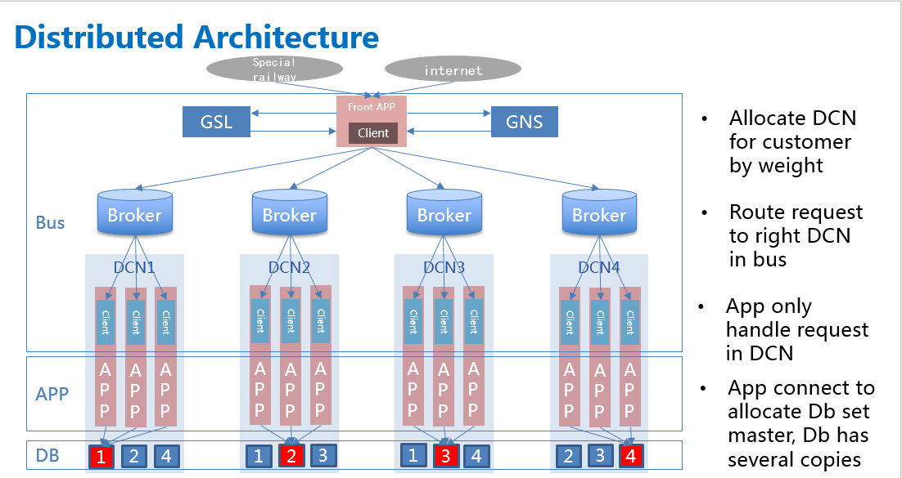

## DeFiBus (Decentralized Financial Message Bus)
&nbsp;&nbsp;&nbsp;&nbsp;&nbsp;&nbsp;
**DeFiBus=RPC+MQ, a reliable distributed financial message bus which is build base on open sourcing message mid-ware. DeFiBus offsers not only traditional feature of MQ system (event notification, multicast, broadcast etc.) but also synchronize call and high availability such as application multi active, service nearby, dark launch. The enhancement of fault tolerant enable DeFiBus running more reliable and offer a all days online service.**  


## Architecture  
<div align=center>



</div>


DeFiBus including the following component:
* **Broker**: Offering message store via the mechanism of topic and queue. Broker registers to Name server periodically. Brokers in the same cluster should register to the same name server to keep route info in all name server is consistent.

* **NameServer**: NameServer maintains route info of topic and provide clients an interface to get route info of given topic.

* **GSL**: GSL(Global Service Location) service provides service-level routing discovery. Services can be deployed in different areas (such as different data centers, logical partitions, etc.). When requesting a specific service, service requesters need not pay attention to the area of service deployment. GSL can automatically locate specific services according to service discovery rules and return service information to clients.

* **SGS**: SGS(Service Governance System) is responsible for the overall service management, including new service applying, service deployment, service offline. In DeFiBus, every service correspond to exactly one Topic. The creation, update and deletion of Topic are managed by SGS. After creating Topic in Broker cluster, SGS updates global service routing data for GSL.

* **Proxy**: Proxy provide HTTP access, allowing access to client of other language such C/C++, Go, Python etc accessing .


## Definition of Service & Topic
&nbsp;&nbsp;&nbsp;&nbsp;&nbsp;&nbsp;
Each service in DeFiBus correspond to exactly a Topic. Topic is named according to the unique ID of the service and the deployment area of the service. Each service needs a unique identity, which can be represented by a digital ID or string. Each deployment area is represented by a 3-bit string of limited numbers and letters.  

Topic is named in the following format:
```
[区域代码]-[服务唯一ID]
``` 
For example, the service ID of the balance query service is 20190001, and it is deployed in the area of "A10". The Topic of such service in the area of A10 is named "A10-20190001". 

## 特性列表:
* [Request-Reply call：support sync invocation between systems](docs/cn/features/1-request-response-call.md)
* Pub/Sub：message publish and subscrbe
* [Dark launch：support dark launch at level of topic](docs/cn/features/2-dark-launch.md)
* [Circuit break mechainsm: circuit break at level of client instance](docs/cn/features/3-circuit-break-mechanism.md)
* [Service nearby：invoke service nearby, reducing invocation cross region](docs/cn/features/4-invoke-service-nearby.md)
* [Multi active：multi active of application among multi region or idc](docs/cn/features/5-multi-active.md)
* [Dynamic expand/shrink queue：expand/shrink queue number according to alive instance adaptive](docs/cn/features/6-dynamic-adjust-queue.md)
* [Fault tolerant](docs/cn/features/8-fault-tolerant.md)
* GSL(under planning for open sourcing)
* Proxy(under planning open sourcing)
* SGS(under planning open sourcing)
* graceful upgrade(under planning open sourcing)

## Quick Start
We offser a instruction of quick start, read[ this ](docs/cn/quickstart.md) to get more information.   
Examples are also provide in defibus-examples module, get more detail from [here](defibus-examples).

## License
Copyright (C) 2015-2019 Webank Group Holding Limited

## Contacts
WeChat & QQ group：


DingDing group: 23372793

Email: defibus.users@webank.com