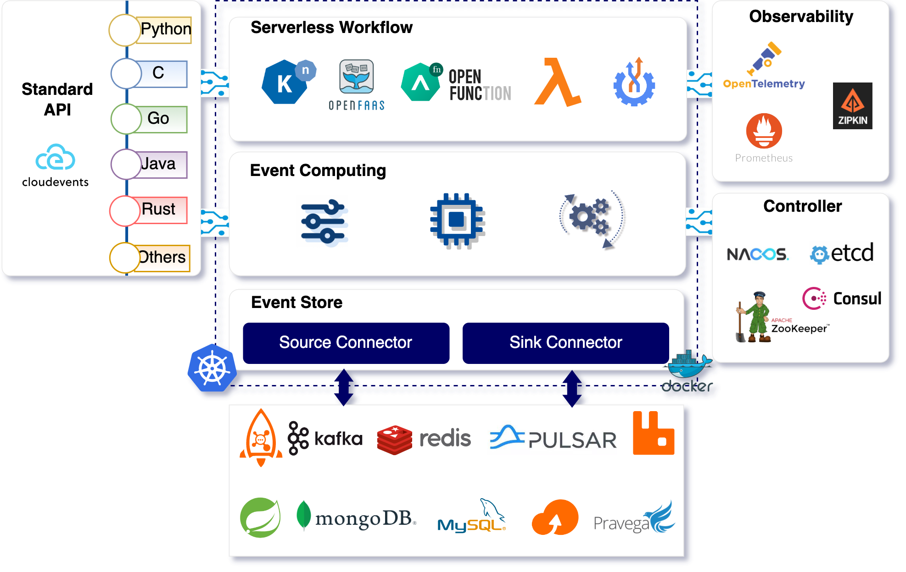
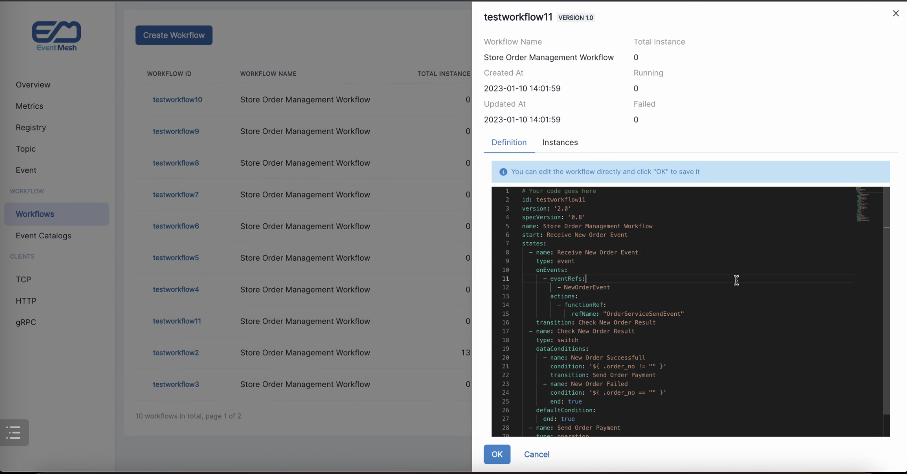

  

 

[📦 Documentation](https://eventmesh.apache.org/docs/introduction) |
[📔 Examples](https://github.com/apache/incubator-eventmesh/tree/master/eventmesh-examples) |
[⚙️ Roadmap](https://github.com/apache/incubator-eventmesh/blob/master/docs/en/roadmap.md) |
[🌐 简体中文](README.zh-CN.md)

# Apache EventMesh (Incubating)

**Apache EventMesh (Incubating)** is a dynamic [event-driven](https://en.wikipedia.org/wiki/Event-driven_architecture) application multi-runtime used to decouple the application and backend middleware layer, which supports a wide range of use cases that encompass complex multi-cloud, widely distributed topologies using diverse technology stacks.

### EventMesh Architecture

### EventMesh Dashboard

## Features

Apache EventMesh (Incubating) has a vast amount of features to help users achieve their goals. Let us share with you some of the key features EventMesh has to offer:

- Built around the [CloudEvents](https://cloudevents.io) specification.
- Rapidty extendsible language sdk around [gRPC](https://grpc.io) protocols.
- Rapidty extendsible middleware by connectors such as [Apache RocketMQ](https://rocketmq.apache.org), [Apache Kafka](https://kafka.apache.org), [Apache Pulsar](https://pulsar.apache.org), [RabbitMQ](https://rabbitmq.com), [Redis](https://redis.io), [Pravega](https://cncf.pravega.io), and [RDMS](https://en.wikipedia.org/wiki/Relational_database)(in progress) using [JDBC](https://en.wikipedia.org/wiki/Java_Database_Connectivity).
- Rapidty extendsible controller such as [Consul](https://consulproject.org/en/), [Nacos](https://nacos.io), [ETCD](https://etcd.io) and [Zookeeper](https://zookeeper.apache.org/).
- Guaranteed at-least-once delivery.
- Deliver events between multiple EventMesh deployments.
- Event schema management by catalog service.
- Powerful event orchestration by [Serverless workflow](https://serverlessworkflow.io/) engine.
- Powerful event filtering and transformation.
- Rapid, seamless scalability to add new machines.

## Roadmap

Please go to the [roadmap](https://github.com/apache/incubator-eventmesh/blob/master/docs/en/roadmap.md) to get the release history and new features of Apache EventMesh (Incubating).

## Quick start
Here are the guidelines:

[Step 1: Deploy eventmesh-store](docs/en/instruction/01-store.md)

[Step 2: Start eventmesh-runtime](docs/en/instruction/02-runtime.md)

[Step 3: Run our demos](docs/en/instruction/03-demo.md)

Besides, we also provide the docker-version guidelines for you if you prefer Docker:

[Step 1: Deploy eventmesh-store using docker](docs/en/instruction/01-store-with-docker.md)

[Step 2: Start eventmesh-runtime using docker](docs/en/instruction/02-runtime-with-docker.md)

[Step 3: Run our demos](docs/en/instruction/03-demo.md)

## Contributing

Each contributor has played an important role in promoting the robust development of Apache EventMesh (Incubating). We sincerely appreciate all contributors who have contributed code and documents.

- [Contributing Guideline](https://github.com/apache/incubator-eventmesh/blob/master/docs/en/contribute/03-new-contributor-guidelines.md)
- [Good First Issues](https://github.com/apache/incubator-eventmesh/issues?q=is%3Aopen+is%3Aissue+label%3A%22good+first+issue%22)

Here is the [List of Contributors](https://github.com/apache/incubator-eventmesh/graphs/contributors), thank you all! :)

## CNCF Landscape

Apache EventMesh (Incubating) enriches the <a href="https://landscape.cncf.io/serverless?license=apache-license-2-0">CNCF Cloud Native Landscape.</a>

## License

Apache EventMesh (Incubating) is licensed under the [Apache License, Version 2.0](http://www.apache.org/licenses/LICENSE-2.0.html).

## Community

|WeChat Assistant|WeChat Public Account|Slack|
|-|-|-|
|||[Join Slack Chat](https://join.slack.com/t/apacheeventmesh/shared_invite/zt-1hgto0wcm-KXKz8pJGUwrWdk00juaQSw)|

### Mailing List

|Name|Description|Subscribe|Unsubscribe|Archive
|-|-|-|-|-|
|Users|User discussion|[Subscribe](mailto:users-subscribe@eventmesh.incubator.apache.org)|[Unsubscribe](mailto:users-unsubscribe@eventmesh.incubator.apache.org)|[Mail Archives](https://lists.apache.org/list.html?users@eventmesh.apache.org)|
|Development|Development discussion (Design Documents, Issues, etc.)|[Subscribe](mailto:dev-subscribe@eventmesh.incubator.apache.org)|[Unsubscribe](mailto:dev-unsubscribe@eventmesh.incubator.apache.org)|[Mail Archives](https://lists.apache.org/list.html?dev@eventmesh.apache.org)|
|Commits|Commits to related repositories| [Subscribe](mailto:commits-subscribe@eventmesh.incubator.apache.org) |[Unsubscribe](mailto:commits-unsubscribe@eventmesh.incubator.apache.org) |[Mail Archives](https://lists.apache.org/list.html?commits@eventmesh.apache.org)|
