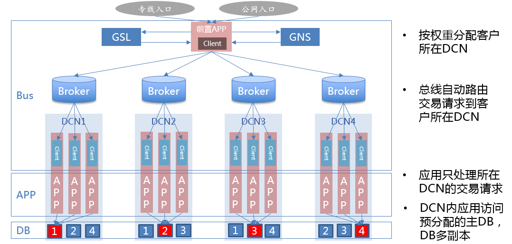
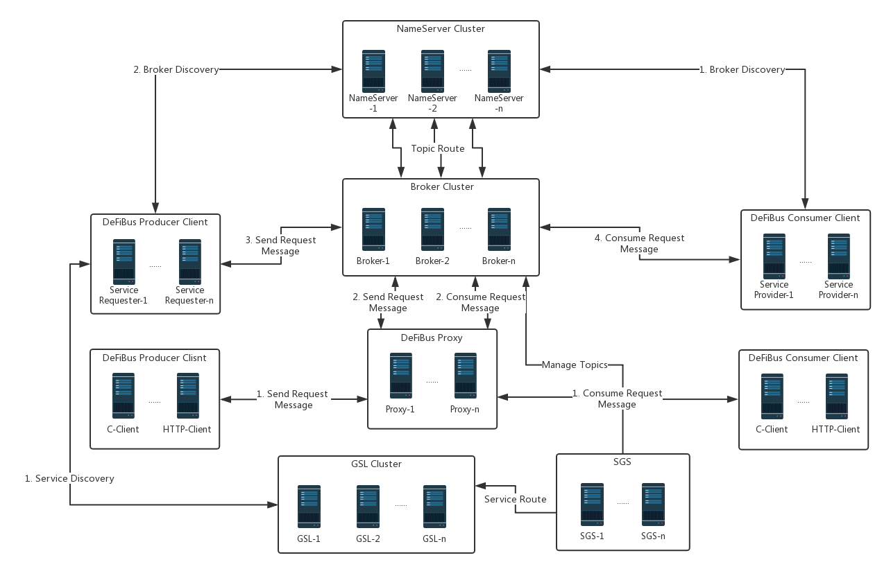

## DeFiBus(Decentralized Financial Message Bus) -- 分布式金融级消息总线
&nbsp;&nbsp;&nbsp;&nbsp;&nbsp;&nbsp;
**DeFiBus=RPC+MQ，是基于开源消息中间件打造的安全可控的分布式金融级消息总线。DeFiBus不仅提供了RPC同步调用，还提供了MQ的异步事件通知、事件组播和广播等常用服务调用和消息模式，同时增加了应用多中心多活、服务就近、灰度发布等分布式场景下的高可用能力。在对于机器故障的容错能力方面的增强，也让消息总线的服务更加稳定可靠，为业务提供7x24的服务。**

### 整体架构  
<div align=center>



</div>


  
DeFiBus主要包括以下几个组件（模块）：  

* **Broker**：通过轻量的Topic和Queue机制提供消息存储功能。Broker定期将Topic信息上报到NameServer中，同集群中的Broker实例上报的NameServer必须保持一致，避免路由信息不一致。  

* **NameServer**：NameServer提供Topic的发现和路由，每一个NameServer接受Broker上报的Topic信息，并维护Topic的路由信息供客户端查询。  

* **GSL**：全局服务定位（Global Service Location）服务提供服务级别的路由发现。服务可以部署在不同的区域（比如不同的数据中心、逻辑分区等），服务请求方在请求某一个具体服务时，无需关注服务部署的区域，GSL能够根据服务发现规则自动定位到具体的服务，将服务信息返回给客户端。  

* **SGS**：服务治理系统（Service Government System）负责全局的服务管理，包括服务的申请、服务部署规划、服务下线等服务全生命周期的管理。在DeFiBus中，服务与Topic一一对应，Topic的名称由对应的服务按照一定的规则来命名。Topic的创建、更新和删除由SGS统一管理。SGS在服务的部署区域对应的Broker集群中创建Topic之后，将更新全局服务路由数据，供GSL定位服务使用。

* **Proxy**：服务代理（Proxy）提供TCP/HTTP接入方式，同时允许按照协议规范开发的C、GO、Python等其他语言客户端的接入。

### 服务和Topic的定义
&nbsp;&nbsp;&nbsp;&nbsp;&nbsp;&nbsp;
DeFiBus把服务和Topic做了一一对应，每个服务必须对应一个Topic。Topic根据服务的唯一ID和服务的部署区域来命名。每个服务需要有服务的唯一标识，可以用数字ID或者字符串来表示。每个部署区域使用3位长度的字符串（限数字和字母构成）表示。  
Topic按照如下格式来命名：
```
[区域代码]-[服务唯一ID]
```

比如，余额查询服务的服务ID为20190001表示，部署在“A10”这个区域，那么该服务在A10区域的Topic就命名为“A10-20190001”。

### 特性列表:
* [RPC调用：即“Request-Reply”模式，支持系统间的同步调用](docs/cn/features/1-request-response-call.md)
* [消息发布/订阅：消息的发布和订阅](docs/cn/features/9-publish-type.md)
* [灰度发布：服务级别的灰度发布](docs/cn/features/2-dark-launch.md)
* [熔断机制：应用实例级别的熔断](docs/cn/features/3-circuit-break-mechanism.md)
* [流量控制：队列级别的限流](docs/cn/features/10-flow-control.md)
* [服务就近：就近进行服务的请求和响应，减少跨区调用](docs/cn/features/4-invoke-service-nearby.md)
* [应用多活：应用多中心多活](docs/cn/features/5-multi-active.md)
* [动态扩缩队列 ：自适应应用实例数量，动态调整队列个数](docs/cn/features/6-dynamic-adjust-queue.md)
* [容错机制：故障和错误隔离](docs/cn/features/8-fault-tolerant.md)
* 服务路由和定位：动态路由及定位(后续开源)
* 服务代理：TCP/HTTP及多语言的代理(后续开源)
* 服务治理：服务元数据的管理(后续开源)
* 平滑升级：平滑升级、平滑扩容(后续开源)


## Quick Start
DeFiBus的安装部署流程请参考：[《DeFiBus使用指引》](docs/cn/quickstart.md)   
examples模块中提供了最佳实践样例：[defibus-examples](defibus-examples)

## License
DeFiBus is licensed under Apache License.

非常感谢以下项目对开源做出的贡献
* [RocketMQ](https://github.com/apache/rocketmq)
* [Netty](https://github.com/netty/netty)

## Contacts
微信/QQ群：


钉钉群: 23372793

