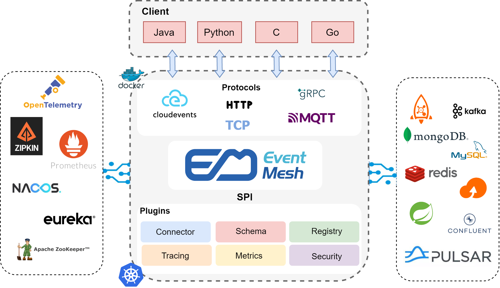

# Apache EventMesh (incubating) 

[点我查看中文版](README.zh-CN.md)

## What is EventMesh?
EventMesh(incubating) is a dynamic event-driven application runtime used to decouple the application and backend middleware layer, which supports a wide range of use cases that encompass complex multi-cloud, widely distributed topologies using diverse technology stacks.

**EventMesh Architecture:**

**Components:**

* **eventmesh-runtime** : an middleware to transmit events between event producers and consumers, support cloud native apps and microservices.
* **eventmesh-sdk-java** : currently supports HTTP and TCP protocols.
* **eventmesh-connector-api** : an api layer based on OpenMessaging api and SPI pluggin, which can be implemented by popular EventStores such as IMDG, Messaging Engine and OSS etc.
* **eventmesh-connector-plugin** : plugins for connector.
* **eventmesh-connector-standalone** : an implementation of eventmesh-connector-api, pub event to or sub event from InMemory as EventStore.
* **eventmesh-connector-rocketmq** : an implementation of eventmesh-connector-api, pub event to or sub event from RocketMQ as EventStore.
* **eventmesh-connector-kafka(WIP)** : an implementation of eventmesh-connector-api, pub event to or sub event from Kafka as EventStore.
* **eventmesh-connector-redis(WIP)** : an implementation of eventmesh-connector-api, pub event to or sub event from Redis as EventStore.
* **eventmesh-connector-defibus(WIP)** : an implementation of eventmesh-connector-api, pub event to or sub event from [DeFiBus](https://github.com/webankfintech/defibus) as EventStore
* **eventmesh-admin** : clients,topics,subscriptions and other management.
* **eventmesh-registry-plugin** : plugins for registry adapter.
* **eventmesh-security-plugin** : plugins for security adpater.
* **eventmesh-protocol-plugin** : plugins for protocol adapter.

**Protocol:**

The protocol of eventmesh is easier and more convenient, you can read more [here](docs/en/instructions/eventmesh-runtime-protocol.md)

## Feature

Event & Service
- [x] Pub/Sub
- [x] Request/Reply
- [ ] Event Streaming
- [ ] Event transaction
- [ ] At-least-once/at-most-once delivery guarantees

Store Connector
- [x] RocketMQ
- [x] InMemory
- [ ] Federated
- [ ] Kafka
- [ ] Redis
- [ ] Pulsar
- [ ] RabbitMQ 
- [ ] DeFiBus
- [ ] Cold storage (S3, Minio, SQL, key/value, etc...)

Protocol
- [x] TCP
- [x] Http
- [ ] gRPC
- [ ] CloudEvents
- [ ] MQTT
- [ ] WebSocket
- [ ] AMQP
- [ ] AsyncAPI

SDK
- [x] Java
- [ ] C
- [ ] Go
- [ ] Python

Deploy
- [x] Sidecar
- [x] Gateway
- [x] Docker

Metrics
- [x] OpenTelemetry
- [x] Promethus exporter

Tracing
- [x] OpenTelemetry
- [x] Zipkin exporter
- [ ] Skywalking

Governance
- [x] Client management
- [ ] Topic management
- [ ] Metadata registry
- [ ] Schema registry
- [ ] Dynamic config

Choreography
- [ ] Servelss workflow
- [ ] Event function,triggers and bindings

Security
- [ ] Auth
- [ ] ACL

Runtime
- [ ] WebAssembly runtime

## Quick Start
1. [Store quickstart](docs/en/instructions/eventmesh-store-quickstart.md)
2. [Runtime quickstart](docs/en/instructions/eventmesh-runtime-quickstart.md) or [Runtime quickstart with docker](docs/en/instructions/eventmesh-runtime-quickstart-with-docker.md).
3. [Java SDK examples](docs/en/instructions/eventmesh-sdk-java-quickstart.md).

## Contributing
Contributions are always welcomed! Please see [CONTRIBUTING](CONTRIBUTING.md) for detailed guidelines.

You can start with the issues labeled with good first issue.
[GitHub Issues](https://github.com/apache/incubator-eventmesh/issues)

## Landscape

  
&nbsp;&nbsp;
  
EventMesh enriches the <a href="https://landscape.cncf.io/serverless?license=apache-license-2-0">CNCF CLOUD NATIVE Landscape.</a>

## License
[Apache License, Version 2.0](http://www.apache.org/licenses/LICENSE-2.0.html) Copyright (C) Apache Software Foundation.

## Community
|              WeChat Assistant                           |                WeChat public account                   | Slack                                                  |
| :----------------------------------------------------:  | :----------------------------------------------------: | :----------------------------------------------------: |
|  |  |[Join slack chat](https://join.slack.com/t/apacheeventmesh/shared_invite/zt-yx3n2ak7-HcVG98CDqb~7PwgoDzgfMA) |

Mailing Lists:

| Name | Description |Subscribe	|Unsubscribe|Archive
| ----    | ----    |----    | ----    | ----    |
|Users	|User support and questions mailing list|	[Subscribe](mailto:users-subscribe@eventmesh.incubator.apache.org)	|[Unsubscribe](mailto:users-unsubscribe@eventmesh.incubator.apache.org)	|[Mail Archives](https://lists.apache.org/list.html?users@eventmesh.apache.org)|
|Development	|Development related discussions|	[Subscribe](mailto:dev-subscribe@eventmesh.incubator.apache.org)	|[Unsubscribe](mailto:dev-unsubscribe@eventmesh.incubator.apache.org)	|[Mail Archives](https://lists.apache.org/list.html?dev@eventmesh.apache.org)|
|Commits	|All commits to repositories|	[Subscribe](mailto:commits-subscribe@eventmesh.incubator.apache.org)	|[Unsubscribe](mailto:commits-unsubscribe@eventmesh.incubator.apache.org)	|[Mail Archives](https://lists.apache.org/list.html?commits@eventmesh.apache.org)|
