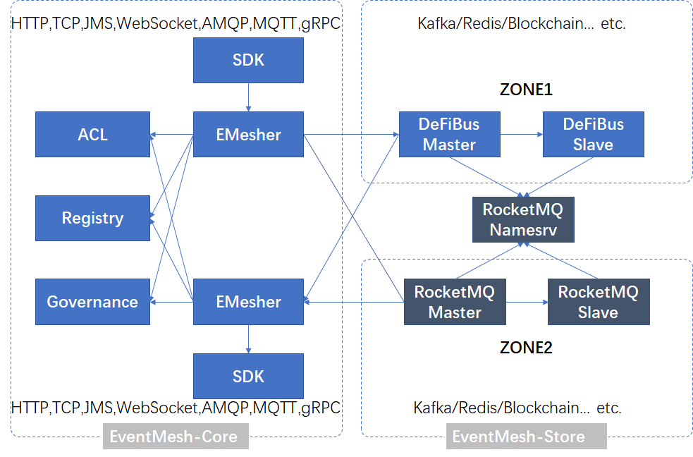

## What is Event Mesh?
This figure shows the positioning of the event mesh relative to other similar technologies (such as service mesh) in the application framework.

Event Mesh is a dynamic plug-in cloud-native basic service layer used to decouple the application and middleware layer. It provides flexible, reliable and fast event distribution, and can be managed.
This diagram shows the architecture of EventMesh:

The event mesh allows events from one application to be dynamically routed to any other application.
General functions of the event grid:
* Event driven;
* Event governance;
* Dynamic routing;
* Cloud native

Dependent components:
* defibus : a distributed messaging platform with low latency, high performance and reliability, flexible scalability. [DefiBus](https://github.com/WeBankFinTech/DeFiBus)

Key components:
* eventmesh-emesher : an middleware to transmit events between event producers and consumers, support cloud native apps and microservices
* eventmesh-sdk-java : support for popular open standard protocols and APIs, including REST/HTTP, AMQP, MQTT, Websocket and JMS, gRPC etc.
* eventmesh-registry : automatically routes events between applications and services connected to seperate event meshers, manage eventmesh-emesher

## Quick Start
1. Build and deploy eventmesh-emesher, see instruction ['eventmesh-emesher quickstart'](docs/en/instructions/eventmesh-emesher-quickstart.md).
2. Run eventmesh-sdk-java demo, see instruction ['eventmesh-sdk-java quickstart'](docs/en/instructions/eventmesh-sdk-java-quickstart.md). 

## Contributing
Contributions are always welcomed! Please see [CONTRIBUTING](CONTRIBUTING.md) for detailed guidelines

You can start with the issues labeled with good first issue. 
[GitHub Issues](https://github.com/WeBankFinTech/EventMesh/issues)

## License
[Apache License, Version 2.0](http://www.apache.org/licenses/LICENSE-2.0.html) Copyright (C) Apache Software Foundation

## Contacts
WeChat group：

