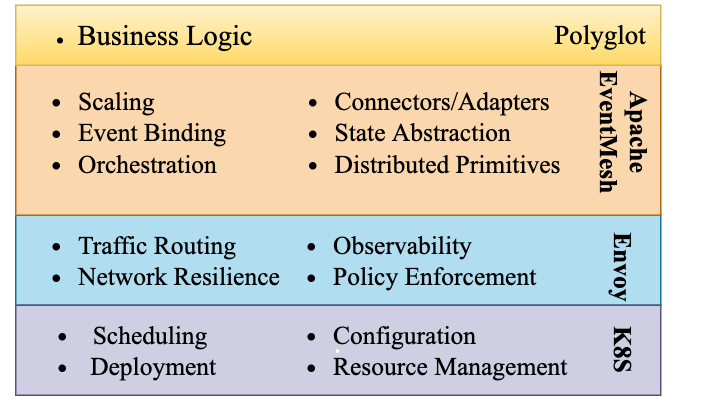

# Apache EventMesh (incubating)

[点我查看中文版](README.zh-CN.md)

## What is EventMesh?
EventMesh(incubating) is a dynamic cloud-native eventing infrastruture used to decouple the application and backend middleware layer, which supports a wide range of use cases that encompass complex multi-cloud, widely distributed topologies using diverse technology stacks.

**EventMesh Ecosystem:**

**EventMesh Architecture:**

**EventMesh Cloud Native:**

**Support connecting event store:**

* [RocketMQ](https://github.com/apache/rocketmq):RocketMQ is a distributed messaging and streaming platform with low latency, high performance and reliability, trillion-level capacity and flexible scalability.

**Components:**

* **eventmesh-runtime** : an middleware to transmit events between event producers and consumers, support cloud native apps and microservices.
* **eventmesh-sdk-java** : currently supports HTTP and TCP protocols.
* **eventmesh-connector-rocketmq** : an implementation based on OpenMessaging Connector Interface, pub event to or sub event from RocketMQ Event Store.

**Protocol:**

The protocol of eventmesh is easier and more convenient, you can read more [here](docs/en/instructions/eventmesh-runtime-protocol.md)

## RoadMap
| version | feature |
| ----    | ----    |
| v1.0.0  |Support java-sdk , tcp pub/sub, http pub|
| v1.1.0  |Support RocketMQ as eventstore|
| v1.1.1  |Support https|
| v1.2.0  |Support OpenMessaging API，support Plug-in architecture, support http sub, support cloud native deploy|
| V1.3.0  |Support CloudEvents, Event Streaming|
|         |Support Event function,triggers and bindings|
|         |Support Event orchestration, Servelss workflow|
|         |Support Event transaction|
|         |Support Event schema|
|         |Support Event governance, dashboard|
|         |Support Event security|
|         |Support multi language SDK(c\go\python\wasm)|
|         |Support Promethus as metrics|
|         |Support Skywalking as tracing|
|         |Support streaming event store|
|         |Support gRPC protocol|
|         |Support MQTT protocol|

## Quick Start
1. Build and deploy event-store(default RocketMQ), see [instruction](https://rocketmq.apache.org/docs/quick-start/).
2. Build and deploy eventmesh-runtime, see instruction ['eventmesh-runtime quickstart'](docs/en/instructions/eventmesh-runtime-quickstart.md).
3. Run eventmesh-sdk-java demo, see instruction ['eventmesh-sdk-java quickstart'](docs/en/instructions/eventmesh-sdk-java-quickstart.md).

## Contributing
Contributions are always welcomed! Please see [CONTRIBUTING](CONTRIBUTING.md) for detailed guidelines.

You can start with the issues labeled with good first issue.
[GitHub Issues](https://github.com/apache/incubator-eventmesh/issues)

## License
[Apache License, Version 2.0](http://www.apache.org/licenses/LICENSE-2.0.html) Copyright (C) Apache Software Foundation.

## Community
WeChat group：

Mailing Lists:

| Name | Description |Subscribe	|Unsubscribe|Archive
| ----    | ----    |----    | ----    | ----    |
|Users	|User support and questions mailing list|	[Subscribe](mailto:users-subscribe@eventmesh.incubator.apache.org)	|[Unsubscribe](mailto:users-unsubscribe@eventmesh.incubator.apache.org)	|[Mail Archives](https://lists.apache.org/list.html?users@eventmesh.apache.org)|
|Development	|Development related discussions|	[Subscribe](mailto:dev-subscribe@eventmesh.incubator.apache.org)	|[Unsubscribe](mailto:dev-unsubscribe@eventmesh.incubator.apache.org)	|[Mail Archives](https://lists.apache.org/list.html?dev@eventmesh.apache.org)|
|Commits	|All commits to repositories|	[Subscribe](mailto:commits-subscribe@eventmesh.incubator.apache.org)	|[Unsubscribe](mailto:commits-unsubscribe@eventmesh.incubator.apache.org)	|[Mail Archives](https://lists.apache.org/list.html?commits@eventmesh.apache.org)|
