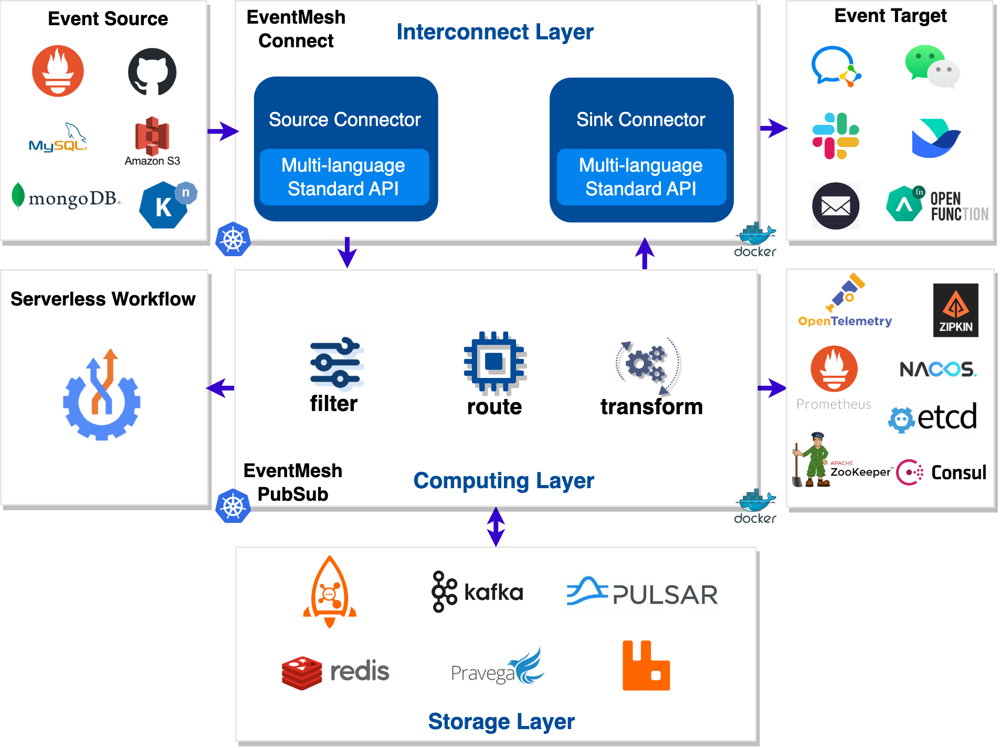
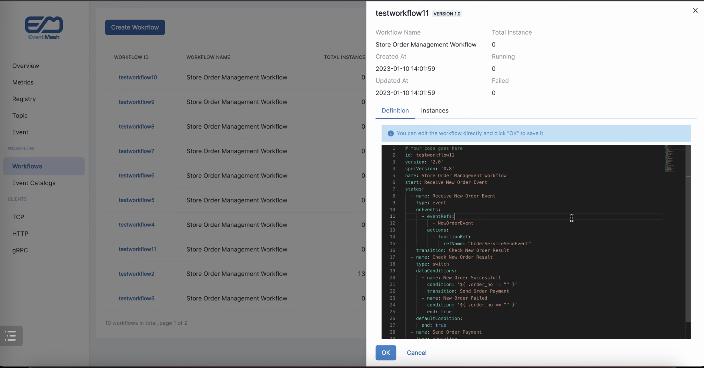

<div align="center">

<br /><br />

<br />

[](https://github.com/apache/eventmesh/actions/workflows/ci.yml)
[](https://codecov.io/gh/apache/eventmesh)
[](https://lgtm.com/projects/g/apache/eventmesh/context:java)
[](https://lgtm.com/projects/g/apache/eventmesh/alerts/)

[](https://www.apache.org/licenses/LICENSE-2.0.html)
[](https://github.com/apache/eventmesh/releases)
[](https://join.slack.com/t/the-asf/shared_invite/zt-1y375qcox-UW1898e4kZE_pqrNsrBM2g)
  

[📦 Documentation](https://eventmesh.apache.org/docs/introduction) |
[📔 Examples](https://github.com/apache/eventmesh/tree/master/eventmesh-examples) |
[⚙️ Roadmap](https://eventmesh.apache.org/docs/roadmap) |
[🌐 简体中文](README.zh-CN.md)
</div>


# Apache EventMesh

**Apache EventMesh** is a new generation serverless event middleware for building distributed [event-driven](https://en.wikipedia.org/wiki/Event-driven_architecture) applications.

### EventMesh Architecture



### EventMesh Dashboard



## Features

Apache EventMesh has a vast amount of features to help users achieve their goals. Let us share with you some of the key features EventMesh has to offer:

- Built around the [CloudEvents](https://cloudevents.io) specification.
- Rapidty extendsible interconnector layer [connectors](https://github.com/apache/eventmesh/tree/master/eventmesh-connectors) using [openConnect](https://github.com/apache/eventmesh/tree/master/eventmesh-openconnect) such as the source or sink of Saas, CloudService, and Database etc.
- Rapidty extendsible storage layer such as [Apache RocketMQ](https://rocketmq.apache.org), [Apache Kafka](https://kafka.apache.org), [Apache Pulsar](https://pulsar.apache.org), [RabbitMQ](https://rabbitmq.com), [Redis](https://redis.io).
- Rapidty extendsible meta such as [Consul](https://consulproject.org/en/), [Nacos](https://nacos.io), [ETCD](https://etcd.io) and [Zookeeper](https://zookeeper.apache.org/).
- Guaranteed at-least-once delivery.
- Deliver events between multiple EventMesh deployments.
- Event schema management by catalog service.
- Powerful event orchestration by [Serverless workflow](https://serverlessworkflow.io/) engine.
- Powerful event filtering and transformation.
- Rapid, seamless scalability.
- Easy Function develop and framework integration.

## Roadmap

Please go to the [roadmap](https://eventmesh.apache.org/docs/roadmap) to get the release history and new features of Apache EventMesh.

## Subprojects

- [EventMesh-site](https://github.com/apache/eventmesh-site): Apache official website resources for EventMesh.
- [EventMesh-workflow](https://github.com/apache/eventmesh-workflow): Serverless workflow runtime for event Orchestration on EventMesh.
- [EventMesh-dashboard](https://github.com/apache/eventmesh-dashboard): Operation and maintenance console of EventMesh.
- [EventMesh-catalog](https://github.com/apache/eventmesh-catalog): Catalog service for event schema management using AsyncAPI.
- [EventMesh-go](https://github.com/apache/eventmesh-go): A go implementation for EventMesh runtime.

## Quick start

This section of the guide will show you the steps to deploy EventMesh from [Local](#run-eventmesh-runtime-locally), [Docker](#run-eventmesh-runtime-in-docker), [K8s](#run-eventmesh-runtime-in-kubernetes).  

This section guide is just to help you quickly get started with EventMesh deployment, start EventMesh according to the default configuration, if you need more detailed EventMesh deployment steps, please visit the [EventMesh official document](https://eventmesh.apache.org/docs/next/introduction).

### Deployment Event Store

> EventMesh supports [multiple Event Stores](https://eventmesh.apache.org/docs/roadmap#event-store-implementation-status), the default storage mode is ' standalone ', and does not rely on other event stores as layers.
> 
> If you are in a non ' standalone ' mode, you need to deploy the required Event Store first, using `rocketmq` mode as an example: Deploy [RocketMQ](https://rocketmq.apache.org/docs/quickStart/01quickstart/).

### Run EventMesh Runtime locally

#### 1. Download EventMesh

Download the latest version of the Binary Distribution from the [EventMesh Download](https://eventmesh.apache.org/download/) page and extract it:

```shell
wget https://dlcdn.apache.org/eventmesh/1.10.0/apache-eventmesh-1.10.0-bin.tar.gz
tar -xvzf apache-eventmesh-1.10.0-bin.tar.gz
cd apache-eventmesh-1.10.0
```

#### 2. Run EventMesh

Execute the `start.sh` script to start the EventMesh Runtime server.

```shell
bash bin/start.sh
```

View the output log:

```shell
tail -n 50 -f logs/eventmesh.out
```

When the log output shows server `state:RUNNING`, it means EventMesh Runtime has started successfully.

You can stop the run with the following command:

```shell
bash bin/stop.sh
```

When the script prints `shutdown server ok!`, it means EventMesh Runtime has stopped.

### Run EventMesh Runtime in Docker

#### 1. Pull EventMesh Image

Use the following command line to download the latest version of [EventMesh](https://hub.docker.com/r/apache/eventmesh):

```shell
sudo docker pull apache/eventmesh:latest
```

#### 2. Run and Manage EventMesh Container

Run an EventMesh container from the `apache/eventmesh` image with the `docker run` command.

- The `-p` option of the command binds the container port with the host machine port.

Use the following command to start the EventMesh container:

```shell
sudo docker run -d --name eventmesh -p 10000:10000 -p 10105:10105 -p 10205:10205 -p 10106:10106 -t apache/eventmesh:latest
```

The `docker ps` command lists the details (id, name, status, etc.) of the running containers. The container id is the unique identifier of the container.

```shell
$ sudo docker ps
CONTAINER ID   IMAGE                     COMMAND               CREATED         STATUS         PORTS                                                                                      NAMES
9c08130ee797   apache/eventmesh:latest   "bash bin/start.sh"   9 seconds ago   Up 8 seconds   0.0.0.0:10000->10000/tcp, 0.0.0.0:10105-10106->10105-10106/tcp, 0.0.0.0:10205->10205/tcp   eventmesh
```

Enter the container (replace `eventmesh` with the container name or ID you specified):

```shell
sudo docker exec -it eventmesh /bin/bash
```

To view the log of the EventMesh container:

```shell
cd logs
tail -n 50 -f eventmesh.out
```

### Run EventMesh Runtime in Kubernetes

#### 1. Deploy operator

Run the following commands(To delete a deployment, simply replace `deploy` with `undeploy`):

```shell
$ cd eventmesh-operator && make deploy
```

Run `kubectl get pods` 、`kubectl get crd | grep eventmesh-operator.eventmesh`to see the status of the deployed eventmesh-operator.

```shell
$ kubectl get pods
NAME                                  READY   STATUS    RESTARTS   AGE
eventmesh-operator-59c59f4f7b-nmmlm   1/1     Running   0          20s

$ kubectl get crd | grep eventmesh-operator.eventmesh
connectors.eventmesh-operator.eventmesh   2024-01-10T02:40:27Z
runtimes.eventmesh-operator.eventmesh     2024-01-10T02:40:27Z
```

#### 2. Deploy EventMesh Runtime

Execute the following command to deploy runtime, connector-rocketmq (To delete, simply replace `create` with `delete`):  

```shell
$ make create
```

Run `kubectl get pods` to see if the deployment was successful.

```shell
NAME                                  READY   STATUS    RESTARTS   AGE
connector-rocketmq-0                  1/1     Running   0          9s
eventmesh-operator-59c59f4f7b-nmmlm   1/1     Running   0          3m12s
eventmesh-runtime-0-a-0               1/1     Running   0          15s
```

## Contributing

Each contributor has played an important role in promoting the robust development of Apache EventMesh. We sincerely appreciate all contributors who have contributed code and documents.

- [Contributing Guideline](https://eventmesh.apache.org/community/contribute/contribute)
- [Good First Issues](https://github.com/apache/eventmesh/issues?q=is%3Aopen+is%3Aissue+label%3A%22good+first+issue%22)

Here is the [List of Contributors](https://github.com/apache/eventmesh/graphs/contributors), thank you all! :)

<a href="https://github.com/apache/eventmesh/graphs/contributors">
  
</a>


## CNCF Landscape

<div align="center">


Apache EventMesh enriches the <a href="https://landscape.cncf.io/serverless?license=apache-license-2-0">CNCF Cloud Native Landscape.</a>

</div>

## License

Apache EventMesh is licensed under the [Apache License, Version 2.0](http://www.apache.org/licenses/LICENSE-2.0.html).

## Community

| WeChat Assistant                                        | WeChat Public Account                                  | Slack                                                                                                                                               |
|---------------------------------------------------------|--------------------------------------------------------|-----------------------------------------------------------------------------------------------------------------------------------------------------|
|  |  | [Join Slack Chat](https://join.slack.com/t/the-asf/shared_invite/zt-1y375qcox-UW1898e4kZE_pqrNsrBM2g)(Please open an issue if this link is expired) |

Bi-weekly meeting : [#Tencent meeting](https://meeting.tencent.com/dm/wes6Erb9ioVV) : 346-6926-0133

Bi-weekly meeting record : [bilibili](https://space.bilibili.com/1057662180)

### Mailing List

| Name        | Description                                             | Subscribe                                                  | Unsubscribe                                                    | Archive                                                                          |
|-------------|---------------------------------------------------------|------------------------------------------------------------|----------------------------------------------------------------|----------------------------------------------------------------------------------|
| Users       | User discussion                                         | [Subscribe](mailto:users-subscribe@eventmesh.apache.org)   | [Unsubscribe](mailto:users-unsubscribe@eventmesh.apache.org)   | [Mail Archives](https://lists.apache.org/list.html?users@eventmesh.apache.org)   |
| Development | Development discussion (Design Documents, Issues, etc.) | [Subscribe](mailto:dev-subscribe@eventmesh.apache.org)     | [Unsubscribe](mailto:dev-unsubscribe@eventmesh.apache.org)     | [Mail Archives](https://lists.apache.org/list.html?dev@eventmesh.apache.org)     |
| Commits     | Commits to related repositories                         | [Subscribe](mailto:commits-subscribe@eventmesh.apache.org) | [Unsubscribe](mailto:commits-unsubscribe@eventmesh.apache.org) | [Mail Archives](https://lists.apache.org/list.html?commits@eventmesh.apache.org) |
| Issues      | Issues or PRs comments and reviews                      | [Subscribe](mailto:issues-subscribe@eventmesh.apache.org)  | [Unsubscribe](mailto:issues-unsubscribe@eventmesh.apache.org)  | [Mail Archives](https://lists.apache.org/list.html?issues@eventmesh.apache.org)  |
