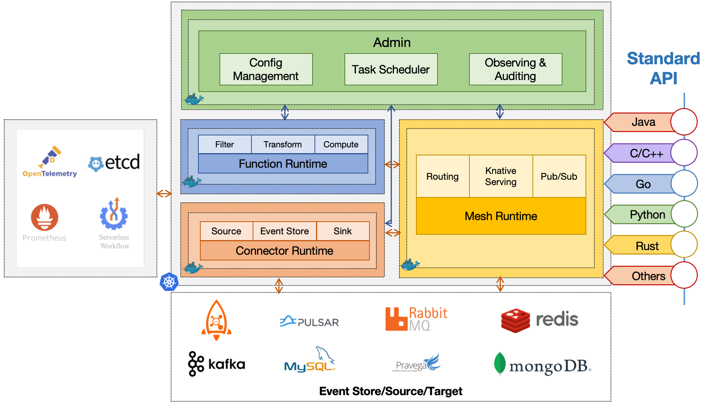

<div align="center">

<br /><br />

<br />

[](https://github.com/apache/eventmesh/actions/workflows/ci.yml)
[](https://codecov.io/gh/apache/eventmesh)
[](https://lgtm.com/projects/g/apache/eventmesh/context:java)
[](https://lgtm.com/projects/g/apache/eventmesh/alerts/)

[](https://www.apache.org/licenses/LICENSE-2.0.html)
[](https://github.com/apache/eventmesh/releases)
[](https://join.slack.com/t/the-asf/shared_invite/zt-1y375qcox-UW1898e4kZE_pqrNsrBM2g)
  

[📦 Documentation](https://eventmesh.apache.org/docs/introduction) |
[📔 Examples](https://github.com/apache/eventmesh/tree/master/eventmesh-examples) |
[⚙️ Roadmap](https://eventmesh.apache.org/docs/roadmap) |
[🌐 简体中文](README.zh-CN.md)
</div>


# Apache EventMesh

**Apache EventMesh** is a new generation serverless event middleware for building distributed [event-driven](https://en.wikipedia.org/wiki/Event-driven_architecture) applications.

### EventMesh Architecture



### EventMesh K8S deployment


## Features

Apache EventMesh has a vast amount of features to help users achieve their goals. Let us share with you some of the key features EventMesh has to offer:

- Built around the [CloudEvents](https://cloudevents.io) specification.
- Rapidty extendsible interconnector layer [connectors](https://github.com/apache/eventmesh/tree/master/eventmesh-connectors) using [openConnect](https://github.com/apache/eventmesh/tree/master/eventmesh-openconnect) such as the source or sink of Saas, CloudService, and Database etc.
- Rapidty extendsible storage layer such as [Apache RocketMQ](https://rocketmq.apache.org), [Apache Kafka](https://kafka.apache.org), [Apache Pulsar](https://pulsar.apache.org), [RabbitMQ](https://rabbitmq.com), [Redis](https://redis.io).
- Rapidty extendsible meta such as [Consul](https://consulproject.org/en/), [Nacos](https://nacos.io), [ETCD](https://etcd.io) and [Zookeeper](https://zookeeper.apache.org/).
- Guaranteed at-least-once delivery.
- Deliver events between multiple EventMesh deployments.
- Event schema management by catalog service.
- Powerful event orchestration by [Serverless workflow](https://serverlessworkflow.io/) engine.
- Powerful event filtering and transformation.
- Rapid, seamless scalability.
- Easy Function develop and framework integration.

## Roadmap

Please go to the [roadmap](https://eventmesh.apache.org/docs/roadmap) to get the release history and new features of Apache EventMesh.

## Subprojects

- [EventMesh-site](https://github.com/apache/eventmesh-site): Apache official website resources for EventMesh.
- [EventMesh-workflow](https://github.com/apache/eventmesh-workflow): Serverless workflow runtime for event Orchestration on EventMesh.
- [EventMesh-dashboard](https://github.com/apache/eventmesh-dashboard): Operation and maintenance console of EventMesh.
- [EventMesh-catalog](https://github.com/apache/eventmesh-catalog): Catalog service for event schema management using AsyncAPI.
- [EventMesh-go](https://github.com/apache/eventmesh-go): A go implementation for EventMesh runtime.

## Quick start

This section of the guide will show you the steps to deploy EventMesh from [Local](#run-eventmesh-runtime-locally), [Docker](#run-eventmesh-runtime-in-docker), [K8s](#run-eventmesh-runtime-in-kubernetes).  

This section guides the launch of EventMesh according to the default configuration, if you need more detailed EventMesh deployment steps, please visit the [EventMesh official document](https://eventmesh.apache.org/docs/introduction).

#### 1. Pull EventMesh Image

Use the following command line to download the latest version of [EventMesh](https://hub.docker.com/r/apache/eventmesh):

```shell
sudo docker pull apache/eventmesh:latest
```

#### 2. Run EventMesh Runtime

Use the following command to start the EventMesh container:

```shell
sudo docker run -d --name eventmesh -p 10000:10000 -p 10105:10105 -p 10205:10205 -p 10106:10106 -t apache/eventmesh:latest
```
#### 3. Creating Topics
Creating a topic is the first step in using EventMesh. You need to send an HTTP POST request to create a topic.
Example Request
```shell
POST /eventmesh/topic/create HTTP/1.1  
Host: localhost:10105  
Content-Type: application/json  
  
{  
  "topic": "example-topic"  
}
```
#### 4. Subscribing to Topics
After creating a topic, you can subscribe to it to receive messages. EventMesh provides two subscription methods: local subscription and remote subscription.

```shell
POST /eventmesh/subscribe/local HTTP/1.1  
Host: localhost:10105  
Content-Type: application/json  
{  
  "url": "http://localhost:8080/callback",  
  "consumerGroup": "example-consumer-group",  
  "topic": [  
    {  
      "topic": "example-topic",  
      "mode": "CLUSTERING",  
      "type": "SYNC"  
    }  
  ]  
}
```
#### 5. Sending Messages
EventMesh provides multiple message sending methods, including asynchronous sending, synchronous sending, and batch sending.
```shell
POST /eventmesh/publish HTTP/1.1  
Host: localhost:10105  
Content-Type: application/json    
eventmesh-message-topic: example-topic 
{  
  "content": "Hello, EventMesh!"  
}
```
#### 6. Unsubscribing
When you no longer need to receive messages for a topic, you can unsubscribe.
```shell
POST /eventmesh/unsubscribe/local HTTP/1.1  
Host: localhost:10105  
Content-Type: application/json  
{  
  "url": "http://localhost:8080/callback",  
  "consumerGroup": "example-consumer-group",  
  "topics": ["example-topic"]  
}
```
## Contributing

[](https://github.com/apache/eventmesh/issues?q=is%3Aopen+is%3Aissue+label%3A%22good+first+issue%22) [](https://github.com/apache/eventmesh/issues?q=is%3Aopen+is%3Aissue+label%3A%22help+wanted%22) [](https://github.com/apache/eventmesh/pulls?q=is%3Aopen+is%3Aissue+label%3A%22help+wanted%22) [](https://github.com/apache/eventmesh/issues?q=is%3Aopen)

Each contributor has played an important role in promoting the robust development of Apache EventMesh. We sincerely appreciate all contributors who have contributed code and documents.

- [Contributing Guideline](https://eventmesh.apache.org/community/contribute/contribute)
- [Good First Issues](https://github.com/apache/eventmesh/issues?q=is%3Aopen+is%3Aissue+label%3A%22good+first+issue%22)


## CNCF Landscape

<div align="center">


Apache EventMesh enriches the <a href="https://landscape.cncf.io/embed/embed.html?base-path=&key=serverless--framework&headers=true&category-header=true&category-in-subcategory=false&title-uppercase=false&title-alignment=left&title-font-family=sans-serif&title-font-size=13&style=shadowed&bg-color=%233e79b0&fg-color=%23ffffff&item-modal=false&item-name=false&size=md&items-alignment=left" style="width:100%;height:100%;display:block;border:none;">CNCF Cloud Native Landscape.</a>

</div>

## License

Apache EventMesh is licensed under the [Apache License, Version 2.0](http://www.apache.org/licenses/LICENSE-2.0.html).

## Community

| WeChat Assistant                                        | WeChat Public Account                                  | Slack                                                                                                                                               |
|---------------------------------------------------------|--------------------------------------------------------|-----------------------------------------------------------------------------------------------------------------------------------------------------|
|  |  | [Join Slack Chat](https://join.slack.com/t/the-asf/shared_invite/zt-1y375qcox-UW1898e4kZE_pqrNsrBM2g)(Please open an issue if this link is expired) |

Bi-weekly meeting : [#Tencent meeting](https://meeting.tencent.com/dm/wes6Erb9ioVV) : 346-6926-0133

Bi-weekly meeting record : [bilibili](https://space.bilibili.com/1057662180)

### Mailing List

| Name        | Description                                             | Subscribe                                                  | Unsubscribe                                                    | Archive                                                                          |
|-------------|---------------------------------------------------------|------------------------------------------------------------|----------------------------------------------------------------|----------------------------------------------------------------------------------|
| Users       | User discussion                                         | [Subscribe](mailto:users-subscribe@eventmesh.apache.org)   | [Unsubscribe](mailto:users-unsubscribe@eventmesh.apache.org)   | [Mail Archives](https://lists.apache.org/list.html?users@eventmesh.apache.org)   |
| Development | Development discussion (Design Documents, Issues, etc.) | [Subscribe](mailto:dev-subscribe@eventmesh.apache.org)     | [Unsubscribe](mailto:dev-unsubscribe@eventmesh.apache.org)     | [Mail Archives](https://lists.apache.org/list.html?dev@eventmesh.apache.org)     |
| Commits     | Commits to related repositories                         | [Subscribe](mailto:commits-subscribe@eventmesh.apache.org) | [Unsubscribe](mailto:commits-unsubscribe@eventmesh.apache.org) | [Mail Archives](https://lists.apache.org/list.html?commits@eventmesh.apache.org) |
| Issues      | Issues or PRs comments and reviews                      | [Subscribe](mailto:issues-subscribe@eventmesh.apache.org)  | [Unsubscribe](mailto:issues-unsubscribe@eventmesh.apache.org)  | [Mail Archives](https://lists.apache.org/list.html?issues@eventmesh.apache.org)  |
