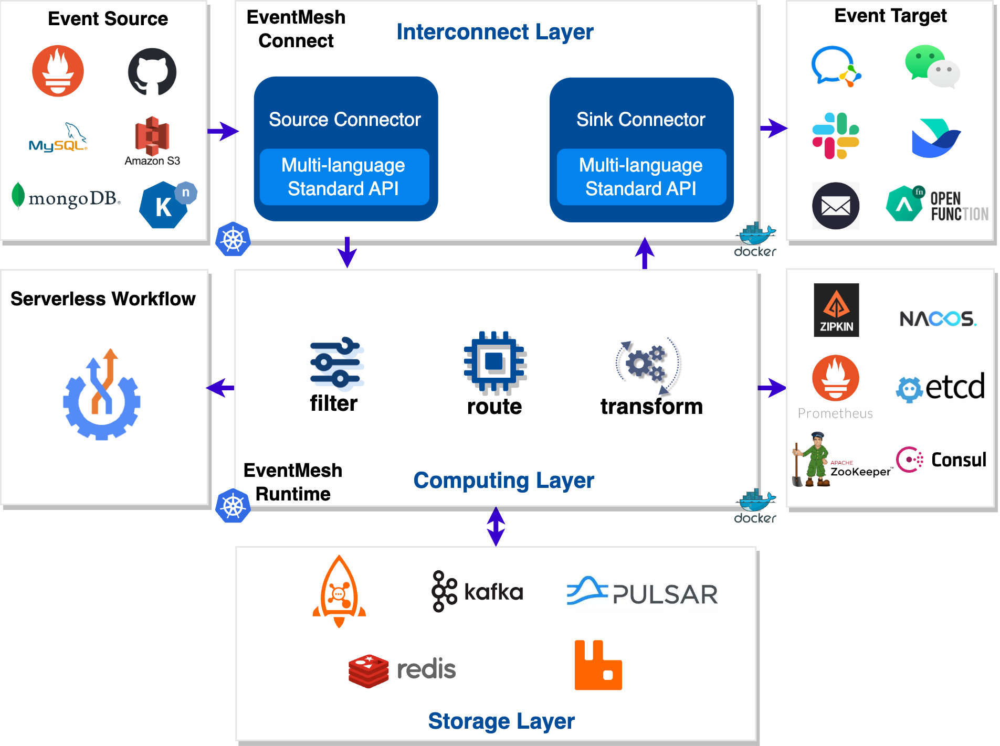

<div align="center">

<br /><br />

<br />

[](https://github.com/apache/eventmesh/actions/workflows/ci.yml)
[](https://codecov.io/gh/apache/eventmesh)
[](https://lgtm.com/projects/g/apache/eventmesh/context:java)
[](https://lgtm.com/projects/g/apache/eventmesh/alerts/)

[](https://www.apache.org/licenses/LICENSE-2.0.html)
[](https://github.com/apache/eventmesh/releases)
[](https://join.slack.com/t/the-asf/shared_invite/zt-1y375qcox-UW1898e4kZE_pqrNsrBM2g)
  

[📦 Documentation](https://eventmesh.apache.org/docs/introduction) |
[📔 Examples](https://github.com/apache/eventmesh/tree/master/eventmesh-examples) |
[⚙️ Roadmap](https://eventmesh.apache.org/docs/roadmap) |
[🌐 简体中文](README.zh-CN.md)
</div>


# Apache EventMesh

**Apache EventMesh** is a new generation serverless event middleware for building distributed [event-driven](https://en.wikipedia.org/wiki/Event-driven_architecture) applications.

### EventMesh Architecture



### EventMesh Dashboard


## Features

Apache EventMesh has a vast amount of features to help users achieve their goals. Let us share with you some of the key features EventMesh has to offer:

- Built around the [CloudEvents](https://cloudevents.io) specification.
- Rapidty extendsible interconnector layer [connectors](https://github.com/apache/eventmesh/tree/master/eventmesh-connectors) using [openConnect](https://github.com/apache/eventmesh/tree/master/eventmesh-openconnect) such as the source or sink of Saas, CloudService, and Database etc.
- Rapidty extendsible storage layer such as [Apache RocketMQ](https://rocketmq.apache.org), [Apache Kafka](https://kafka.apache.org), [Apache Pulsar](https://pulsar.apache.org), [RabbitMQ](https://rabbitmq.com), [Redis](https://redis.io).
- Rapidty extendsible meta such as [Consul](https://consulproject.org/en/), [Nacos](https://nacos.io), [ETCD](https://etcd.io) and [Zookeeper](https://zookeeper.apache.org/).
- Guaranteed at-least-once delivery.
- Deliver events between multiple EventMesh deployments.
- Event schema management by catalog service.
- Powerful event orchestration by [Serverless workflow](https://serverlessworkflow.io/) engine.
- Powerful event filtering and transformation.
- Rapid, seamless scalability.
- Easy Function develop and framework integration.

## Roadmap
Please go to the [roadmap](https://eventmesh.apache.org/docs/roadmap) to get the release history and new features of Apache EventMesh.

## Subprojects
- [EventMesh-site](https://github.com/apache/eventmesh-site): Apache official website resources for EventMesh.
- [EventMesh-workflow](https://github.com/apache/eventmesh-workflow): Serverless workflow runtime for event Orchestration on EventMesh.
- [EventMesh-dashboard](https://github.com/apache/eventmesh-dashboard): Operation and maintenance console of EventMesh.
- [EventMesh-catalog](https://github.com/apache/eventmesh-catalog): Catalog service for event schema management using AsyncAPI.
- [EventMesh-go](https://github.com/apache/eventmesh-go): A go implementation for EventMesh runtime.

## Quick start

This section of the guide will show you the steps to deploy EventMesh from [local](#run-eventmesh-runtime-locally), [docker](#run-eventmesh-runtime-in-docker), [k8s](#run-eventmesh-runtime-in-kubernetes).  

This section guide is just to help you quickly get started with EventMesh deployment. Start EventMesh according to the default configuration. If you need more detailed EventMesh deployment steps, please visit the [EventMesh official document](https://eventmesh.apache.org/docs/next/introduction).

### Deployment EventMesh Store

> EventMesh now supports `standalone`, `RocketMQ`, `Kafka` and other middleware as a storage.      
> If you are in non-`standalone` mode, you need to deploy the required `store` first, using `rocketmq` mode as an example: Deploy [RocketMQ](https://rocketmq.apache.org/docs/quickStart/01quickstart/).  

### Run EventMesh Runtime locally

Please check the JKD version before you start, you need to install Java 8.  
```
$ java -version
java version "1.8.0_311"
```

#### 1.Download EventMesh:

Download and extract the executable binaries of the latest release from[EventMesh download](https://eventmesh.apache.org/download/).For example, with the current latest version, you will get `apache-eventmesh-1.10.0.tar.gz`.
```
tar -xvzf apache-eventmesh-1.10.0-bin.tar.gz
cd apache-eventmesh-1.10.0
```

#### 2.Run EventMesh: 

Edit the `eventmesh.properties` to change the configuration (e.g. TCP port, client blacklist) of EventMesh Runtime. The executable binaries contain all plugins in the bundle, thus there's no need to build them from source code.
```
vim conf/eventmesh.properties
```

Specify RocketMQ as Event Store(The default is standalone.):
```
# storage plugin
eventMesh.storage.plugin.type=rocketmq
```

Execute the `start.sh` script to start the EventMesh Runtime server.
```
bash bin/start.sh
```
If you see `EventMeshTCPServer[port=10000] started....`, then the setup was successful.

View the output log:
```
cd /root/apache-eventmesh-1.10.0/logs
tail -f eventmesh.out
```

You can stop the run with the following command:
```
bash bin/stop.sh
```

### Run EventMesh Runtime in Docker

#### 1.Pull EventMesh Image  

Download the pre-built image of [eventmesh](https://hub.docker.com/r/apache/eventmesh) from Docker Hub with docker pull:
```
sudo docker pull apache/eventmesh:latest
```

To verify that the apache/eventmesh image is successfully installed, list the downloaded images with docker images:
```
$ sudo docker images
REPOSITORY         TAG       IMAGE ID       CREATED      SIZE
apache/eventmesh   latest    f32f9e5e4694   2 days ago   917MB
```

#### 2.Edit Configuration:

Edit the `eventmesh.properties` to change the configuration (e.g. TCP port, client blacklist) of EventMesh Runtime. To integrate RocketMQ as a connector, these two configuration files should be created: `eventmesh.properties` and `rocketmq-client.properties`.
```
sudo mkdir -p /data/eventmesh/rocketmq/conf
cd /data/eventmesh/rocketmq/conf
sudo touch eventmesh.properties
sudo touch rocketmq-client.properties
```

#### 3.Configure `eventmesh.properties`

The `eventmesh.properties` file contains the properties of EventMesh Runtime environment and integrated plugins.Please refer to the [default configuration file](https://github.com/apache/eventmesh/blob/1.10.0-prepare/eventmesh-runtime/conf/eventmesh.properties) for the available configuration keys.
```
sudo vim eventmesh.properties
``` 

Specify RocketMQ as Event Store(The default is standalone):
```
# storage plugin
eventMesh.storage.plugin.type=rocketmq
```

Please check if the default port in the configuration file is occupied, if it is occupied please change it to an unoccupied port:

| Configuration Key                  | Default Value | Description                  |   
|------------------------------------|---------------|------------------------------|  
| `eventMesh.server.http.port`       | `10105`       | `EventMesh http server port` |  
| `eventMesh.server.tcp.port`        | `10000`       | `EventMesh tcp server port`  | 
| `eventMesh.server.grpc.port`       | `10205`       | `EventMesh grpc server port` | 
| `eventMesh.server.admin.http.port` | `10106`       | `HTTP management port`       | 

#### 4.Configure `rocketmq-client.properties`

The `rocketmq-client.properties` file contains the properties of the Apache RocketMQ nameserver.

```
sudo vim rocketmq-client.properties
```
Please refer to the [default configuration file](https://github.com/apache/eventmesh/blob/1.10.0-prepare/eventmesh-storage-plugin/eventmesh-storage-rocketmq/src/main/resources/rocketmq-client.properties) and change the value of eventMesh.server.rocketmq.namesrvAddr to the nameserver address of RocketMQ.
> Note that if the `nameserver` address you are running is not the default in the configuration file, change it to the `nameserver` address that is actually running.

Please check if the `default namesrvAddr` in the configuration file is occupied, if it is occupied please change it to an unoccupied address:

| Configuration Key	                      | Default Value	                  | Description                        |   
|-----------------------------------------|---------------------------------|------------------------------------|  
| `eventMesh.server.rocketmq.namesrvAddr` | `127.0.0.1:9876;127.0.0.1:9876` | `RocketMQ namesrv default address` |

#### 5.Run and Manage EventMesh Container

Run an EventMesh container from the `apache/eventmesh` image with the `docker run` command.
- The `-p` option of the command binds the container port with the host machine port.
- The `-v` option of the command mounts the configuration files from files in the host machine.

```
sudo docker run -d --name eventmesh \
    -p 10000:10000 -p 10105:10105 -p 10205:10205 -p 10106:10106 \
    -v /data/eventmesh/rocketmq/conf/eventMesh.properties:/data/app/eventmesh/conf/eventMesh.properties \
    -v /data/eventmesh/rocketmq/conf/rocketmq-client.properties:/data/app/eventmesh/conf/rocketmq-client.properties \
    apache/eventmesh:latest
```

The docker ps command lists the details (id, name, status, etc.) of the running containers. The container id is the unique identifier of the container.
```
$ sudo docker ps
CONTAINER ID   IMAGE                        COMMAND                  CREATED         STATUS         PORTS                                                                                                                                                                 NAMES
5bb6b6092672   apache/eventmesh:latest      "/bin/sh -c 'sh star…"   6 seconds ago   Up 3 seconds   0.0.0.0:10000->10000/tcp, :::10000->10000/tcp, 0.0.0.0:10105-10106->10105-10106/tcp, :::10105-10106->10105-10106/tcp, 0.0.0.0:10205->10205/tcp, :::10205->10205/tcp   eventmesh
```

To read the log of the EventMesh container:
```
cd ../logs
tail -f eventmesh.out
```

### Run EventMesh Runtime in Kubernetes

#### 1.Deploy operator

Run the following commands(To delete a deployment, simply replace `deploy` with `undeploy`):
```
make deploy
```

Run `kubectl get pods` 、`kubectl get crd | grep eventmesh-operator.eventmesh`to see the status of the deployed eventmesh-operator.
```
$ kubectl get pods
NAME                                  READY   STATUS    RESTARTS   AGE
eventmesh-operator-59c59f4f7b-nmmlm   1/1     Running   0          20s

$ kubectl get crd | grep eventmesh-operator.eventmesh
connectors.eventmesh-operator.eventmesh   2024-01-10T02:40:27Z
runtimes.eventmesh-operator.eventmesh     2024-01-10T02:40:27Z
```

#### 2.Execute the following command to deploy runtime, connector(To delete, simply replace `create` with `delete`).  

```
make create
```

Run `kubectl get pods` to see if the deployment was successful.
```
NAME                                  READY   STATUS    RESTARTS   AGE
connector-rocketmq-0                  1/1     Running   0          9s
eventmesh-operator-59c59f4f7b-nmmlm   1/1     Running   0          3m12s
eventmesh-runtime-0-a-0               1/1     Running   0          15s
```

## Contributing

Each contributor has played an important role in promoting the robust development of Apache EventMesh. We sincerely appreciate all contributors who have contributed code and documents.

- [Contributing Guideline](https://eventmesh.apache.org/community/contribute/contribute)
- [Good First Issues](https://github.com/apache/eventmesh/issues?q=is%3Aopen+is%3Aissue+label%3A%22good+first+issue%22)

Here is the [List of Contributors](https://github.com/apache/eventmesh/graphs/contributors), thank you all! :)

<a href="https://github.com/apache/eventmesh/graphs/contributors">
  
</a>


## CNCF Landscape

<div align="center">


Apache EventMesh enriches the <a href="https://landscape.cncf.io/serverless?license=apache-license-2-0">CNCF Cloud Native Landscape.</a>

</div>

## License

Apache EventMesh is licensed under the [Apache License, Version 2.0](http://www.apache.org/licenses/LICENSE-2.0.html).

## Community

| WeChat Assistant                                        | WeChat Public Account                                  | Slack                                                                                                                                               |
|---------------------------------------------------------|--------------------------------------------------------|-----------------------------------------------------------------------------------------------------------------------------------------------------|
|  |  | [Join Slack Chat](https://join.slack.com/t/the-asf/shared_invite/zt-1y375qcox-UW1898e4kZE_pqrNsrBM2g)(Please open an issue if this link is expired) |

Bi-weekly meeting : [#Tencent meeting](https://meeting.tencent.com/dm/wes6Erb9ioVV) : 346-6926-0133

Bi-weekly meeting record : [bilibili](https://space.bilibili.com/1057662180)

### Mailing List

| Name        | Description                                             | Subscribe                                                  | Unsubscribe                                                    | Archive                                                                          |
|-------------|---------------------------------------------------------|------------------------------------------------------------|----------------------------------------------------------------|----------------------------------------------------------------------------------|
| Users       | User discussion                                         | [Subscribe](mailto:users-subscribe@eventmesh.apache.org)   | [Unsubscribe](mailto:users-unsubscribe@eventmesh.apache.org)   | [Mail Archives](https://lists.apache.org/list.html?users@eventmesh.apache.org)   |
| Development | Development discussion (Design Documents, Issues, etc.) | [Subscribe](mailto:dev-subscribe@eventmesh.apache.org)     | [Unsubscribe](mailto:dev-unsubscribe@eventmesh.apache.org)     | [Mail Archives](https://lists.apache.org/list.html?dev@eventmesh.apache.org)     |
| Commits     | Commits to related repositories                         | [Subscribe](mailto:commits-subscribe@eventmesh.apache.org) | [Unsubscribe](mailto:commits-unsubscribe@eventmesh.apache.org) | [Mail Archives](https://lists.apache.org/list.html?commits@eventmesh.apache.org) |
| Issues      | Issues or PRs comments and reviews                      | [Subscribe](mailto:issues-subscribe@eventmesh.apache.org)  | [Unsubscribe](mailto:issues-unsubscribe@eventmesh.apache.org)  | [Mail Archives](https://lists.apache.org/list.html?issues@eventmesh.apache.org)  |
