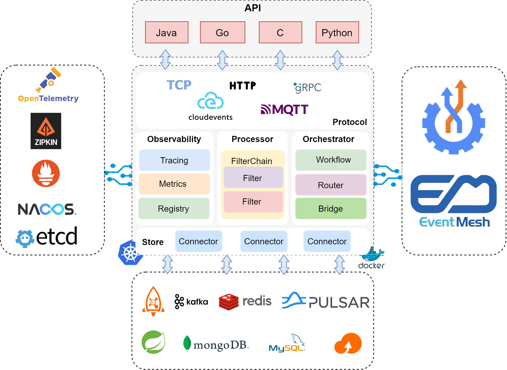
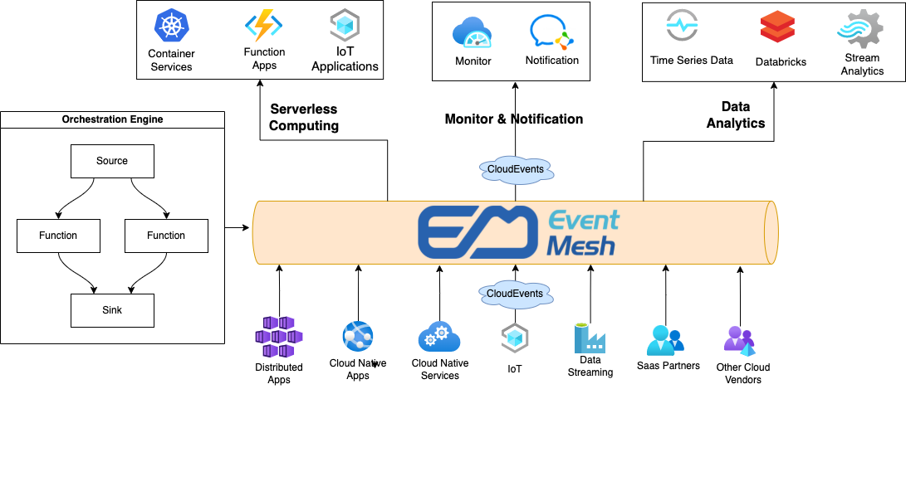
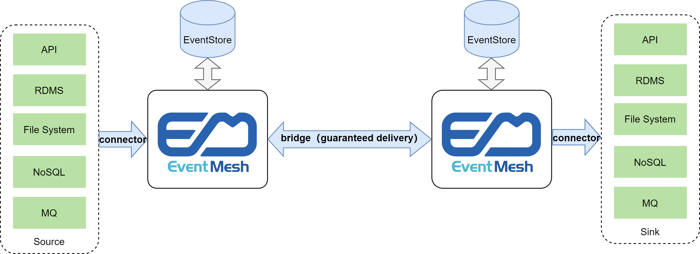

<div align="center">

<br /><br />

<br />

[](https://github.com/apache/incubator-eventmesh/actions/workflows/ci.yml)
[](https://codecov.io/gh/apache/incubator-eventmesh)
[](https://lgtm.com/projects/g/apache/incubator-eventmesh/context:java)
[](https://lgtm.com/projects/g/apache/incubator-eventmesh/alerts/)

[](https://www.apache.org/licenses/LICENSE-2.0.html)
[](https://github.com/apache/incubator-eventmesh/releases)
[](https://join.slack.com/t/apacheeventmesh/shared_invite/zt-16y1n77va-q~JepYy3RqpkygDYmQaQbw)

[📦 文档 (英文)](https://eventmesh.apache.org/docs/introduction) |
[📔 例子](https://github.com/apache/incubator-eventmesh/tree/master/eventmesh-examples) |
[⚙️ 路线图](https://eventmesh.apache.org/docs/roadmap) |
[🌐 简体中文](README.zh-CN.md)
</div>

# Apache EventMesh (Incubating)

**Apache EventMesh (Incubating)** 是一个用于解耦应用和后端中间件层的的动态云原生 [事件驱动](https://en.wikipedia.org/wiki/Event-driven_architecture) 架构基础设施。它支持广泛的用例，包括复杂的混合云、使用了不同技术栈的分布式架构。

## 特性

### 多运行时微服务架构



### 编排



### 数据网格



## 组件
 
**Apache EventMesh (Incubating)** 由多个组件组成，这些组件集成了不同的中间件和消息传输协议，以增强应用程序运行时的功能。

- **eventmesh-runtime**: 在生产者和消费者之间传输事件的中间件，它支持云原生应用程序和微服务。
- **eventmesh-sdk-java**: 支持 HTTP、HTTPS、TCP 和 [gRPC](https://grpc.io) 协议的 Java SDK。
- **eventmesh-connector-plugin**: 连接 [Apache Kafka](https://kafka.apache.org)、[Apache RocketMQ](https://rocketmq.apache.org)、[Apache Pulsar](https://pulsar.apache.org/)、[DeFiBus](https://github.com/webankfintech/DeFiBus) 和 [Redis](https://redis.io) 等中间件的插件集合。
- **eventmesh-registry-plugin**: 集成服务注册表的插件集合，如 [Nacos](https://nacos.io) 和 [etcd](https://etcd.io)。

- **eventmesh-security-plugin**: 实现安全机制的插件的集合，如 ACL（访问控制列表）、认证和授权。

- **eventmesh-protocol-plugin**: 实现消息传递协议的插件集合，如 [CloudEvents](https://cloudevents.io) 和 [MQTT](https://mqtt.org)。

- **eventmesh-admin**: 客户端管理、主题管理、订阅管理和其他管理。

## 下载

你可以在这个页面 [release page](https://eventmesh.apache.org/download) 获取所有的历史发布版本。

## 编译
你可以通过以下命令来编译EventMesh：
```shell
./gradlew clean dist
```
你可以在dist目录下找到生成的二进制jar包。

## 贡献这个项目

每一名贡献者都在这个项目的发展上都是至关重要的。我们真诚地感谢所有对代码和文档的贡献者！想要尝试贡献的可以看看以下三个链接。

- [贡献准则](https://eventmesh.apache.org/docs/contribute/contribute)
- [贡献者名单](https://github.com/apache/incubator-eventmesh/graphs/contributors)
- [值得新人尝试的 Issue](https://github.com/apache/incubator-eventmesh/issues?q=is%3Aopen+is%3Aissue+label%3A%22good+first+issue%22)

## CNCF Landscape

<div align="center">


Apache EventMesh (Incubating) enriches the <a href="https://landscape.cncf.io/serverless?license=apache-license-2-0">CNCF Cloud Native Landscape.</a>
</div>

## 开源授权

Apache EventMesh (Incubating) is licensed under the [Apache License, Version 2.0](http://www.apache.org/licenses/LICENSE-2.0.html).

## 社区

|微信小助手|微信公众号|Slack|
|-|-|-|
|||[加入 Slack](https://join.slack.com/t/apacheeventmesh/shared_invite/zt-16y1n77va-q~JepYy3RqpkygDYmQaQbw)|

### 邮件名单

| 列表名称 | 描述 |订阅 |取消订阅|邮件列表存档
| ----    | ----    |----    | ----    | ----    |
|用户 |用户支持与用户问题| [点击订阅](mailto:users-subscribe@eventmesh.incubator.apache.org) |[点击取消订阅](mailto:users-unsubscribe@eventmesh.incubator.apache.org) |[邮件列表存档](https://lists.apache.org/list.html?users@eventmesh.apache.org)|
|开发 |开发相关| [点击订阅](mailto:dev-subscribe@eventmesh.incubator.apache.org) |[点击取消订阅](mailto:dev-unsubscribe@eventmesh.incubator.apache.org) |[邮件列表存档](https://lists.apache.org/list.html?dev@eventmesh.apache.org)|
|Commits |所有与仓库相关的 commits 信息通知| [点击订阅](mailto:commits-subscribe@eventmesh.incubator.apache.org) |[点击取消订阅](mailto:commits-unsubscribe@eventmesh.incubator.apache.org) |[邮件列表存档](https://lists.apache.org/list.html?commits@eventmesh.apache.org)|
