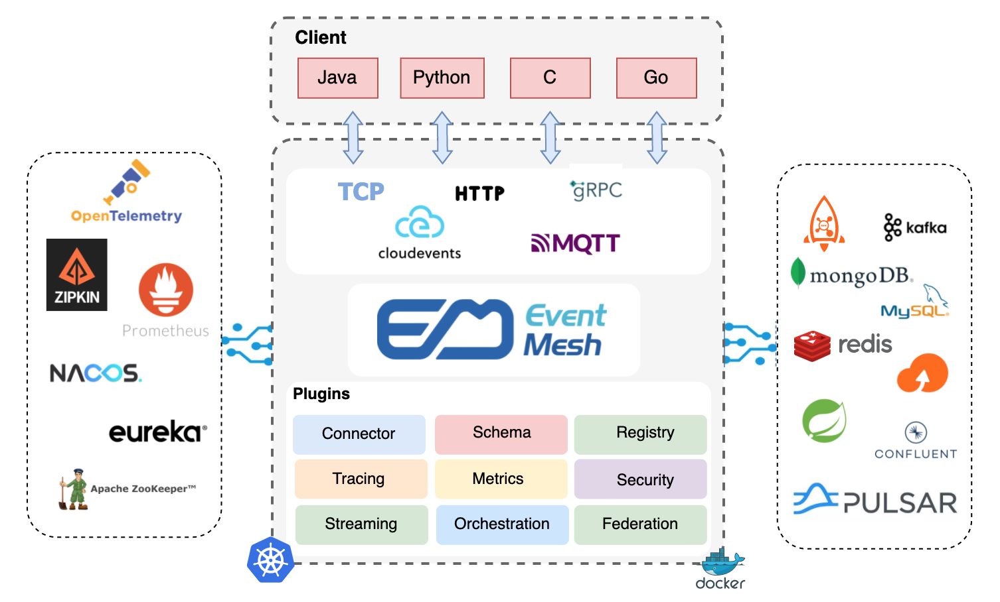
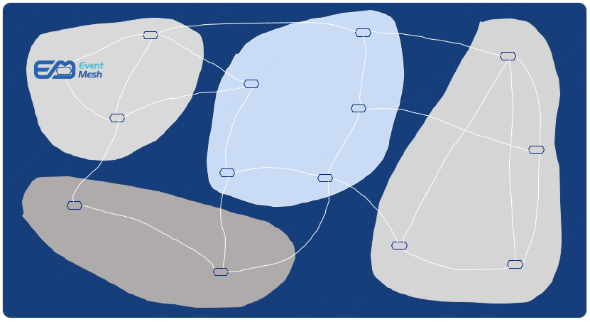

# Apache EventMesh (incubating)

## 什么是Event Mesh？
EventMesh是一个动态的云原生事件驱动架构基础设施，用于分离应用程序和后端中间件层，它支持广泛的用例，包括复杂的混合云、使用了不同技术栈的分布式架构。

**多运行时:**

**编排:**

**联邦:**

**组件:**
* **eventmesh-runtime** : 一种中间件，用于在事件产生者和使用者之间传输事件，支持云原生应用程序和微服务。
* **eventmesh-sdk-java** : 当前支持HTTP和TCP协议，未来会支持gRPC等。
* **eventmesh-connector-plugin** : 连接中间件的插件，如RocketMQ/Kafka/Redis/Pulsar等。
* **eventmesh-registry-plugin** : 注册表适配器插件，如Nacos/Etcd。
* **eventmesh-security-plugin** : 安全适配器插件，如ACL/认证/授权。
* **eventmesh-protocol-plugin** : 协议适配器的插件，如CloudEvents/MQTT。
* **eventmesh-admin** : 客户端管理、主题管理、订阅管理和其他管理。

## 快速开始
1. [Store quickstart](docs/en/instructions/eventmesh-store-quickstart.md)
2. [Runtime quickstart](docs/en/instructions/eventmesh-runtime-quickstart.md) or [Runtime quickstart with docker](docs/en/instructions/eventmesh-runtime-quickstart-with-docker.md).
3. [Java SDK examples](docs/en/instructions/eventmesh-sdk-java-quickstart.md).

## 文档
查看EventMesh [Documentation](docs/en/intro.md) 所有文档.

## Roadmap
查看EventMesh [Roadmap](docs/en/roadmap.md) 特性规划.

## 贡献
永远欢迎参与共建, 请参阅[贡献](CONTRIBUTING.zh-CN.md)了解详细指南

您可以从问题开始.
[GitHub Issues](https://github.com/apache/incubator-eventmesh/issues)

## Landscape

  
&nbsp;&nbsp;
  
EventMesh enriches the <a href="https://landscape.cncf.io/serverless?license=apache-license-2-0">CNCF CLOUD NATIVE Landscape.</a>

## License
[Apache License, Version 2.0](http://www.apache.org/licenses/LICENSE-2.0.html) Copyright (C) Apache Software Foundation

## 开发社区
|              微信助手                           |                微信公众号                   | Slack                                                  |
| :----------------------------------------------------:  | :----------------------------------------------------: | :----------------------------------------------------: |
|  |  |[加入slack](https://join.slack.com/t/apacheeventmesh/shared_invite/zt-11974dndy-cn3Aq638eleKwKPWP9tkLg) |

Mailing Lists:

| 列表名称 | 描述 |订阅	|取消订阅|邮件列表存档
| ----    | ----    |----    | ----    | ----    |
|Users	|用户支持与用户问题|	[点击订阅](mailto:users-subscribe@eventmesh.incubator.apache.org)	|[点击取消订阅](mailto:users-unsubscribe@eventmesh.incubator.apache.org)	|[邮件列表存档](https://lists.apache.org/list.html?users@eventmesh.apache.org)|
|Development	|开发相关|	[点击订阅](mailto:dev-subscribe@eventmesh.incubator.apache.org)	|[点击取消订阅](mailto:dev-unsubscribe@eventmesh.incubator.apache.org)	|[邮件列表存档](https://lists.apache.org/list.html?dev@eventmesh.apache.org)|
|Commits	|所有与仓库相关的commits信息通知|	[点击订阅](mailto:commits-subscribe@eventmesh.incubator.apache.org)	|[点击取消订阅](mailto:commits-unsubscribe@eventmesh.incubator.apache.org)	|[邮件列表存档](https://lists.apache.org/list.html?commits@eventmesh.apache.org)|
