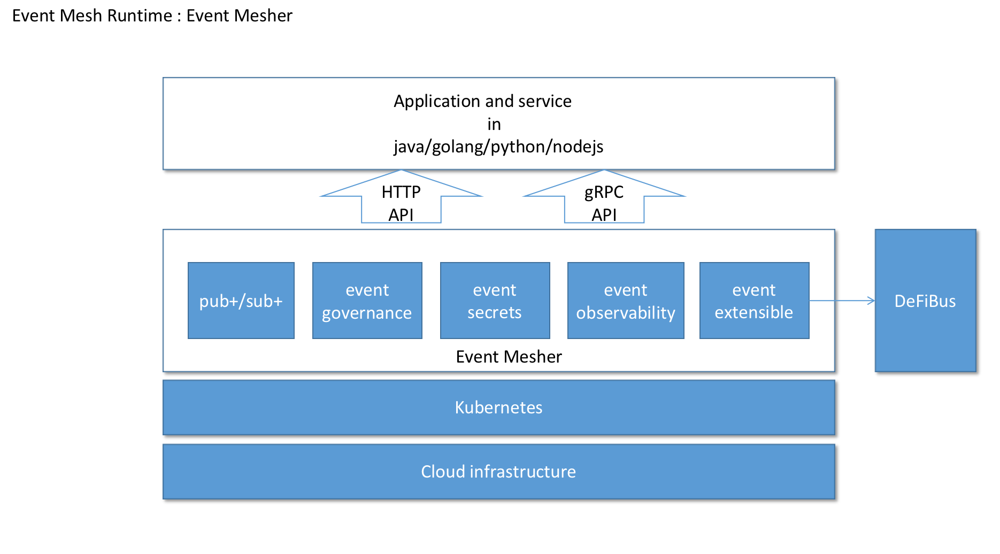
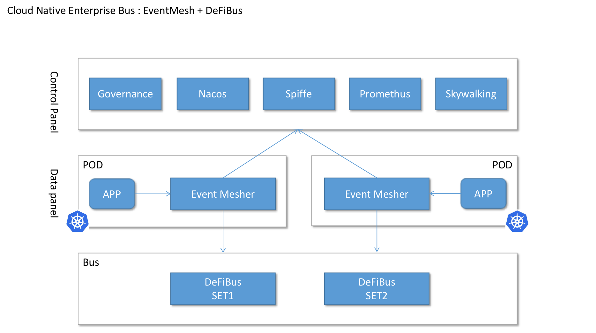

## 什么是Event Mesh？
该图显示了Event Mesh相对于应用程序框架中其他类似技术(例如Service Mesh)的定位.

Event Mesh是一个动态的插件式云原生基础服务层，用于分离应用程序和中间件层。它提供了灵活，可靠和快速的事件分发，并且可以进行管理：

云原生Event Mesh：

Event Mesh允许将来自一个应用程序的事件动态路由到任何其他应用程序.
Event Mesh的一般功能:
* 事件驱动;
* 事件治理;
* 动态路由;
* 云原生

依赖部件：
* DeFiBus：具有低延迟，高性能和可靠性，和灵活可伸缩性的分布式消息传递平台 [DeFiBus](https://github.com/WeBankFinTech/DeFiBus)
* RocketMQ

关键部件：
* eventmesh-emesher：一种中间件，用于在事件产生者和使用者之间传输事件，支持云原生应用程序和微服务
* eventmesh-sdk-java：当前支持HTTP和TCP协议，未来会支持gRPC等
* eventmesh-registry：自动在连接到单独事件网格器的应用程序和服务之间路由事件, 管理emesher

## RoadMap
| version | feature |
| ----    | ----    |
| v1.0.0  |Support DeFiBus as eventstore, support pub/sub, http api, java-sdk|
| v1.1.0  |Support rocketmq as eventstore|
| v1.2.0  |Support transaction event|
| v1.3.0  |Support Plug-in architectur|
|         |Support Event Sourcing|
|         |Support Event orchestration|
|         |Support Dashboard|
|         |Support Event governance|
|         |Support Nacos as a event router|
|         |Support Promethus|
|         |Support Skywalking|
|         |Support Spiffe|
|         |Support gRPC|
|         |Support c/go/python/nodejs SDK|

## 快速开始
1. 构建并部署event-store([DeFiBus](https://github.com/WeBankFinTech/DeFiBus))
   请参见说明['event-store quickstart.zh-CN'](docs/cn/instructions/eventmesh-store-quickstart.zh-CN.md)
2. 构建并部署eventmesh-emesher，请参见说明['eventmesh-emesher quickstart.zh-CN'](docs/cn/instructions/eventmesh-emesher-quickstart.zh-CN.md)
3. 运行eventmesh-sdk-java演示，请参见说明['eventmesh-sdk-java quickstart.zh-CN'](docs/cn/instructions/eventmesh-sdk-java-quickstart.zh-CN.md)

## 贡献
永远欢迎参与共建, 请参阅[贡献](CONTRIBUTING.zh-CN.md)了解详细指南

您可以从问题开始. 
[GitHub Issues](https://github.com/WeBankFinTech/EventMesh/issues)

## License
[Apache License, Version 2.0](http://www.apache.org/licenses/LICENSE-2.0.html) Copyright (C) Apache Software Foundation

## 联系人
微信群:

