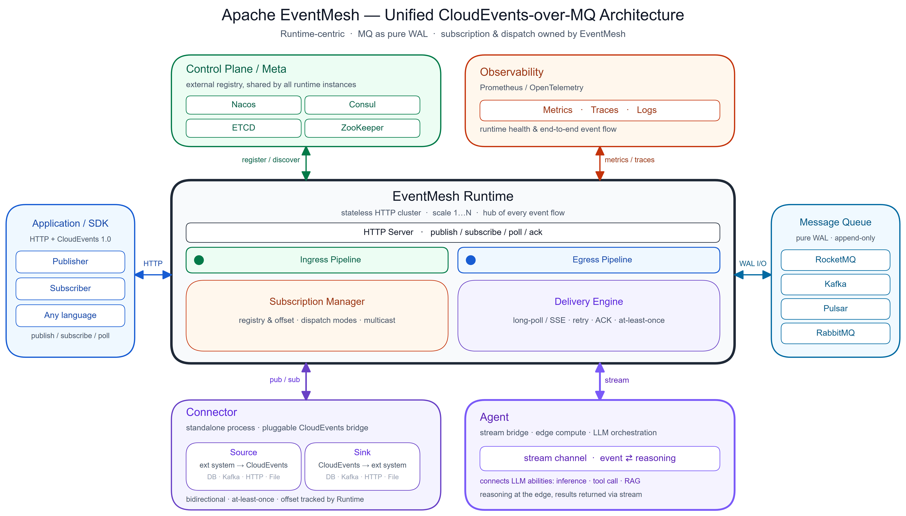

<div align="center">


<br /><br />

<br />

[](https://github.com/apache/eventmesh/actions/workflows/ci.yml)
[](https://codecov.io/gh/apache/eventmesh)
[](https://github.com/apache/eventmesh/actions/workflows/code-scanning.yml)

[](https://www.apache.org/licenses/LICENSE-2.0.html)
[](https://github.com/apache/eventmesh/releases)
[](https://join.slack.com/t/apacheeventmesh/shared_invite/zt-1t1816dli-I0t3OE~IpdYWrZbIWhMbXg)

[📦 文档(英文)](https://eventmesh.apache.org/docs/introduction) |
[📔 例子](https://github.com/apache/eventmesh/tree/master/eventmesh-examples) |
[⚙️ 路线图](https://eventmesh.apache.org/docs/roadmap) |
[🌐 英文版](README.zh-CN.md)
</div>


# Apache EventMesh

**Apache EventMesh** 是用于构建分布式[事件驱动](https://en.wikipedia.org/wiki/Event-driven_architecture)应用程序的新一代无服务器事件中间件。

### EventMesh 架构



EventMesh 采用统一的 **CloudEvents-over-MQ** 架构。消息队列（MQ）仅作为持久化的预写日志（WAL）存储层——没有消费者组（consumer group）、没有 Tag，也不承担 Broker 端的订阅语义。所有投递逻辑由无状态的 EventMesh Runtime 掌控：其中的 **SubscriptionManager** 负责维护订阅注册表与位点（offset）跟踪，并以负载均衡（load-balance）、广播（broadcast）、多播（multicast）等语义分发事件。应用通过轻量的 **HTTP + CloudEvents 1.0** SDK（`publish` / `subscribe` / `unsubscribe`）接入，与外部系统的集成则通过 connector SPI 在独立进程的 Connector Runtime 中运行。


## 特性

Apache EventMesh 提供了丰富的能力，帮助用户轻松构建事件驱动应用。以下是让 EventMesh 与众不同的核心亮点：

**核心架构**

- **全链路 CloudEvents 原生** —— 完全基于 [CloudEvents](https://cloudevents.io) 1.0 规范构建，事件天然厂商中立、可移植。
- **轻量、语言无关的 SDK** —— 纯 HTTP 上仅需 `publish`、`subscribe`、`unsubscribe` 三个操作，无重客户端、无厂商锁定。
- **订阅与分发由 Runtime 掌控** —— 订阅状态与投递语义（负载均衡 / 广播 / 多播）由 EventMesh 自主管理，而非底层 MQ，无论后端是哪种存储，行为都保持一致。
- **MQ 仅作纯预写日志（WAL）** —— 仅追加写入，无消费者组、无 Tag；Broker 退化为纯持久化存储，大幅简化运维。
- **保证至少一次（at-least-once）投递** —— 可靠性由 EventMesh 通过自管 offset + 显式 ACK 掌控。
- **多种下发通道** —— 订阅者可自由选择 HTTP 长轮询、Server-Sent Events（SSE）或 WebSocket 推送，并支持请求-应答（request-reply）。
- **轻松水平扩展** —— 无状态 Runtime 实例可无缝扩容，无重平衡成本。

**扩展性与生态**

- **智能体协作（A2A）** —— 内置的 [A2A 协议](docs/a2a-protocol.md) 将 EventMesh 打造成智能体协作总线，打通同步的 MCP / JSON-RPC 2.0 工具调用与异步的事件驱动发布订阅，原生支撑大模型（LLM）与多智能体（Multi-Agent）场景。
- **可插拔存储层** —— [Apache RocketMQ](https://rocketmq.apache.org)、[Apache Kafka](https://kafka.apache.org)、[Apache Pulsar](https://pulsar.apache.org)、[RabbitMQ](https://rabbitmq.com)、[Redis](https://redis.io) 等。
- **可插拔互联层（Connector）** —— [connectors](https://github.com/apache/eventmesh/tree/develop/eventmesh-connector-plugin) 作为独立进程运行，可充当 SaaS、CloudService、数据库等的 source 或 sink。
- **可插拔元数据服务** —— [Consul](https://consulproject.org/en/)、[Nacos](https://nacos.io)、[ETCD](https://etcd.io) 和 [Zookeeper](https://zookeeper.apache.org/)。
- **事件模式管理** —— 通过目录（catalog）服务实现。
- **强大的事件编排** —— 基于 [Serverless workflow](https://serverlessworkflow.io/) 引擎。
- **强大的事件过滤与转换能力。**

## 能力状态（Capability Status）

每个 EventMesh 对外能力都有明确的状态定级。下表是**唯一的状态事实来源**——各模块文档链接到这里，
不再各自重复描述。各能力的详细指南见 [docs](docs/)。

| 能力 | 状态 | 建议 | 迁移目标 |
| --- | :---: | --- | --- |
| [HTTP + CloudEvents](docs/eventmesh-cloudevents-client-guide.md) | **GA 目标** | 推荐——主用户路径（`CloudEventsClient` + `/events/*`） | 主路径 |
| [Kafka / RocketMQ 存储](eventmesh-storage-plugin/)（4.x、5.x） | **GA 目标** | 推荐——可插拔 WAL 后端，TCK 覆盖（`MeshStoragePluginTCK`） | 主路径 |
| SSE / WebSocket 推送 | **Beta** | 可用——已有集成测试；统一 ACK/重投递语义仍在收敛 | 统一推送传输 |
| [Connector Runtime](docs/production-readiness.md) | **Beta** | 可用——独立运行时上的 24 个连接器插件 | 新连接器 SPI 迁移 |
| [A2A / Agent 网关](docs/a2a-protocol.md) | **实验性** | 评估——TaskStore + Runtime 桥已落地（#5302/#5304）；reaper 与 Meta 化 AgentCard 待做 | 统一 Runtime A2A |
| TCP / gRPC / OpenMessaging SDK | **Legacy 兼容** | 仅存量用户——保持老客户端零改动运行；不再扩展 | [HTTP + CloudEvents](docs/eventmesh-cloudevents-client-guide.md) |

状态含义：

- **GA 目标** —— 当前架构下功能完整，已对真实 broker 做集成测试；可安全用于生产。
- **Beta** —— 功能可用且有测试，但语义或部署形态在次版本仍可能调整。
- **实验性** —— 迭代开发中；API 与存储布局可能破坏性变更；请先在开发集群试用。
- **Legacy 兼容** —— 仅为存量客户端零改动兼容而维护；只修缺陷、不加功能。新接入不要选这里。

> 正在从 TCP / gRPC SDK 迁移？Legacy 客户端在当前 Runtime 上继续可用；替代方案（HTTP +
> CloudEvents 的 `CloudEventsClient`）见[客户端指引](docs/eventmesh-cloudevents-client-guide.md)。

### 文档导航

- [快速上手（英文）](docs/eventmesh-getting-started.md) / [配置参考（英文）](docs/eventmesh-configuration.md)
- [客户端指引（中文）](docs/eventmesh-cloudevents-client-guide.md) —— `CloudEventsClient` 完整用法
- [生产准入](docs/production-readiness.md) —— 已验证能力、SLO、运维手册

## 子项目

- [EventMesh-site](https://github.com/apache/eventmesh-site): Apache EventMesh 的官方网站资源。
- [EventMesh-workflow](https://github.com/apache/eventmesh-workflow): 用于在 EventMesh 上进行事件编排的无服务器工作流运行时。
- [EventMesh-dashboard](https://github.com/apache/eventmesh-dashboard): EventMesh 的运维控制台。
- [EventMesh-catalog](https://github.com/apache/eventmesh-catalog): 使用 AsyncAPI 进行事件模式管理的目录服务。
- [EventMesh-go](https://github.com/apache/eventmesh-go): EventMesh 运行时的 Go 语言实现。

## 快速入门

本节指南将指导您分别从[本地](#在本地运行-eventmesh-runtime)、[Docker](#在-docker-中运行-eventmesh-runtime)、[K8s](#在-kubernetes-中运行-eventmesh-runtime)部署EventMesh的步骤:

本节指南按照默认配置启动 EventMesh，如果您需要更加详细的 EventMesh 部署步骤，请访问[EventMesh官方文档](https://eventmesh.apache.org/docs/introduction)。

### 部署 Event Store

> EventMesh 支持[多种事件存储](https://eventmesh.apache.org/docs/roadmap#event-store-implementation-status)，默认存储模式为 `standalone`，不依赖其他事件存储作为层。

### 在本地运行 EventMesh Runtime

#### 1. 下载 EventMesh

从 [EventMesh Download](https://eventmesh.apache.org/download/) 页面下载最新版本的 Binary Distribution 发行版并解压：

```shell
wget https://dlcdn.apache.org/eventmesh/1.10.0/apache-eventmesh-1.10.0-bin.tar.gz
tar -xvzf apache-eventmesh-1.10.0-bin.tar.gz
cd apache-eventmesh-1.10.0
```

#### 2. 运行 EventMesh

执行 `start.sh` 脚本启动 EventMesh Runtime 服务器。

```shell
bash bin/start.sh
```

查看输出日志:

```shell
tail -n 50 -f logs/eventmesh.out
```

当日志输出 `server state:RUNNING`，则代表 EventMesh Runtime 启动成功了。

停止:

```shell
bash bin/stop.sh
```

脚本打印 `shutdown server ok!` 时，代表 EventMesh Runtime 已停止。

### 在 Docker 中运行 EventMesh Runtime

#### 1. 获取 EventMesh 镜像

使用下面的命令行下载最新版本的 [EventMesh](https://hub.docker.com/r/apache/eventmesh)：

```shell
sudo docker pull apache/eventmesh:latest
```

#### 2. 运行 EventMesh

使用以下命令启动 EventMesh 容器：

```shell
sudo docker run -d --name eventmesh -p 8080:8080 -p 8081:8081 -p 8082:8082 -t apache/eventmesh:latest
```

> 端口说明：`8080` = 流量 HTTP（`/events/*` CloudEvents API），`8081` = 管理 HTTP（`/admin/*`），`8082` = WebSocket 推送（按需开启）。Connector 运行时镜像另暴露 `8083` 作为其可选的管理端口。

进入容器：

```shell
sudo docker exec -it eventmesh /bin/bash
```

查看日志：

```shell
cd logs
tail -n 50 -f eventmesh.out
```

### 在 Kubernetes 中运行 EventMesh Runtime

#### 1. 部署 Operator

运行以下命令部署(删除部署, 只需将 `deploy` 替换为 `undeploy` 即可):

```shell
$ cd eventmesh-operator && make deploy
```

运行 `kubectl get pods` 、`kubectl get crd | grep eventmesh-operator.eventmesh` 查看部署的 EventMesh-Operator 状态以及 CRD 信息.

```shell
$ kubectl get pods
NAME                                  READY   STATUS    RESTARTS   AGE
eventmesh-operator-59c59f4f7b-nmmlm   1/1     Running   0          20s

$ kubectl get crd | grep eventmesh-operator.eventmesh
connectors.eventmesh-operator.eventmesh   2024-01-10T02:40:27Z
runtimes.eventmesh-operator.eventmesh     2024-01-10T02:40:27Z
```

#### 2. 部署 EventMesh Runtime

运行以下命令部署 runtime、connector-rocketmq (删除部署, 只需将 `create` 替换为 `delete` 即可)：

```shell
$ make create
```

运行 `kubectl get pods` 查看部署是否成功.

```shell
NAME                                  READY   STATUS    RESTARTS   AGE
connector-rocketmq-0                  1/1     Running   0          9s
eventmesh-operator-59c59f4f7b-nmmlm   1/1     Running   0          3m12s
eventmesh-runtime-0-a-0               1/1     Running   0          15s
```

### 使用 EventMesh API

应用通过 `/events/*` HTTP 端点以标准 [CloudEvents](https://cloudevents.io) 1.0 与 EventMesh 交互，仅需 `publish` / `subscribe` / `unsubscribe` 等操作。订阅与分发由 EventMesh 自主管理，无需消费者组或 Tag。

#### 1. 发布 CloudEvent

以 CloudEvents 1.0 格式通过 HTTP POST 发布事件（返回 `202 Accepted` 表示事件已写入 WAL）：

```shell
POST /events/publish HTTP/1.1
Host: localhost:8080
Content-Type: application/cloudevents+json

{
  "specversion": "1.0",
  "id": "89010a5a-3c6f-4a1e-9b2d-0f7c1f2e3a4b",
  "source": "/example/producer",
  "type": "com.example.order.created",
  "subject": "orders",
  "datacontenttype": "application/json",
  "data": {
    "content": "Hello, EventMesh!"
  }
}
```

#### 2. 订阅 Topic

向 EventMesh 注册订阅（无消费者组、无 Tag）。提供 `clientId`、`topic` 以及分发模式 `mode`（`LOAD_BALANCE`、`BROADCAST`、`MULTICAST` 或 `LOAD_BALANCE_STICKY`），响应返回 `subscriptionId`：

```shell
POST /events/subscribe HTTP/1.1
Host: localhost:8080
Content-Type: application/json

{
  "clientId": "order-svc",
  "topic": "orders",
  "mode": "LOAD_BALANCE"
}
```

#### 3. 接收事件

订阅者可通过三种传输方式接收下发的事件，按业务场景任选其一——它们下发相同的 CloudEvents，并遵循 EventMesh 的 ACK / 至少一次语义。

**a) HTTP 长轮询** —— 主动拉取，请求会阻塞直到有事件或超时：

```shell
GET /events/poll?clientId=order-svc&topics=orders&timeout=30000 HTTP/1.1
Host: localhost:8080
```

处理完事件后，进行 ACK 以推进 offset（至少一次投递）：

```shell
POST /events/ack HTTP/1.1
Host: localhost:8080
Content-Type: application/json

{
  "subId": "sub-123",
  "clientId": "order-svc",
  "topic": "orders",
  "partition": 0,
  "offset": 42
}
```

**b) Server-Sent Events（SSE）** —— 服务端经长连接主动推送，客户端无需轮询：

```shell
GET /events/stream?clientId=order-svc&topics=orders HTTP/1.1
Host: localhost:8080
Accept: text/event-stream
```

**c) WebSocket** —— 经独立 WebSocket 端口的全双工服务端推送：

```shell
GET /events/stream HTTP/1.1
Host: localhost:8082
Upgrade: websocket
Connection: Upgrade
```

> 长轮询、SSE、WebSocket 是可互换的下发传输——订阅者任选其一。SSE 与 WebSocket 由服务端推送（无需轮询循环），长轮询则由客户端驱动。此外还支持请求-应答（`POST /events/request` + `POST /events/reply`）。`CloudEventsClient` Java SDK 封装了以上全部方式（`subscribe` / `subscribeSse` / `subscribeWs`），用法见[CloudEvents 客户端使用指引](docs/eventmesh-cloudevents-client-guide.md)。

#### 4. 取消订阅

当不再需要接收某 Topic 的事件时，按 `clientId` 取消订阅（可选带 `subscriptionId`）：

```shell
POST /events/unsubscribe HTTP/1.1
Host: localhost:8080
Content-Type: application/json

{
  "clientId": "order-svc",
  "topic": "orders"
}
```

## 贡献

每个贡献者在推动 Apache EventMesh 的健康发展中都发挥了重要作用。我们真诚感谢所有为代码和文档作出贡献的贡献者。

- [贡献指南](https://eventmesh.apache.org/community/contribute/contribute)
- [Good First Issues](https://github.com/apache/eventmesh/issues?q=is%3Aopen+is%3Aissue+label%3A%22good+first+issue%22)

这里是[贡献者列表](https://github.com/apache/eventmesh/graphs/contributors)，感谢大家！ :)

<a href="https://github.com/apache/eventmesh/graphs/contributors">
  
</a>


## CNCF Landscape

<div align="center">


Apache EventMesh enriches the <a href="https://landscape.cncf.io/serverless?license=apache-license-2-0">CNCF Cloud Native Landscape.</a>

</div>

## License

Apache EventMesh 的开源协议遵循 [Apache License, Version 2.0](http://www.apache.org/licenses/LICENSE-2.0.html).

## Community

| 微信小助手                                                   | 微信公众号                                                  | Slack                                                                                                   |
|---------------------------------------------------------|--------------------------------------------------------|---------------------------------------------------------------------------------------------------------|
|  |  | [加入 Slack ](https://join.slack.com/t/apacheeventmesh/shared_invite/zt-1t1816dli-I0t3OE~IpdYWrZbIWhMbXg) |

双周会议 : [#Tencent meeting](https://meeting.tencent.com/dm/wes6Erb9ioVV) : 346-6926-0133

双周会议记录 : [bilibili](https://space.bilibili.com/1057662180)

### 邮件名单

| 名称      | 描述                       | 订阅                                                  | 取消订阅                                                    | 邮件列表存档                                                                  |
|---------|--------------------------|-----------------------------------------------------|---------------------------------------------------------|-------------------------------------------------------------------------|
| 用户      | 用户支持与用户问题                | [订阅](mailto:users-subscribe@eventmesh.apache.org)   | [取消订阅](mailto:users-unsubscribe@eventmesh.apache.org)   | [邮件存档](https://lists.apache.org/list.html?users@eventmesh.apache.org)   |
| 开发      | 开发相关 (设计文档， Issues等等.)   | [订阅](mailto:dev-subscribe@eventmesh.apache.org)     | [取消订阅](mailto:dev-unsubscribe@eventmesh.apache.org)     | [邮件存档](https://lists.apache.org/list.html?dev@eventmesh.apache.org)     |
| Commits | 所有与仓库相关的 commits 信息通知    | [订阅](mailto:commits-subscribe@eventmesh.apache.org) | [取消订阅](mailto:commits-unsubscribe@eventmesh.apache.org) | [邮件存档](https://lists.apache.org/list.html?commits@eventmesh.apache.org) |
| Issues  | Issues 或者 PR 提交和代码Review | [订阅](mailto:issues-subscribe@eventmesh.apache.org)  | [取消订阅](mailto:issues-unsubscribe@eventmesh.apache.org)  | [邮件存档](https://lists.apache.org/list.html?issues@eventmesh.apache.org)  |

