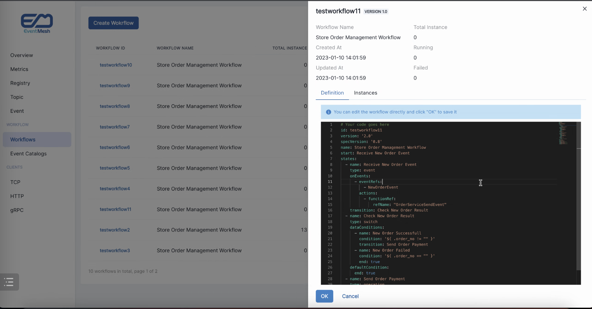

<div align="center">


<br /><br />

<br />

[](https://github.com/apache/eventmesh/actions/workflows/ci.yml)
[](https://codecov.io/gh/apache/eventmesh)
[](https://lgtm.com/projects/g/apache/eventmesh/context:java)
[](https://lgtm.com/projects/g/apache/eventmesh/alerts/)

[](https://www.apache.org/licenses/LICENSE-2.0.html)
[](https://github.com/apache/eventmesh/releases)
[](https://join.slack.com/t/apacheeventmesh/shared_invite/zt-1t1816dli-I0t3OE~IpdYWrZbIWhMbXg)

[📦 文档(英文)](https://eventmesh.apache.org/docs/introduction) |
[📔 例子](https://github.com/apache/eventmesh/tree/master/eventmesh-examples) |
[⚙️ 路线图](https://eventmesh.apache.org/docs/roadmap) |
[🌐 英文版](README.zh-CN.md)
</div>


# Apache EventMesh

**Apache EventMesh** 是用于构建分布式[事件驱动](https://en.wikipedia.org/wiki/Event-driven_architecture)应用程序的新一代无服务器事件中间件。

### EventMesh 架构


### EventMesh Dashboard



## 特性

Apache EventMesh提供了许多功能来帮助用户实现他们的目标，以下是一些EventMesh的关键特点：

- 基于 [CloudEvents](https://cloudevents.io) 规范构建。
- 快速可扩展的Connector，[connectors](https://github.com/apache/eventmesh/tree/master/eventmesh-connectors)，例如作为Saas、CloudService和数据库等的source 或sink。.
- 快速可扩展的存储层，使用 [JDBC](https://en.wikipedia.org/wiki/Java_Database_Connectivity)和[Apache RocketMQ](https://rocketmq.apache.org), [Apache Kafka](https://kafka.apache.org), [Apache Pulsar](https://pulsar.apache.org), [RabbitMQ](https://rabbitmq.com), [Redis](https://redis.io), [Pravega](https://cncf.pravega.io), 和 [RDMS](https://en.wikipedia.org/wiki/Relational_database)（正在进行中）集成。
- 快速可扩展的控制器，例如 [Consul](https://consulproject.org/en/), [Nacos](https://nacos.io), [ETCD](https://etcd.io) 和 [Zookeeper](https://zookeeper.apache.org/)。
- 至少一次的可靠性投递。
- 在多个EventMesh部署之间传递事件。
- 通过目录服务进行事件模式管理。
- 通过 [Serverless workflow](https://serverlessworkflow.io/) 引擎实现强大的事件编排。
- 强大的事件过滤和转换功能。
- 快速、无缝的可扩展性。
- 易于函数开发和框架集成。

## 路线图

请前往[路线图](https://eventmesh.apache.org/docs/roadmap)查看Apache EventMesh的版本历史和新功能。.

## 子项目

- [EventMesh-site](https://github.com/apache/eventmesh-site): Apache EventMesh 的官方网站资源。
- [EventMesh-workflow](https://github.com/apache/eventmesh-workflow): 用于在 EventMesh 上进行事件编排的无服务器工作流运行时。
- [EventMesh-dashboard](https://github.com/apache/eventmesh-dashboard): EventMesh 的运维控制台。
- [EventMesh-catalog](https://github.com/apache/eventmesh-catalog): 使用 AsyncAPI 进行事件模式管理的目录服务。
- [EventMesh-go](https://github.com/apache/eventmesh-go): EventMesh 运行时的 Go 语言实现。

## 快速入门

本节指南将指导您分别从[本地](#在本地运行-eventmesh-runtime)、[Docker](#在-docker-中运行-eventmesh-runtime)、[K8s](#在-kubernetes-中运行-eventmesh-runtime)部署EventMesh的步骤:

本节指南按照默认配置启动 EventMesh，如果您需要更加详细的 EventMesh 部署步骤，请访问[EventMesh官方文档](https://eventmesh.apache.org/docs/next/introduction)。

### 部署 Event Store

> EventMesh 现在支持多个[事件存储](https://eventmesh.apache.org/docs/roadmap#event-store-implementation-status)，默认存储模式为 `standalone`
> 
> 如果是在非`standalone`模式下，需要先部署所需的事件存储，以`rocketmq`模式为例: 部署[RocketMQ](https://rocketmq.apache.org/docs/quickStart/01quickstart/)

### 在本地运行 EventMesh Runtime

#### 1. 下载

从 [EventMesh Download](https://eventmesh.apache.org/download/) 页面下载最新版本的 Binary Distribution 发行版并解压：

```shell
wget https://dlcdn.apache.org/eventmesh/1.10.0/apache-eventmesh-1.10.0-bin.tar.gz
tar -xvzf apache-eventmesh-1.10.0-bin.tar.gz
cd apache-eventmesh-1.10.0
```

#### 2. 运行

执行 `start.sh` 脚本启动 EventMesh Runtime 服务器。

```shell
bash bin/start.sh
```

查看输出日志:

```shell
tail -n 50 -f logs/eventmesh.out
```

当日志输出 `server state:RUNNING`，则代表 EventMesh Runtime 启动成功了。

停止:

```shell
bash bin/stop.sh
```

脚本打印 `shutdown server ok!` 时，代表 EventMesh Runtime 已停止。

### 在 Docker 中运行 EventMesh Runtime

#### 1. 获取 EventMesh 镜像

使用下面的命令行下载最新版本的 [EventMesh](https://hub.docker.com/r/apache/eventmesh)。

```shell
sudo docker pull apache/eventmesh:latest
```

#### 2. 运行EventMesh

现在你就可以开始根据下载好的EventMesh镜像运行容器了。

使用到的命令是 `docker run`。

- 绑定容器端口和宿主机端口: 使用 `docker run` 的 `-p` 选项。

综合一下，对应的启动命令为:

```shell
sudo docker run -d --name eventmesh -p 10000:10000 -p 10105:10105 -p 10205:10205 -p 10106:10106 -t apache/eventmesh:latest
```

如果成功的话，你会看到终端打印出了如下所示容器的信息，其中就有运行 EventMesh 镜像的容器。

```shell
$ sudo docker ps
CONTAINER ID   IMAGE                     COMMAND                   CREATED         STATUS         PORTS                                                                                                                                  NAMES
9c08130ee797   apache/eventmesh:latest   "bash bin/start.sh"       9 seconds ago   Up 8 seconds   0.0.0.0:10000->10000/tcp, 0.0.0.0:10105-10106->10105-10106/tcp, 0.0.0.0:10205->10205/tcp                                               eventmesh
```

进入容器（将eventmesh替换为您指定的容器名称或 ID）：

```shell
sudo docker exec -it eventmesh /bin/bash
```

读取 EventMesh 容器的日志：

```shell
cd logs
tail -n 50 -f eventmesh.out
```

### 在 Kubernetes 中运行 EventMesh Runtime

#### 1. 部署 Operator

运行以下命令部署(删除部署, 只需将 `deploy` 替换为 `undeploy` 即可):

```shell
$ make deploy
```

运行 `kubectl get pods` 、`kubectl get crd | grep eventmesh-operator.eventmesh` 查看部署的 EventMesh-Operator 状态以及 CRD 信息.

```shell
$ kubectl get pods
NAME                                  READY   STATUS    RESTARTS   AGE
eventmesh-operator-59c59f4f7b-nmmlm   1/1     Running   0          20s

$ kubectl get crd | grep eventmesh-operator.eventmesh
connectors.eventmesh-operator.eventmesh   2024-01-10T02:40:27Z
runtimes.eventmesh-operator.eventmesh     2024-01-10T02:40:27Z
```

#### 2. 运行以下命令部署 runtime、connector (删除部署, 只需将 `create` 替换为 `delete` 即可).

```shell
$ make create
```

运行 `kubectl get pods` 查看部署是否成功.

```shell
NAME                                  READY   STATUS    RESTARTS   AGE
connector-rocketmq-0                  1/1     Running   0          9s
eventmesh-operator-59c59f4f7b-nmmlm   1/1     Running   0          3m12s
eventmesh-runtime-0-a-0               1/1     Running   0          15s
```

## 贡献

每个贡献者在推动 Apache EventMesh 的健康发展中都发挥了重要作用。我们真诚感谢所有为代码和文档作出贡献的贡献者。

- [贡献指南](https://eventmesh.apache.org/community/contribute/contribute)
- [Good First Issues](https://github.com/apache/eventmesh/issues?q=is%3Aopen+is%3Aissue+label%3A%22good+first+issue%22)

这里是[贡献者列表](https://github.com/apache/eventmesh/graphs/contributors)，感谢大家！ :)

<a href="https://github.com/apache/eventmesh/graphs/contributors">
  
</a>


## CNCF Landscape

<div align="center">


Apache EventMesh enriches the <a href="https://landscape.cncf.io/serverless?license=apache-license-2-0">CNCF Cloud Native Landscape.</a>

</div>

## License

Apache EventMesh 的开源协议遵循 [Apache License, Version 2.0](http://www.apache.org/licenses/LICENSE-2.0.html).

## Community

| 微信小助手                                                   | 微信公众号                                                  | Slack                                                                                                   |
|---------------------------------------------------------|--------------------------------------------------------|---------------------------------------------------------------------------------------------------------|
|  |  | [加入 Slack ](https://join.slack.com/t/apacheeventmesh/shared_invite/zt-1t1816dli-I0t3OE~IpdYWrZbIWhMbXg) |

双周会议 : [#Tencent meeting](https://meeting.tencent.com/dm/wes6Erb9ioVV) : 346-6926-0133

双周会议记录 : [bilibili](https://space.bilibili.com/1057662180)

### 邮件名单

| 名称      | 描述                       | 订阅                                                  | 取消订阅                                                    | 邮件列表存档                                                                  |
|---------|--------------------------|-----------------------------------------------------|---------------------------------------------------------|-------------------------------------------------------------------------|
| 用户      | 用户支持与用户问题                | [订阅](mailto:users-subscribe@eventmesh.apache.org)   | [取消订阅](mailto:users-unsubscribe@eventmesh.apache.org)   | [邮件存档](https://lists.apache.org/list.html?users@eventmesh.apache.org)   |
| 开发      | 开发相关 (设计文档， Issues等等.)   | [订阅](mailto:dev-subscribe@eventmesh.apache.org)     | [取消订阅](mailto:dev-unsubscribe@eventmesh.apache.org)     | [邮件存档](https://lists.apache.org/list.html?dev@eventmesh.apache.org)     |
| Commits | 所有与仓库相关的 commits 信息通知    | [订阅](mailto:commits-subscribe@eventmesh.apache.org) | [取消订阅](mailto:commits-unsubscribe@eventmesh.apache.org) | [邮件存档](https://lists.apache.org/list.html?commits@eventmesh.apache.org) |
| Issues  | Issues 或者 PR 提交和代码Review | [订阅](mailto:issues-subscribe@eventmesh.apache.org)  | [取消订阅](mailto:issues-unsubscribe@eventmesh.apache.org)  | [邮件存档](https://lists.apache.org/list.html?issues@eventmesh.apache.org)  |

