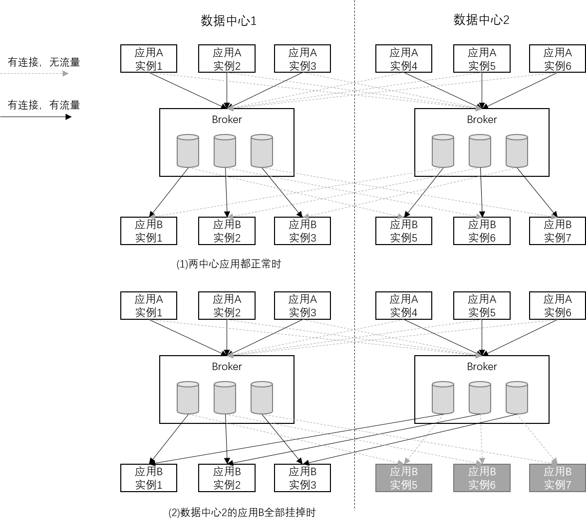

## 5.同城多中心多活
&nbsp;&nbsp;&nbsp;&nbsp;&nbsp;&nbsp;
同城多中心多活指的是应用的多活，在DeFiBus集群正常运行的情况下，应用部署在多个数据中心，一个数据中心的应用实例全部挂掉后，DeFiBus能够自动将应用流量切换到另一个数据中心的应用实例上，保证应用能够持续稳定地提供服务而不中断。同城多中心多活得益于DeFiBus的服务就近特性，结合应用部署的规划，使得正常情况下服务调用发生在同一个数据中心，当一个中心的应用出现故障时，能够有其他中心的实例接管服务。

---
#### Links:
* [架构介绍](../../../README.md)
* [Request-Reply调用](docs/cn/features/1-request-response-call.md)
* [灰度发布](docs/cn/features/2-dark-launch.md)
* [熔断机制](docs/cn/features/3-circuit-break-mechanism.md)
* [服务就近](docs/cn/features/4-invoke-service-nearby.md)
* [应用多活](docs/cn/features/5-multi-active.md)
* [动态扩缩队列](docs/cn/features/6-dynamic-adjust-queue.md)
* [容错机制](docs/cn/features/8-fault-tolerant.md)