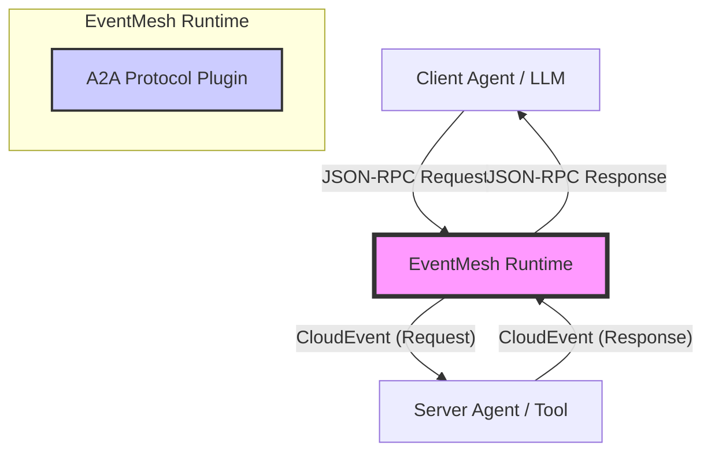

# EventMesh A2A Protocol Architecture & Functional Specification

## 1. Overview

The **EventMesh A2A (Agent-to-Agent) Protocol** is a specialized, high-performance protocol plugin designed to enable asynchronous communication, collaboration, and task coordination between autonomous agents.

With the release of v2.0, A2A adopts the **MCP (Model Context Protocol)** architecture, transforming EventMesh into a robust **Agent Collaboration Bus**. It bridges the gap between synchronous LLM-based tool calls (JSON-RPC 2.0) and asynchronous Event-Driven Architectures (EDA), enabling scalable, distributed, and decoupled agent systems.

## 2. Core Philosophy

The architecture adheres to the principles outlined in the broader agent community (e.g., A2A Project, FIPA-ACL, and CloudEvents):

1.  **JSON-RPC 2.0 as Lingua Franca**: Uses standard JSON-RPC for payload semantics, ensuring compatibility with modern LLM ecosystems (LangChain, AutoGen).
2.  **Transport Agnostic**: Encapsulates all messages within **CloudEvents**, allowing transport over any EventMesh-supported protocol (HTTP, TCP, gRPC, Kafka).
3.  **Async by Default**: Maps synchronous Request/Response patterns to asynchronous Event streams using correlation IDs.
4.  **Hybrid Compatibility**: Supports both modern MCP messages and legacy A2A (FIPA-style) messages simultaneously.

## 3. Architecture Design

### 3.1 System Context



### 3.2 Component Design (`eventmesh-protocol-a2a`)

The core logic resides in the `eventmesh-protocol-plugin` module.

*   **`EnhancedA2AProtocolAdaptor`**: The central brain of the protocol.
    *   **Intelligent Parsing**: Automatically detects message format (MCP vs. Legacy vs. Raw CloudEvent).
    *   **Protocol Delegation**: Delegates to `CloudEvents` or `HTTP` adaptors when necessary to reuse existing infrastructure.
    *   **Semantic Mapping**: Transforms JSON-RPC methods and IDs into CloudEvent attributes.
*   **`McpMethods`**: Defines standard MCP operations (e.g., `tools/call`, `resources/read`).
*   **`JsonRpc*` Models**: Strictly typed POJOs for JSON-RPC 2.0 compliance.

### 3.3 Asynchronous RPC Mapping ( The "Async Bridge" )

To support MCP on an Event Bus, synchronous RPC concepts are mapped to asynchronous events:

| Concept | MCP / JSON-RPC | CloudEvent Mapping |
| :--- | :--- | :--- |
| **Action** | `method` (e.g., `tools/call`) | **Type**: `org.apache.eventmesh.a2a.tools.call.req`<br>**Extension**: `a2amethod` |
| **Correlation** | `id` (e.g., `req-123`) | **Extension**: `collaborationid` (on Response)<br>**ID**: Preserved on Request |
| **Direction** | Implicit (Request vs Result) | **Extension**: `mcptype` (`request` or `response`) |
| **Routing** | `params._agentId` (Convention) | **Extension**: `targetagent` |

## 4. Functional Specification

### 4.1 Message Processing Flow

1.  **Ingestion**: The adaptor receives a `ProtocolTransportObject` (byte array/string).
2.  **Detection**:
    *   Checks for `jsonrpc: "2.0"` → **MCP Mode**.
    *   Checks for `protocol: "A2A"` → **Legacy Mode**.
    *   Otherwise → **Fallback/Delegation**.
3.  **Transformation (MCP Mode)**:
    *   **Request**: Parses `method` and `params`. Extracts routing hints (`_agentId`). Constructs a CloudEvent with type suffix `.req`.
    *   **Response**: Parses `result` or `error`. Extracts `id`. Constructs a CloudEvent with type suffix `.resp` and sets `collaborationid` = `id`.
4.  **Batch Processing**:
    *   If the input is a JSON Array, the adaptor splits it into a `List<CloudEvent>`, allowing parallel downstream processing.

### 4.2 Key Features

#### A. Intelligent Routing Support
The protocol extracts routing information from the payload without requiring the runtime to unmarshal the full body.
*   **Mechanism**: Promotes `_agentId` from JSON body to CloudEvent Extension `targetagent`.
*   **Benefit**: Enables EventMesh Router to perform content-based routing (CBR) efficiently.

#### B. Batching
*   **Input**: `[ {req1}, {req2}, ... ]`
*   **Output**: `[ Event1, Event2, ... ]`
*   **Benefit**: Significantly increases throughput for high-frequency agent interactions (e.g., polling multiple sensors).

#### C. Error Handling
*   **Standardization**: Maps JSON-RPC Error objects (code, message) into the generic `common.response` event type.
*   **Tracing**: Preserves correlation IDs even in error scenarios, ensuring the requester is notified of failures.

## 5. Usage Examples

### 5.1 Sending a Tool Call (Request)

**Raw Payload:**
```json
{
  "jsonrpc": "2.0",
  "method": "tools/call",
  "params": {
    "name": "weather_service",
    "arguments": { "city": "New York" }
  },
  "id": "msg-101"
}
```

**Generated CloudEvent:**
*   `type`: `org.apache.eventmesh.a2a.tools.call.req`
*   `a2amethod`: `tools/call`
*   `mcptype`: `request`
*   `id`: `msg-101`

### 5.2 Returning a Result (Response)

**Raw Payload:**
```json
{
  "jsonrpc": "2.0",
  "result": { "temperature": 22 },
  "id": "msg-101"
}
```

**Generated CloudEvent:**
*   `type`: `org.apache.eventmesh.a2a.common.response`
*   `mcptype`: `response`
*   `collaborationid`: `msg-101` (Links back to Request)

## 6. Future Roadmap

*   **Schema Registry**: Implement dynamic discovery of Agent capabilities via `methods/list`.
*   **Sidecar Injection**: Fully integrate the adaptor into the EventMesh Sidecar for transparent HTTP-to-Event conversion for non-Java agents.
