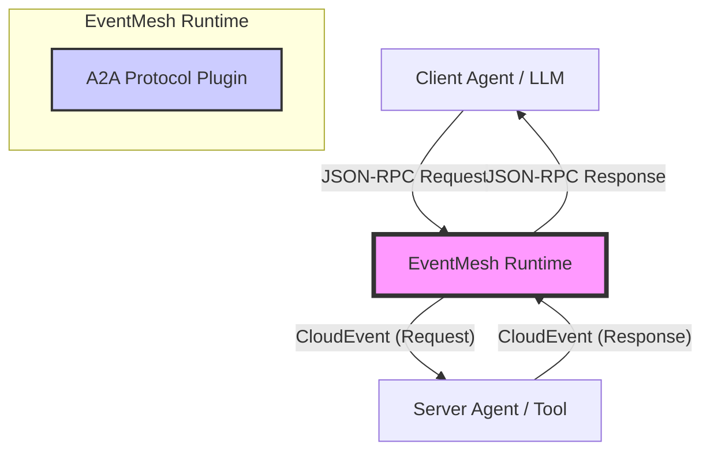
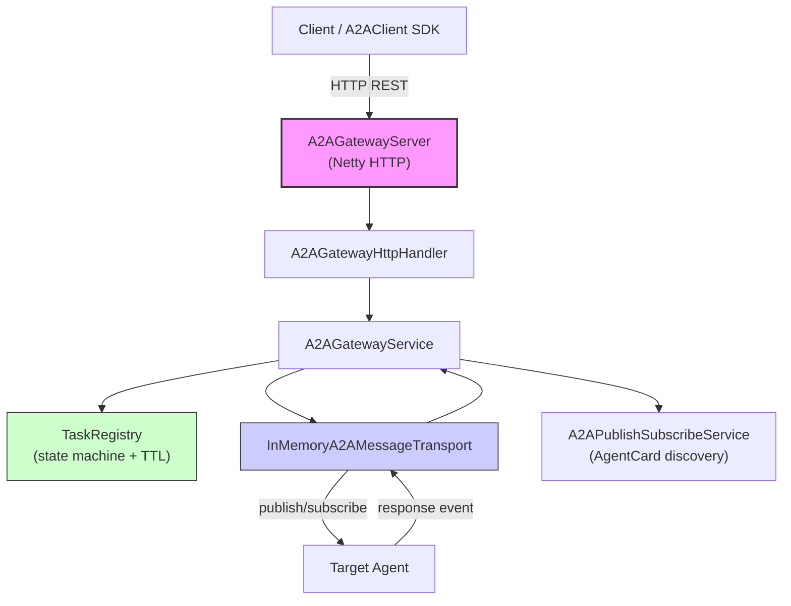

# EventMesh A2A Protocol Architecture & Functional Specification

## 1. Overview

The **EventMesh A2A (Agent-to-Agent) Protocol** is a specialized, high-performance protocol plugin designed to enable asynchronous communication, collaboration, and task coordination between autonomous agents.

With the release of v2.0, A2A adopts the **MCP (Model Context Protocol)** architecture, transforming EventMesh into a robust **Agent Collaboration Bus**. It bridges the gap between synchronous LLM-based tool calls (JSON-RPC 2.0) and asynchronous Event-Driven Architectures (EDA), enabling scalable, distributed, and decoupled agent systems.

## 2. Core Philosophy

The architecture adheres to the principles outlined in the broader agent community (e.g., A2A Project, FIPA-ACL, and CloudEvents):

1.  **JSON-RPC 2.0 as Lingua Franca**: Uses standard JSON-RPC for payload semantics, ensuring compatibility with modern LLM ecosystems (LangChain, AutoGen).
2.  **Transport Agnostic**: Encapsulates all messages within **CloudEvents**, allowing transport over any EventMesh-supported protocol (HTTP, TCP, gRPC, Kafka).
3.  **Async by Default**: Maps synchronous Request/Response patterns to asynchronous Event streams using correlation IDs.
4.  **Native Pub/Sub Semantics**: Supports O(1) broadcast complexity, temporal decoupling (Late Join), and backpressure isolation, solving the scalability limits of traditional P2P webhook callbacks.

### 2.1 Native Pub/Sub Semantics

Traditional A2A implementations often rely on HTTP Webhooks (`POST /inbox`) for asynchronous callbacks. While functional, this **Point-to-Point (P2P)** model suffers from significant scaling issues:

*   **Insufficient Fan-Out**: A publisher must send $N$ requests to reach $N$ subscribers, leading to $O(N)$ complexity.
*   **Temporal Coupling**: Consumers must be online at the exact moment of publication.
*   **Backpressure Propagation**: A slow subscriber can block the publisher.

**EventMesh A2A** solves this by introducing **Native Pub/Sub** capabilities:

```mermaid
graph LR
    Publisher[Publisher Agent] -->|1. Publish (Once)| Bus[EventMesh Bus]
    
    subgraph Fanout_Layer [EventMesh Fanout Layer]
        Queue[Topic Queue]
    end
    
    Bus --> Queue
    
    Queue -->|Push| Sub1[Subscriber 1]
    Queue -->|Push| Sub2[Subscriber 2]
    Queue -->|Push| Sub3[Subscriber 3]
    
    style Bus fill:#f9f,stroke:#333
    style Fanout_Layer fill:#ccf,stroke:#333
```

## 3. Architecture Design

### 3.1 System Context


```mermaid
graph TD
    Client[Client Agent / LLM] -- "JSON-RPC Request" --> EM[EventMesh Runtime]
    EM -- "CloudEvent (Request)" --> Server[Server Agent / Tool]
    Server -- "CloudEvent (Response)" --> EM
    EM -- "JSON-RPC Response" --> Client
    
    subgraph Runtime [EventMesh Runtime]
        Plugin[A2A Protocol Plugin]
    end
    
    style EM fill:#f9f,stroke:#333,stroke-width:4px
    style Plugin fill:#ccf,stroke:#333,stroke-width:2px
```

### 3.2 Component Design (`eventmesh-protocol-a2a`)

The core protocol logic resides in the `eventmesh-protocol-plugin` module.

*   **`EnhancedA2AProtocolAdaptor`**: The central brain of the protocol.
    *   **Intelligent Parsing**: Automatically detects message format (MCP vs. Raw CloudEvent).
    *   **Protocol Delegation**: Delegates to `CloudEvents` or `HTTP` adaptors when necessary.
    *   **Semantic Mapping**: Transforms JSON-RPC methods and IDs into CloudEvent attributes.
*   **`A2AProtocolConstants`**: Defines standard operations like `task/get`, `message/sendStream`.
*   **`JsonRpc*` Models**: Strictly typed POJOs for JSON-RPC 2.0 compliance.
*   **`AgentCard` / `AgentSkill` / `AgentInterface`**: Agent capability discovery models.
*   **`A2ATopicFactory`**: Topic naming and parsing utility for request/response/status topics.
*   **`A2AClient`**: Java SDK for agent developers — AgentCard registration, task submission (sync/async), task status query, heartbeat, and transport-based request handling. Returns typed `TaskResult` objects.
*   **`A2AMessageTransport`**: Transport-agnostic pub/sub interface (InMemory implementation for dev/testing).

### 3.3 Gateway Runtime Architecture (`eventmesh-runtime`)

The Gateway runtime provides a standalone Netty HTTP server bridging external clients to the A2A event bus.


```mermaid
graph TD
    Client["Client / A2AClient SDK"] -- "HTTP REST" --> Server["A2AGatewayServer<br/>(Netty HTTP)"]
    Server --> Handler["A2AGatewayHttpHandler"]
    Handler --> GwService["A2AGatewayService"]
    GwService --> Registry["TaskRegistry<br/>(state machine + TTL)"]
    GwService --> Transport["InMemoryA2AMessageTransport"]
    GwService --> PubSub["A2APublishSubscribeService<br/>(AgentCard discovery)"]
    Transport -- "publish/subscribe" --> Agent["Target Agent"]
    Agent -- "response event" --> Transport
    Transport --> GwService

    style Server fill:#f9f,stroke:#333,stroke-width:2px
    style Registry fill:#cfc,stroke:#333
    style Transport fill:#ccf,stroke:#333
```

#### Core Components

| Component | Module | Responsibility |
| :--- | :--- | :--- |
| `A2AGatewayServer` | runtime | Standalone Netty HTTP server entry point. Pre-registers mock agents, wires all components. |
| `A2AGatewayHttpHandler` | runtime | HTTP request router. Maps REST endpoints to service calls. Supports SSE streaming. |
| `A2AGatewayService` | runtime | Core orchestration: task submission, response handling, status subscription, SSE push. |
| `TaskRegistry` | runtime | In-memory task lifecycle state machine with TTL auto-cleanup. |
| `A2APublishSubscribeService` | runtime | AgentCard registration, discovery, and heartbeat management. |
| `InMemoryA2AMessageTransport` | runtime | In-memory pub/sub (replaceable by EventMesh broker). |
| `A2ACardHttpHandler` | runtime | AgentCard CRUD REST endpoints (`/a2a/cards/*`). |
| `A2AClient` | protocol-a2a | Java SDK for agent developers (HTTP + transport). |

#### Task Lifecycle State Machine

```
SUBMITTED → WORKING → COMPLETED
                    ↘ FAILED
                    ↘ CANCELLED
```

*   **TTL Auto-Cleanup**: Terminal-state tasks are automatically removed after a configurable TTL (default: 5 minutes). A daemon thread runs cleanup every 60 seconds.
*   **Race Condition Prevention**: `pendingTasks.put(taskId, future)` is called **before** `transport.publish()` to ensure the future is registered before any synchronous delivery could trigger `handleResponse()`.

#### REST API

| Method | Path | Description |
| :--- | :--- | :--- |
| `POST` | `/a2a/tasks?mode=sync` | Submit task synchronously (wait for result) |
| `POST` | `/a2a/tasks?mode=async` | Submit task asynchronously (return taskId immediately) |
| `GET` | `/a2a/tasks/{taskId}` | Get task status and result |
| `DELETE` | `/a2a/tasks/{taskId}` | Cancel a task |
| `GET` | `/a2a/tasks/{taskId}/wait` | Long-poll wait for task result |
| `GET` | `/a2a/tasks/{taskId}/stream` | **SSE** stream of task status updates |
| `GET` | `/a2a/agents` | List all registered agents |
| `POST` | `/a2a/heartbeat` | Agent heartbeat |
| `GET` | `/a2a/cards/list` | List all AgentCards |
| `POST` | `/a2a/cards/card/{org}/{unit}/{agent}` | Register an AgentCard |

### 3.4 Asynchronous RPC Mapping ( The "Async Bridge" )

To support MCP on an Event Bus, synchronous RPC concepts are mapped to asynchronous events:

| Concept | MCP / JSON-RPC | CloudEvent Mapping |
| :--- | :--- | :--- |
| **Action** | `method` (e.g., `tools/call`) | **Type**: `org.apache.eventmesh.a2a.tools.call.req`<br>**Extension**: `a2amethod` |
| **Correlation** | `id` (e.g., `req-123`) | **Extension**: `collaborationid` (on Response)<br>**ID**: Preserved on Request |
| **Direction** | Implicit (Request vs Result) | **Extension**: `mcptype` (`request` or `response`) |
| **P2P Routing** | `params._agentId` | **Extension**: `targetagent` |
| **Pub/Sub Topic** | `params._topic` | **Subject**: The topic value (e.g. `market.btc`) |
| **Streaming Seq** | `params._seq` | **Extension**: `seq` |

## 4. Functional Specification

### 4.1 Message Processing Flow

1.  **Ingestion**: The adaptor receives a `ProtocolTransportObject` (byte array/string).
2.  **Detection**: Checks for `jsonrpc: "2.0"`.
3.  **Transformation (MCP Mode)**:
    *   **Request**: Parses `method`.
        *   If `message/sendStream`, sets type suffix to `.stream` and extracts `_seq`.
        *   If `_topic` present, sets `subject` (Pub/Sub).
        *   If `_agentId` present, sets `targetagent` (P2P).
    *   **Response**: Parses `result`/`error`. Sets `collaborationid` = `id`.
4.  **Batch Processing**: Splits JSON Array into a `List<CloudEvent>`.

### 4.2 Key Features

#### A. Intelligent Routing Support
*   **Mechanism**: Promotes `_agentId` or `_topic` from JSON body to CloudEvent attributes.
*   **Benefit**: Enables EventMesh Router to perform content-based routing (CBR) efficiently.

#### B. Batching
*   **Benefit**: Significantly increases throughput for high-frequency interactions.

#### C. Streaming Support
*   **Operation**: `message/sendStream`
*   **Mechanism**: Maps to `.stream` event type and preserves sequence order via `seq` extension attribute.

#### D. SSE Task Streaming (Gateway)
*   **Endpoint**: `GET /a2a/tasks/{taskId}/stream`
*   **Mechanism**: Server-Sent Events (`text/event-stream`) pushes real-time task state transitions.
*   **Flow**: Initial state → WORKING updates → terminal state → connection close.
*   **Implementation**: Handler writes `DefaultHttpContent` chunks directly to the Netty channel, returning `null` to skip the standard `FullHttpResponse` path.

#### E. Task TTL Auto-Cleanup (Gateway)
*   Terminal-state tasks are automatically removed by a daemon scheduler after a configurable TTL (default: 5 minutes, cleanup interval: 60 seconds), preventing memory leaks.

#### F. AgentCard Discovery & Heartbeat (Gateway)
*   AgentCards expire after 60 seconds without heartbeat. `POST /a2a/heartbeat` refreshes the last-seen timestamp.

## 5. Usage Examples

### 5.1 Sending a Tool Call (Request)

**Raw Payload:**
```json
{
  "jsonrpc": "2.0",
  "method": "tools/call",
  "params": {
    "name": "weather_service",
    "arguments": { "city": "New York" }
  },
  "id": "msg-101"
}
```

### 5.2 Pub/Sub Broadcast

**Raw Payload:**
```json
{
  "jsonrpc": "2.0",
  "method": "market/update",
  "params": {
    "symbol": "BTC",
    "price": 50000,
    "_topic": "market.crypto.btc"
  }
}
```

**Generated CloudEvent:**
*   `subject`: `market.crypto.btc`
*   `targetagent`: (Empty)

### 5.3 Gateway REST API (HTTP)

The A2A Gateway provides a REST API for external clients and non-Java agents.

#### 5.3.1 Submit Task (Sync)

```bash
curl -X POST 'http://localhost:10105/a2a/tasks?mode=sync' \
  -H 'Content-Type: application/json' \
  -d '{"targetAgent":"weather-agent","message":"Beijing"}'
```

Response:
```json
{
  "taskId": "task-a1b2c3d4",
  "state": "COMPLETED",
  "data": "The weather in Beijing is sunny, 25°C"
}
```

#### 5.3.2 Submit Task (Async)

```bash
curl -X POST 'http://localhost:10105/a2a/tasks?mode=async' \
  -H 'Content-Type: application/json' \
  -d '{"targetAgent":"weather-agent","message":"Shanghai"}'
```

#### 5.3.3 SSE Stream

```bash
curl -N http://localhost:10105/a2a/tasks/{taskId}/stream
```

Response (`text/event-stream`):
```
data: {"taskId":"task-a1b2c3d4","state":"SUBMITTED"}

data: {"taskId":"task-a1b2c3d4","state":"WORKING","data":"processing..."}

data: {"taskId":"task-a1b2c3d4","state":"completed","data":"result..."}
```

#### 5.3.4 List Agents

```bash
curl http://localhost:10105/a2a/agents
```

### 5.4 A2AClient SDK (Java)

```java
A2AClient client = A2AClient.builder()
    .gatewayUrl("http://localhost:10105")
    .namespace("global")
    .agentName("my-agent")
    .agentCard(card)
    .heartbeatInterval(30_000)
    .build();

client.start();

// Synchronous task (returns typed TaskResult)
TaskResult result = client.sendTaskSync("weather-agent", "Beijing", null);

// Asynchronous task (returns taskId immediately)
String taskId = client.sendTaskAsync("weather-agent", "Shanghai", null);

// Poll status
TaskResult status = client.getTaskStatus(taskId);

// Cancel
boolean cancelled = client.cancelTask(taskId);

// List registered agents (typed List<String>)
List<String> agents = client.listAgents();

client.shutdown();
```

## 6. Future Roadmap

*   **EventMesh Broker Integration**: Replace `InMemoryA2AMessageTransport` with the real EventMesh broker for production deployment.
*   **Schema Registry**: Implement dynamic discovery of Agent capabilities via `methods/list`.
*   **Sidecar Injection**: Fully integrate the adaptor into the EventMesh Sidecar.
*   **WebSocket Streaming**: Extend SSE to bidirectional WebSocket for real-time agent dialogue.
*   **Task Persistence**: Persist `TaskRegistry` state to a durable store for crash recovery.
*   **Authentication**: Add API key / JWT authentication to the Gateway REST API.