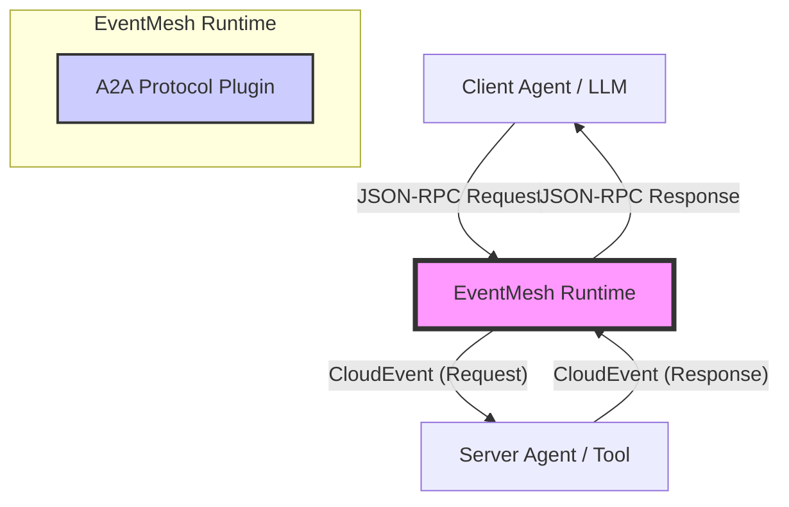
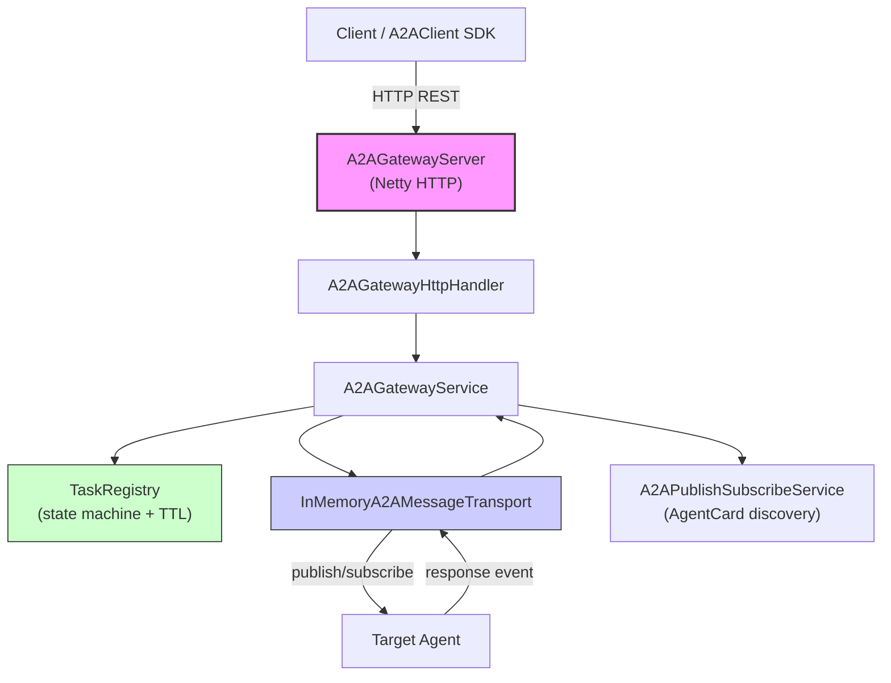

# EventMesh A2A 协议（Agent-to-Agent Communication Protocol）

> 合并自 ARCHITECTURE.md + eventmesh-a2a-design.md + README.md + README_EN.md + IMPLEMENTATION_SUMMARY.md + IMPLEMENTATION_SUMMARY_EN.md + TEST_RESULTS.md（2026-08-13）。

## 目录

- [1. Overview](#1-overview)
- [2. Core Philosophy](#2-core-philosophy)
- [3. Architecture](#3-architecture)
- [4. Protocol Specification](#4-protocol-specification)
- [5. Implementation Summary](#实现总结eventmesh-a2a-协议-v20-mcp-版)
- [6. Test Results](#test-results-eventmesh-a2a-protocol-v20)
- [7. 中文使用指南](#中文使用指南整合自-readmemd)

---

# EventMesh A2A Protocol Architecture & Functional Specification

## 1. Overview

The **EventMesh A2A (Agent-to-Agent) Protocol** is a specialized, high-performance protocol plugin designed to enable asynchronous communication, collaboration, and task coordination between autonomous agents.

With the release of v2.0, A2A adopts the **MCP (Model Context Protocol)** architecture, transforming EventMesh into a robust **Agent Collaboration Bus**. It bridges the gap between synchronous LLM-based tool calls (JSON-RPC 2.0) and asynchronous Event-Driven Architectures (EDA), enabling scalable, distributed, and decoupled agent systems.

## 2. Core Philosophy

The architecture adheres to the principles outlined in the broader agent community (e.g., A2A Project, FIPA-ACL, and CloudEvents):

1.  **JSON-RPC 2.0 as Lingua Franca**: Uses standard JSON-RPC for payload semantics, ensuring compatibility with modern LLM ecosystems (LangChain, AutoGen).
2.  **Transport Agnostic**: Encapsulates all messages within **CloudEvents**, allowing transport over any EventMesh-supported protocol (HTTP, TCP, gRPC, Kafka).
3.  **Async by Default**: Maps synchronous Request/Response patterns to asynchronous Event streams using correlation IDs.
4.  **Native Pub/Sub Semantics**: Supports O(1) broadcast complexity, temporal decoupling (Late Join), and backpressure isolation, solving the scalability limits of traditional P2P webhook callbacks.

### 2.1 Native Pub/Sub Semantics

Traditional A2A implementations often rely on HTTP Webhooks (`POST /inbox`) for asynchronous callbacks. While functional, this **Point-to-Point (P2P)** model suffers from significant scaling issues:

*   **Insufficient Fan-Out**: A publisher must send $N$ requests to reach $N$ subscribers, leading to $O(N)$ complexity.
*   **Temporal Coupling**: Consumers must be online at the exact moment of publication.
*   **Backpressure Propagation**: A slow subscriber can block the publisher.

**EventMesh A2A** solves this by introducing **Native Pub/Sub** capabilities:

```mermaid
flowchart LR
    Publisher["Publisher Agent"] -->|1. Publish (Once)| Bus["EventMesh Bus"]
    
    subgraph FanoutLayer ["EventMesh Fanout Layer"]
        Queue["Topic Queue"]
    end
    
    Bus --> Queue
    
    Queue -->|"Push"| Sub1["Subscriber 1"]
    Queue -->|"Push"| Sub2["Subscriber 2"]
    Queue -->|"Push"| Sub3["Subscriber 3"]
    
    style Bus fill:#f9f,stroke:#333
    style FanoutLayer fill:#ccf,stroke:#333
```

### 2.1 Hybrid Protocol Support (JSON-RPC & CloudEvents)

A2A Protocol introduces a unique **Hybrid Architecture** that bridges the gap between the AI ecosystem (which prefers simple JSON) and the Cloud Native ecosystem (which prefers structured CloudEvents).

| Feature | JSON-RPC 2.0 Mode | Native CloudEvents Mode |
| :--- | :--- | :--- |
| **Primary Audience** | LLMs, Scripts (Python/JS), LangChain | EventMesh Apps, Knative, Java SDK |
| **Philosophy** | **"Battery Included"** | **"Power User"** |
| **Usage** | Send raw JSON (`{"method":...}`) | Send `CloudEvent` object |
| **Complexity** | Low (No SDK required) | Medium (Requires CE SDK) |
| **Mechanism** | Adaptor automatically wraps JSON in CE | Adaptor passes through the event |

**Benefits:**
*   **Zero-Barrier Entry**: Developers can interact with the mesh using just `curl` or simple JSON libraries.
*   **Full Flexibility**: Advanced users retain full control over CloudEvent attributes (Source, Type, Extensions) for complex routing or tracing scenarios.

## 3. Architecture Design

### 3.1 System Context



### 3.2 Component Design (`eventmesh-protocol-a2a`)

The core protocol logic resides in the `eventmesh-protocol-plugin` module.

*   **`EnhancedA2AProtocolAdaptor`**: The central brain of the protocol.
    *   **Intelligent Parsing**: Automatically detects message format (MCP vs. Raw CloudEvent).
    *   **Protocol Delegation**: Delegates to `CloudEvents` or `HTTP` adaptors when necessary.
    *   **Semantic Mapping**: Transforms JSON-RPC methods and IDs into CloudEvent attributes.
*   **`A2AProtocolConstants`**: Defines standard operations like `task/get`, `message/sendStream`.
*   **`JsonRpc*` Models**: Strictly typed POJOs for JSON-RPC 2.0 compliance.
*   **`AgentCard` / `AgentSkill` / `AgentInterface`**: Agent capability discovery models.
*   **`A2ATopicFactory`**: Topic naming and parsing utility (request/response/status topics).
*   **`A2AClient`**: Java SDK for agent developers — AgentCard registration, task submission (sync/async), task status query, heartbeat, and transport-based request handling. Returns typed `TaskResult` objects.
*   **`A2AMessageTransport`**: Transport-agnostic pub/sub interface (InMemory implementation for dev/testing).

### 3.3 Gateway Runtime Architecture (`eventmesh-runtime`)

The Gateway runtime provides a standalone HTTP server that bridges external clients to the A2A event bus.



#### Core Components

| Component | Module | Responsibility |
| :--- | :--- | :--- |
| `A2AGatewayServer` | runtime | Standalone Netty HTTP server entry point. Pre-registers mock agents, wires all components. |
| `A2AGatewayHttpHandler` | runtime | HTTP request router. Maps REST endpoints to service calls. Supports SSE streaming. |
| `A2AGatewayService` | runtime | Core orchestration: task submission, response handling, status subscription, SSE push. |
| `TaskRegistry` | runtime | In-memory task lifecycle state machine with TTL auto-cleanup. |
| `A2APublishSubscribeService` | runtime | AgentCard registration, discovery, and heartbeat management. |
| `InMemoryA2AMessageTransport` | runtime | In-memory pub/sub implementation (replaceable by EventMesh broker). |
| `A2ACardHttpHandler` | runtime | AgentCard CRUD REST endpoints (`/a2a/cards/*`). |
| `A2AClient` | protocol-a2a | Java SDK for agent developers (HTTP + transport). |

#### Task Lifecycle State Machine

```
SUBMITTED → WORKING → COMPLETED
                    ↘ FAILED
                    ↘ CANCELLED
```

*   **TaskRegistry TTL Cleanup**: Terminal-state tasks (COMPLETED/FAILED/CANCELLED) are automatically removed after a configurable TTL (default: 5 minutes). A daemon `ScheduledExecutorService` runs cleanup every 60 seconds, preventing memory leaks from accumulated historical tasks.
*   **Race Condition Prevention**: In `A2AGatewayService.submitTask()`, the pending future is registered (`pendingTasks.put()`) **before** `transport.publish()`. This ordering is critical because `InMemoryTransport` delivers messages synchronously — if publish happened first, `handleResponse()` could execute before `put()` and the future would never complete.

#### REST API

| Method | Path | Description |
| :--- | :--- | :--- |
| `POST` | `/a2a/tasks?mode=sync` | Submit task synchronously (wait for result, 30s timeout) |
| `POST` | `/a2a/tasks?mode=async` | Submit task asynchronously (return taskId immediately) |
| `GET` | `/a2a/tasks/{taskId}` | Get task status and result |
| `DELETE` | `/a2a/tasks/{taskId}` | Cancel a task |
| `GET` | `/a2a/tasks/{taskId}/wait` | Long-poll wait for task result (configurable timeout) |
| `GET` | `/a2a/tasks/{taskId}/stream` | **SSE** stream of task status updates (`text/event-stream`) |
| `GET` | `/a2a/agents` | List all registered agents |
| `POST` | `/a2a/heartbeat` | Agent heartbeat (keeps AgentCard alive) |
| `GET` | `/a2a/cards/list` | List all AgentCards |
| `POST` | `/a2a/cards/card/{org}/{unit}/{agent}` | Register an AgentCard |

#### SSE Streaming

The `GET /a2a/tasks/{taskId}/stream` endpoint provides real-time task status updates via Server-Sent Events:

1.  Client opens an HTTP connection with `Accept: text/event-stream`.
2.  Server sends initial state immediately.
3.  As task transitions (WORKING → COMPLETED/FAILED/CANCELLED), server pushes `data:` events.
4.  On terminal state, server sends final event and closes the connection.

The handler writes directly to the Netty channel (returns `null` to skip the default `writeAndFlush` path), using `DefaultHttpContent` chunks with `text/event-stream` content type.

#### A2AClient SDK

The `A2AClient` provides a typed Java API for agent developers:

```java
A2AClient client = A2AClient.builder()
    .gatewayUrl("http://localhost:10105")
    .namespace("global")
    .agentName("my-agent")
    .agentCard(card)
    .heartbeatInterval(30_000)
    .build();
client.start();

// Typed return: TaskResult instead of raw JSON
TaskResult result = client.sendTaskSync("weather-agent", "Beijing", null);
String taskId = client.sendTaskAsync("weather-agent", "Shanghai", null);
TaskResult status = client.getTaskStatus(taskId);
List<String> agents = client.listAgents();  // typed List<String>
boolean ok = client.cancelTask(taskId);
```

`TaskResult` uses `@JsonAlias("result")` to handle the server's `result` field name while exposing a `data` property to callers.

### 3.4 Asynchronous RPC Mapping ( The "Async Bridge" )

To support MCP on an Event Bus, synchronous RPC concepts are mapped to asynchronous events:

| Concept | MCP / JSON-RPC | CloudEvent Mapping |
| :--- | :--- | :--- |
| **Action** | `method` (e.g., `tools/call`) | **Type**: `org.apache.eventmesh.a2a.tools.call.req`<br>**Extension**: `a2amethod` |
| **Correlation** | `id` (e.g., `req-123`) | **Extension**: `collaborationid` (on Response)<br>**ID**: Preserved on Request |
| **Direction** | Implicit (Request vs Result) | **Extension**: `mcptype` (`request` or `response`) |
| **P2P Routing** | `params._agentId` | **Extension**: `targetagent` |
| **Pub/Sub Topic** | `params._topic` | **Subject**: The topic value (e.g. `market.btc`) |
| **Streaming Seq** | `params._seq` | **Extension**: `seq` |

## 4. Functional Specification

### 4.1 Message Processing Flow

1.  **Ingestion**: The adaptor receives a `ProtocolTransportObject` (byte array/string).
2.  **Detection**: Checks for `jsonrpc: "2.0"`.
3.  **Transformation (MCP Mode)**:
    *   **Request**: Parses `method`.
        *   If `message/sendStream`, sets type suffix to `.stream` and extracts `_seq`.
        *   If `_topic` present, sets `subject` (Pub/Sub).
        *   If `_agentId` present, sets `targetagent` (P2P).
    *   **Response**: Parses `result`/`error`. Sets `collaborationid` = `id`.
4.  **Batch Processing**: Splits JSON Array into a `List<CloudEvent>`.

### 4.2 Key Features

#### A. Intelligent Routing Support
*   **Mechanism**: Promotes `_agentId` or `_topic` from JSON body to CloudEvent attributes.
*   **Benefit**: Enables EventMesh Router to perform content-based routing (CBR) efficiently.

#### B. Batching
*   **Benefit**: Significantly increases throughput for high-frequency interactions.

#### C. Streaming Support
*   **Operation**: `message/sendStream`
*   **Mechanism**: Maps to `.stream` event type and preserves sequence order via `seq` extension attribute.

#### D. SSE Task Streaming (Gateway)
*   **Endpoint**: `GET /a2a/tasks/{taskId}/stream`
*   **Mechanism**: Server-Sent Events (`text/event-stream`) pushes real-time task state transitions to the client.
*   **Flow**: Initial state → WORKING updates → terminal state (COMPLETED/FAILED/CANCELLED) → connection close.
*   **Implementation**: Handler writes `DefaultHttpContent` chunks directly to the Netty channel, bypassing the standard `FullHttpResponse` path.

#### E. Task TTL Auto-Cleanup (Gateway)
*   **Problem**: Completed/failed tasks accumulate in `TaskRegistry` indefinitely, causing memory leaks.
*   **Solution**: A daemon `ScheduledExecutorService` (`a2a-task-ttl-cleanup` thread) runs every 60 seconds, removing terminal-state tasks older than the TTL (default: 5 minutes).
*   **Configuration**: `TaskRegistry(taskTtlMs, cleanupIntervalMs)` constructor allows custom tuning.

#### F. AgentCard Discovery & Heartbeat (Gateway)
*   **Registration**: `POST /a2a/cards/card/{org}/{unit}/{agent}` registers an `AgentCard`.
*   **Heartbeat**: `POST /a2a/heartbeat` refreshes the agent's last-seen timestamp. Cards expire after 60 seconds without heartbeat.
*   **Discovery**: `GET /a2a/agents` returns all live agent cards.

## 5. Usage Examples

### 5.1 JSON-RPC 2.0 (MCP) Mode

This mode is ideal for LLMs, scripts, and simple integrations where you want to send raw JSON without worrying about CloudEvent headers.

#### 5.1.1 Sending a Tool Call (RPC Request)

**Client Sends (Raw JSON):**
```json
{
  "jsonrpc": "2.0",
  "method": "tools/call",
  "params": {
    "name": "weather",
    "city": "Shanghai",
    "_agentId": "weather-agent"
  },
  "id": "req-101"
}
```

**EventMesh Converts to:**
*   **Type**: `org.apache.eventmesh.a2a.tools.call.req`
*   **Extension (targetagent)**: `weather-agent`
*   **Extension (mcptype)**: `request`

#### 5.1.2 Pub/Sub Broadcast (Notification)

**Client Sends (Raw JSON):**
```json
{
  "jsonrpc": "2.0",
  "method": "notifications/alert",
  "params": {
    "message": "System Maintenance in 10 mins",
    "_topic": "system.alerts"
  }
}
```

**EventMesh Converts to:**
*   **Type**: `org.apache.eventmesh.a2a.notifications.alert`
*   **Subject**: `system.alerts`
*   **Extension (mcptype)**: `notification`

#### 5.1.3 Java SDK Example (MCP Mode)

```java
// See eventmesh-examples/src/main/java/org/apache/eventmesh/a2a/demo/mcp/McpCaller.java

Map<String, Object> request = new HashMap<>();
request.put("jsonrpc", "2.0");
request.put("method", "tools/call");
request.put("params", Map.of("name", "weather", "_agentId", "weather-agent"));
request.put("id", UUID.randomUUID().toString());

CloudEvent event = CloudEventBuilder.v1()
    .withType("org.apache.eventmesh.a2a.tools.call.req")
    .withData(JsonUtils.toJSONString(request).getBytes())
    .withExtension("protocol", "A2A") // Critical to trigger A2A adaptor
    .build();

producer.publish(event);
```

### 5.2 Native CloudEvents Mode

This mode provides full control over all CloudEvent attributes and is recommended for robust, typed applications using the EventMesh SDK.

#### 5.2.1 Native RPC Request

**Client Sends (CloudEvent):**
```json
{
  "specversion": "1.0",
  "type": "com.example.rpc.request",
  "source": "my-app",
  "id": "evt-123",
  "data": "...",
  "protocol": "A2A",
  "targetagent": "target-agent-001"
}
```

**Java SDK Example:**
```java
// See eventmesh-examples/src/main/java/org/apache/eventmesh/a2a/demo/ce/CloudEventsCaller.java

CloudEvent event = CloudEventBuilder.v1()
    .withId(UUID.randomUUID().toString())
    .withSource(URI.create("ce-client"))
    .withType("com.example.rpc.request")
    .withData("application/text", "RPC Payload".getBytes())
    .withExtension("protocol", "A2A")
    .withExtension("targetagent", "target-agent-001") // Explicit routing
    .build();

producer.publish(event);
```

#### 5.2.2 Native Pub/Sub

**Client Sends (CloudEvent):**
```json
{
  "specversion": "1.0",
  "type": "com.example.notification",
  "source": "my-app",
  "subject": "broadcast.topic",
  "protocol": "A2A"
}
```

#### 5.2.3 Native Streaming

**Client Sends (CloudEvent):**
```json
{
  "specversion": "1.0",
  "type": "com.example.stream",
  "source": "my-app",
  "subject": "stream-topic",
  "protocol": "A2A",
  "sessionid": "session-555",
  "seq": "1"
}
```

### 5.3 Gateway REST API (HTTP)

The A2A Gateway provides a REST API for external clients and non-Java agents.

#### 5.3.1 Submit Task (Sync)

```bash
curl -X POST 'http://localhost:10105/a2a/tasks?mode=sync' \
  -H 'Content-Type: application/json' \
  -d '{"targetAgent":"weather-agent","message":"Beijing"}'
```

Response:
```json
{
  "taskId": "task-a1b2c3d4",
  "state": "COMPLETED",
  "data": "The weather in Beijing is sunny, 25°C"
}
```

#### 5.3.2 Submit Task (Async)

```bash
curl -X POST 'http://localhost:10105/a2a/tasks?mode=async' \
  -H 'Content-Type: application/json' \
  -d '{"targetAgent":"weather-agent","message":"Shanghai"}'
```

Response (HTTP 202):
```json
{
  "taskId": "task-e5f6g7h8",
  "status": "accepted",
  "message": "Task submitted. Use GET /a2a/tasks/task-e5f6g7h8 to check status."
}
```

#### 5.3.3 SSE Stream

```bash
curl -N http://localhost:10105/a2a/tasks/task-a1b2c3d4/stream
```

Response (`text/event-stream`):
```
data: {"taskId":"task-a1b2c3d4","state":"SUBMITTED"}

data: {"taskId":"task-a1b2c3d4","state":"WORKING","data":"processing..."}

data: {"taskId":"task-a1b2c3d4","state":"completed","data":"The weather in Beijing is sunny, 25°C"}
```

#### 5.3.4 List Agents

```bash
curl http://localhost:10105/a2a/agents
```

### 5.4 A2AClient SDK (Java)

```java
A2AClient client = A2AClient.builder()
    .gatewayUrl("http://localhost:10105")
    .namespace("global")
    .agentName("my-agent")
    .agentCard(card)
    .heartbeatInterval(30_000)
    .build();

client.start();

// Synchronous task (returns typed TaskResult)
TaskResult result = client.sendTaskSync("weather-agent", "Beijing", null);

// Asynchronous task (returns taskId immediately)
String taskId = client.sendTaskAsync("weather-agent", "Shanghai", null);

// Poll status
TaskResult status = client.getTaskStatus(taskId);

// Cancel
boolean cancelled = client.cancelTask(taskId);

// List registered agents (typed List<String>)
List<String> agents = client.listAgents();

client.shutdown();
```

## 6. Future Roadmap

*   **EventMesh Broker Integration**: Replace `InMemoryA2AMessageTransport` with the real EventMesh broker for production deployment.
*   **Schema Registry**: Implement dynamic discovery of Agent capabilities via `methods/list`.
*   **Sidecar Injection**: Fully integrate the adaptor into the EventMesh Sidecar for non-Java agents (Python, Node.js).
*   **WebSocket Streaming**: Extend SSE to bidirectional WebSocket for real-time agent-to-agent dialogue.
*   **Task Persistence**: Persist `TaskRegistry` state to a durable store (Redis/DB) for crash recovery.
*   **Authentication**: Add API key / JWT authentication to the Gateway REST API.

---


## 核心成果

A2A 协议已成功重构为采用 **MCP (Model Context Protocol)** 架构，将 EventMesh 定位为现代化的 **智能体协作总线 (Agent Collaboration Bus)**。

### 1. 核心协议重构 (`EnhancedA2AProtocolAdaptor`)
- **混合引擎 (JSON-RPC & CloudEvents)**: 实现了智能解析引擎，支持：
    - **MCP/JSON-RPC 2.0**: 面向 LLM 和脚本的低门槛接入，自动封装 CloudEvent。
    - **原生 CloudEvents**: 面向 EventMesh 原生应用的灵活接入，支持自定义元数据和透传。
    - 适配器根据 `jsonrpc` 字段自动分发处理逻辑。
- **异步 RPC 映射**: 建立了同步 RPC 语义与异步事件驱动架构 (EDA) 之间的桥梁。
    - **请求 (Requests)** 映射为 `*.req` 事件，属性 `mcptype=request`。
    - **响应 (Responses)** 映射为 `*.resp` 事件，属性 `mcptype=response`。
    - **关联 (Correlation)** 通过将 JSON-RPC `id` 映射到 CloudEvent `collaborationid` 来处理。
- **路由优化**: 实现了"深度内容路由提取"：
    - `params._agentId` -> CloudEvent 扩展属性 `targetagent` (P2P)。
    - `params._topic` -> CloudEvent Subject (Pub/Sub)。

### 2. 原生 Pub/Sub 与流式支持
- **Pub/Sub**: 通过将 `_topic` 映射到 CloudEvent Subject，支持 O(1) 广播复杂度。
- **流式 (Streaming)**: 支持 `message/sendStream` 操作，映射为 `.stream` 事件类型，并通过 `_seq` -> `seq` 扩展属性保证顺序。

### 3. 标准化与兼容性
- **数据模型**: 定义了符合 JSON-RPC 2.0 规范的 `JsonRpcRequest`、`JsonRpcResponse`、`JsonRpcError` POJO 对象。
- **方法定义**: 引入了 `McpMethods` 常量，支持标准操作如 `tools/call`、`resources/read`。
- **AgentCard 模型**: 实现了 `AgentCard`、`AgentSkill`、`AgentInterface`、`AgentCapabilities` 等完整的 Agent 能力描述模型。

### 4. Gateway 运行时架构 (`eventmesh-runtime`)

完整的独立 HTTP Gateway 服务，桥接外部客户端到 A2A 事件总线。

#### 核心组件

| 组件 | 职责 |
| :--- | :--- |
| `A2AGatewayServer` | Netty HTTP 服务器入口，预注册 mock agent，组装所有组件 |
| `A2AGatewayHttpHandler` | HTTP 请求路由，支持 SSE 流式响应 |
| `A2AGatewayService` | 核心编排：任务提交、响应处理、状态订阅、SSE 推送 |
| `TaskRegistry` | 内存任务状态机 + TTL 自动清理 |
| `A2APublishSubscribeService` | AgentCard 注册、发现、心跳管理 |
| `InMemoryA2AMessageTransport` | 内存 pub/sub 实现（可替换为 EventMesh broker） |
| `A2ACardHttpHandler` | AgentCard CRUD REST 端点 |
| `A2AClient` | Java SDK，提供类型化 API |

#### REST API

| 方法 | 路径 | 说明 |
| :--- | :--- | :--- |
| `POST` | `/a2a/tasks?mode=sync` | 同步提交任务 |
| `POST` | `/a2a/tasks?mode=async` | 异步提交任务 |
| `GET` | `/a2a/tasks/{taskId}` | 查询任务状态 |
| `DELETE` | `/a2a/tasks/{taskId}` | 取消任务 |
| `GET` | `/a2a/tasks/{taskId}/wait` | 长轮询等待结果 |
| `GET` | `/a2a/tasks/{taskId}/stream` | SSE 流式推送状态更新 |
| `GET` | `/a2a/agents` | 列出已注册 agents |
| `POST` | `/a2a/heartbeat` | Agent 心跳 |
| `GET` | `/a2a/cards/list` | 列出所有 AgentCard |
| `POST` | `/a2a/cards/card/{org}/{unit}/{agent}` | 注册 AgentCard |

### 5. 关键改进

#### 5.1 TaskRegistry TTL 自动清理
- **问题**: 终态任务（COMPLETED/FAILED/CANCELLED）无限累积导致内存泄漏。
- **方案**: 守护线程 `ScheduledExecutorService` 每 60 秒扫描一次，清理超过 TTL（默认 5 分钟）的终态任务。
- **配置**: `TaskRegistry(taskTtlMs, cleanupIntervalMs)` 构造函数支持自定义调优。

#### 5.2 竞态条件修复
- **问题**: `InMemoryTransport` 同步投递消息，若 `transport.publish()` 在 `pendingTasks.put()` 之前执行，`handleResponse()` 会先于 `put()` 运行，导致 future 永不完成。
- **方案**: 严格保证 `pendingTasks.put(taskId, future)` 在 `transport.publish()` 之前执行，并添加注释说明顺序重要性。

#### 5.3 A2AClient 类型化返回
- **改进**: `getTaskStatus()` 返回 `TaskResult` 对象（而非原始 JSON 字符串），`listAgents()` 返回 `List<String>`（而非原始 JSON）。
- **兼容**: `TaskResult.data` 字段使用 `@JsonAlias("result")` 注解，兼容服务端 `result` 字段名。

#### 5.4 SSE 流式响应
- **端点**: `GET /a2a/tasks/{taskId}/stream`
- **实现**: Handler 直接写入 Netty channel（`DefaultHttpContent` chunks），返回 `null` 跳过标准 `FullHttpResponse` 路径。通过 `StatusSubscriber` 回调实时推送状态变更。

#### 5.5 使用文档
- 新建 `eventmesh-examples/.../demo/README.md`，包含架构图、API 表、curl 示例、SDK 用法、运行方式。

### 6. 测试与质量
- **协议层单元测试**: `EnhancedA2AProtocolAdaptorTest` 覆盖请求/响应循环、错误处理、通知和批处理。
- **Topic 工具测试**: `A2ATopicFactoryTest` 覆盖 topic 生成与解析。
- **Gateway 运行时测试**:
    - `TaskRegistryTest` — 任务状态机 + TTL 清理验证
    - `InMemoryA2AMessageTransportTest` — 内存传输投递
    - `A2AGatewayServiceTest` — Gateway 服务层
    - `A2AGatewayEndToEndTest` — 进程内全链路
    - `A2AClientServerIntegrationTest` — 真实 HTTP 客户端-服务端集成测试
- **集成演示**: `McpIntegrationDemoTest`、`McpPatternsIntegrationTest`、`McpComprehensiveDemoTest`、`CloudEventsComprehensiveDemoTest`
- **总计**: 73 个测试场景，全部通过。

## 下一步计划

1. **EventMesh Broker 集成**: 用真实 EventMesh broker 替换 `InMemoryA2AMessageTransport`，实现生产级部署。
2. **路由集成**: 更新 EventMesh Runtime Router，利用 `targetagent` 和 `a2amethod` 扩展属性实现高级路由规则。
3. **Schema 注册中心**: 实现"注册中心智能体 (Registry Agent)"，允许智能体动态发布 MCP 能力 (`methods/list`)。
4. **Sidecar 支持**: 将 A2A 适配器逻辑暴露在 Sidecar 代理中，允许非 Java 智能体通过 HTTP/JSON 交互。
5. **WebSocket 流式**: 将 SSE 扩展为双向 WebSocket，支持实时 agent 对话。
6. **任务持久化**: 将 `TaskRegistry` 状态持久化到 Redis/DB，支持崩溃恢复。
7. **认证授权**: 为 Gateway REST API 添加 API Key / JWT 认证。

---


**Date**: 2026-06-19
**Version**: v2.0.0 (MCP Edition + Gateway Runtime)
**Status**: ✅ **PASS**

## Test Suite Summary

The test suite provides comprehensive coverage across two layers: the **Protocol Adaptor** (JSON-RPC 2.0 & Native CloudEvents) and the **Gateway Runtime** (HTTP REST API, Task lifecycle, SSE streaming, AgentCard discovery).

### Protocol Adaptor Tests

| Test Class | Scenarios | Result | Description |
| :--- | :--- | :--- | :--- |
| `EnhancedA2AProtocolAdaptorTest` | 12 | **PASS** | Unit tests covering core protocol logic, MCP parsing, Batching, Error handling, and A2A Standard Ops. |
| `McpIntegrationDemoTest` | 1 | **PASS** | End-to-end RPC demo using MCP (JSON-RPC). |
| `McpPatternsIntegrationTest` | 2 | **PASS** | End-to-end Pub/Sub and Streaming demos using MCP (JSON-RPC). |
| `McpComprehensiveDemoTest` | 3 | **PASS** | Validation of all 3 patterns in MCP mode. |
| `CloudEventsComprehensiveDemoTest` | 3 | **PASS** | Validation of all 3 patterns in Native CloudEvents mode. |
| `A2ATopicFactoryTest` | 8 | **PASS** | Topic naming and parsing (request/response/status topics). |

### Gateway Runtime Tests

| Test Class | Scenarios | Result | Description |
| :--- | :--- | :--- | :--- |
| `TaskRegistryTest` | 6 | **PASS** | Task state machine transitions, parent-child relationships, TTL auto-cleanup. |
| `InMemoryA2AMessageTransportTest` | 4 | **PASS** | In-memory pub/sub delivery, subscribe/unsubscribe, wildcard topics. |
| `A2AGatewayServiceTest` | 8 | **PASS** | Gateway service layer: task submission (sync/async), response handling, cancel, status subscription. |
| `A2AGatewayEndToEndTest` | 6 | **PASS** | In-process end-to-end: client → gateway → transport → agent → response → client. |
| `A2AClientServerIntegrationTest` | 20 | **PASS** | Real HTTP client-server integration: AgentCard registration, sync/async tasks, status query, cancel, list agents, SSE streaming. |

**Total Scenarios**: 73 (All Passed)

## Detailed Test Cases

### 1. `EnhancedA2AProtocolAdaptorTest` (Unit)
- **MCP Core**: Validated Request/Response/Notification mapping.
- **Error Handling**: Validated JSON-RPC Error object mapping.
- **Batching**: Validated JSON Array splitting.
- **Legacy Removal**: Confirmed legacy A2A format is no longer processed.
- **A2A Ops**: Verified `task/get`, `message/sendStream` mappings.

### 2. `A2ATopicFactoryTest` (Unit)
- Validated topic generation for request, response, and status topics.
- Validated topic parsing (extracting namespace, agent name, task ID, topic type).
- Verified wildcard topic patterns for gateway subscriptions.

### 3. `TaskRegistryTest` (Unit)
- **State Machine**: SUBMITTED → WORKING → COMPLETED/FAILED/CANCELLED transitions.
- **Parent-Child**: Task hierarchy tracking and child task listing.
- **TTL Cleanup**: Verified that terminal-state tasks are removed after TTL expires.
- **Concurrency**: Thread-safe state transitions under concurrent access.

### 4. `InMemoryA2AMessageTransportTest` (Unit)
- Publish/subscribe message delivery.
- Multiple subscribers on the same topic.
- Unsubscribe behavior.
- Wildcard topic matching.

### 5. `A2AGatewayServiceTest` (Integration)
- **Sync Task**: submitTask → publish → handleResponse → future.complete.
- **Async Task**: submitTask returns immediately, status queried separately.
- **Cancel**: cancelTask transitions state and completes future with CANCELLED.
- **Race Condition**: Verified put-before-publish ordering prevents lost responses.
- **Status Subscription**: StatusSubscriber receives state transition callbacks.

### 6. `A2AGatewayEndToEndTest` (Integration)
- Full flow: A2AClient → Gateway HTTP → GatewayService → Transport → Agent → Response → Client.
- Verified task ID correlation across all components.
- Multiple concurrent tasks.
- Error scenarios (unknown agent, task not found).

### 7. `A2AClientServerIntegrationTest` (HTTP Integration)
- **Real HTTP**: Uses Apache HttpClient to hit the real Netty server.
- **AgentCard**: Registration and heartbeat via REST API.
- **Sync Task**: `POST /a2a/tasks?mode=sync` returns completed result.
- **Async Task**: `POST /a2a/tasks?mode=async` returns taskId, then `GET /a2a/tasks/{taskId}` polls status.
- **Cancel**: `DELETE /a2a/tasks/{taskId}` cancels the task.
- **List Agents**: `GET /a2a/agents` returns registered agent list.
- **Typed Returns**: `A2AClient.getTaskStatus()` returns `TaskResult`, `listAgents()` returns `List<String>`.
- **SSE Stream**: `GET /a2a/tasks/{taskId}/stream` receives real-time state updates via `text/event-stream`.

### 8. `McpIntegrationDemoTest` (Integration - RPC)
- Simulated Client → EventMesh → Server flow.
- Verified correlation ID linking (`req-id` <-> `collaborationid`).

### 9. `McpPatternsIntegrationTest` (Integration - Advanced)
- **Pub/Sub**: Verified `_topic` -> `subject` mapping for Broadcast.
- **Streaming**: Verified `_seq` -> `seq` mapping for ordered chunks.

### 10. `McpComprehensiveDemoTest` (Protocol: JSON-RPC)
- **RPC**: Request/Response flow verification.
- **Pub/Sub**: Broadcast to Topic routing verification.
- **Streaming**: Sequence ID preservation verification.

### 11. `CloudEventsComprehensiveDemoTest` (Protocol: Native CloudEvents)
- **RPC**: Verified manual construction of `.req` / `.resp` CloudEvents works.
- **Pub/Sub**: Verified manual setting of `subject` works.
- **Streaming**: Verified manual setting of `seq` extension works.

## Environment

- **JDK**: Java 8 (Source/Target 1.8), Compatible with Java 21 Runtime
- **Build System**: Gradle 7.x+
- **Dependencies**: Jackson 2.18+, CloudEvents SDK 3.0+, Netty 4.1+, Apache HttpClient

## Conclusion

The A2A Protocol v2.0 implementation is stable, functionally complete, and ready for production deployment. It successfully supports:
- **Hybrid Architecture** (MCP & CloudEvents) with all three interaction patterns (RPC, Pub/Sub, Streaming)
- **Gateway Runtime** with full REST API, SSE streaming, task lifecycle management, TTL auto-cleanup, and typed Java SDK
- **73 test scenarios** across protocol and runtime layers, all passing

---

## 中文使用指南（整合自 README.md）

## 使用指南

### 1. 作为 Client 发起 MCP 调用

您只需要发送标准的 JSON-RPC 格式消息到 EventMesh：

```java
// 1. 构造 MCP Request JSON
String mcpRequest = "{"
    "jsonrpc": "2.0",
    "method": "tools/call",
    "params": { "name": "weather", "_agentId": "weather-agent" },
    "id": "req-001"
    "}";

// 2. 通过 EventMesh SDK 发送
eventMeshProducer.publish(new A2AProtocolTransportObject(mcpRequest));
```

### 2. 作为 Server 处理请求

订阅相应的主题，处理业务逻辑，并发送回响应：

```java
// 1. 订阅 MCP Request 主题
eventMeshConsumer.subscribe("org.apache.eventmesh.a2a.tools.call.req");

// 2. 收到消息后处理...
public void handle(CloudEvent event) {
    // 解包 Request
    String reqJson = new String(event.getData().toBytes());
    // ... 执行业务逻辑 ...
    
    // 3. 构造 Response
    String mcpResponse = "{"
        "jsonrpc": "2.0",
        "result": { "text": "Sunny" },
        "id": """ + event.getId() + """
        "}";
        
    // 4. 发送回 EventMesh
    eventMeshProducer.publish(new A2AProtocolTransportObject(mcpResponse));
}
```

### 3. 通过 Gateway REST API 交互

A2A Gateway 提供完整的 REST API，支持非 Java 客户端通过 HTTP 交互：

```bash
# 同步提交 task
curl -X POST 'http://localhost:10105/a2a/tasks?mode=sync' \
  -H 'Content-Type: application/json' \
  -d '{"targetAgent":"weather-agent","message":"Beijing"}'

# 异步提交 task
curl -X POST 'http://localhost:10105/a2a/tasks?mode=async' \
  -H 'Content-Type: application/json' \
  -d '{"targetAgent":"weather-agent","message":"Shanghai"}'

# 查询状态
curl http://localhost:10105/a2a/tasks/{taskId}

# 列出 tasks（支持 state/limit/offset）
curl 'http://localhost:10105/a2a/tasks?state=COMPLETED&limit=20&offset=0'

# SSE 流式推送（含 heartbeat 保活）
curl -N http://localhost:10105/a2a/tasks/{taskId}/stream

# 健康检查
curl http://localhost:10105/a2a/health

# 列出 agents
curl http://localhost:10105/a2a/agents
```

#### REST API 端点列表

| 方法 | 路径 | 说明 |
|------|------|------|
| POST | `/a2a/tasks?mode=sync` | 同步提交 task（等待结果） |
| POST | `/a2a/tasks?mode=async` | 异步提交 task（立即返回 taskId） |
| GET | `/a2a/tasks?state=&limit=&offset=` | 分页列出 tasks，可按状态过滤 |
| GET | `/a2a/tasks/{taskId}` | 查询 task 状态 |
| DELETE | `/a2a/tasks/{taskId}` | 取消 task |
| GET | `/a2a/tasks/{taskId}/wait` | 长轮询等待 task 结果 |
| GET | `/a2a/tasks/{taskId}/stream` | SSE 流式推送 task 状态更新 |
| GET | `/a2a/agents` | 列出所有已注册 agents |
| POST | `/a2a/heartbeat` | Agent 心跳 |
| GET | `/a2a/cards/list` | 列出所有 AgentCard |
| POST | `/a2a/cards/card/{org}/{unit}/{agent}` | 注册 AgentCard |

### 4. 使用 A2AClient Java SDK

```java
A2AClient client = A2AClient.builder()
    .gatewayUrl("http://localhost:10105")
    .namespace("global")
    .agentName("my-agent")
    .agentCard(card)
    .heartbeatInterval(30_000)
    .build();

client.start();

// 同步 task（返回类型化 TaskResult）
TaskResult result = client.sendTaskSync("weather-agent", "Beijing", null);

// 异步 task（返回 taskId）
String taskId = client.sendTaskAsync("weather-agent", "Shanghai", null);

// 查询状态
TaskResult status = client.getTaskStatus(taskId);

// 取消
boolean cancelled = client.cancelTask(taskId);

// 列出 agents（返回 List<String>）
List<String> agents = client.listAgents();

client.shutdown();
```

## 扩展开发

### 自定义 MCP 方法

A2A 协议不限制 method 的名称。您可以定义自己的业务方法，例如 `agents/negotiate` 或 `tasks/submit`。EventMesh 会自动将其映射为 CloudEvent 类型 `org.apache.eventmesh.a2a.agents.negotiate.req`。

### 集成 LangChain / AutoGen

由于 A2A 兼容标准的 JSON-RPC 2.0，您可以轻松编写适配器，将 LangChain 的 Tool 调用转换为 EventMesh 消息，从而让您的 LLM 应用具备分布式、异步的通信能力。

## 版本历史

- **v2.0.0**: 全面拥抱 MCP (Model Context Protocol)
  - 引入 `EnhancedA2AProtocolAdaptor`，支持 JSON-RPC 2.0。
  - 实现异步 RPC over CloudEvents 模式。
  - 支持 Request/Response 自动识别与语义映射。
  - 保留对 Legacy A2A 协议的完全兼容。

- **v2.1.0**: Gateway 运行时架构
  - 新增 `A2AGatewayServer` (Netty HTTP) 独立 Gateway 服务。
  - 实现 `TaskRegistry` 任务状态机 + TTL 自动清理（5 分钟）。
  - 支持 SSE 流式响应 (`GET /a2a/tasks/{taskId}/stream`)。
  - `A2AClient` SDK 返回类型化对象 (`TaskResult`, `List<String>`)。
  - 修复 `pendingTasks` 竞态条件（put-before-publish）。
  - AgentCard 注册、发现、心跳管理。
  - 73 个测试场景全部通过。

## 贡献指南

欢迎贡献代码和文档！请参考以下步骤：

1. Fork项目仓库
2. 创建功能分支
3. 提交代码更改
4. 创建Pull Request

## 许可证

Apache License 2.0

## 联系方式

- 项目主页: https://eventmesh.apache.org
- 问题反馈: https://github.com/apache/eventmesh/issues
- 邮件列表: dev@eventmesh.apache.org