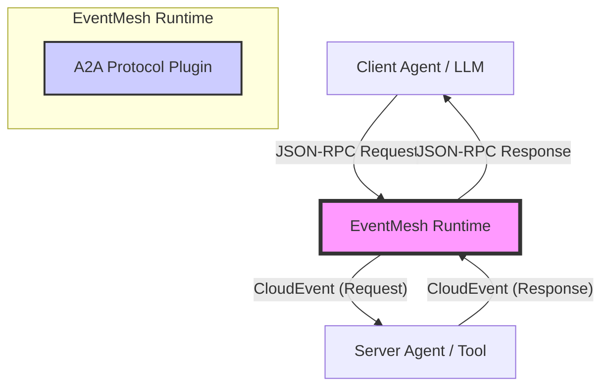

# EventMesh A2A Protocol Architecture & Functional Specification

## 1. Overview

The **EventMesh A2A (Agent-to-Agent) Protocol** is a specialized, high-performance protocol plugin designed to enable asynchronous communication, collaboration, and task coordination between autonomous agents.

With the release of v2.0, A2A adopts the **MCP (Model Context Protocol)** architecture, transforming EventMesh into a robust **Agent Collaboration Bus**. It bridges the gap between synchronous LLM-based tool calls (JSON-RPC 2.0) and asynchronous Event-Driven Architectures (EDA), enabling scalable, distributed, and decoupled agent systems.

## 2. Core Philosophy

The architecture adheres to the principles outlined in the broader agent community (e.g., A2A Project, FIPA-ACL, and CloudEvents):

1.  **JSON-RPC 2.0 as Lingua Franca**: Uses standard JSON-RPC for payload semantics, ensuring compatibility with modern LLM ecosystems (LangChain, AutoGen).
2.  **Transport Agnostic**: Encapsulates all messages within **CloudEvents**, allowing transport over any EventMesh-supported protocol (HTTP, TCP, gRPC, Kafka).
3.  **Async by Default**: Maps synchronous Request/Response patterns to asynchronous Event streams using correlation IDs.
4.  **Native Pub/Sub Semantics**: Supports O(1) broadcast complexity, temporal decoupling (Late Join), and backpressure isolation, solving the scalability limits of traditional P2P webhook callbacks.

### 2.1 Native Pub/Sub Semantics

Traditional A2A implementations often rely on HTTP Webhooks (`POST /inbox`) for asynchronous callbacks. While functional, this **Point-to-Point (P2P)** model suffers from significant scaling issues:

*   **Insufficient Fan-Out**: A publisher must send $N$ requests to reach $N$ subscribers, leading to $O(N)$ complexity.
*   **Temporal Coupling**: Consumers must be online at the exact moment of publication.
*   **Backpressure Propagation**: A slow subscriber can block the publisher.

**EventMesh A2A** solves this by introducing **Native Pub/Sub** capabilities:

```mermaid
graph LR
    Publisher[Publisher Agent] -->|1. Publish (Once)| Bus[EventMesh Bus]
    
    subgraph Fanout_Layer [EventMesh Fanout Layer]
        Queue[Topic Queue]
    end
    
    Bus --> Queue
    
    Queue -->|Push| Sub1[Subscriber 1]
    Queue -->|Push| Sub2[Subscriber 2]
    Queue -->|Push| Sub3[Subscriber 3]
    
    style Bus fill:#f9f,stroke:#333
    style Fanout_Layer fill:#ccf,stroke:#333
```

### 2.1 Hybrid Protocol Support (JSON-RPC & CloudEvents)

A2A Protocol introduces a unique **Hybrid Architecture** that bridges the gap between the AI ecosystem (which prefers simple JSON) and the Cloud Native ecosystem (which prefers structured CloudEvents).

| Feature | JSON-RPC 2.0 Mode | Native CloudEvents Mode |
| :--- | :--- | :--- |
| **Primary Audience** | LLMs, Scripts (Python/JS), LangChain | EventMesh Apps, Knative, Java SDK |
| **Philosophy** | **"Battery Included"** | **"Power User"** |
| **Usage** | Send raw JSON (`{"method":...}`) | Send `CloudEvent` object |
| **Complexity** | Low (No SDK required) | Medium (Requires CE SDK) |
| **Mechanism** | Adaptor automatically wraps JSON in CE | Adaptor passes through the event |

**Benefits:**
*   **Zero-Barrier Entry**: Developers can interact with the mesh using just `curl` or simple JSON libraries.
*   **Full Flexibility**: Advanced users retain full control over CloudEvent attributes (Source, Type, Extensions) for complex routing or tracing scenarios.

## 3. Architecture Design

### 3.1 System Context



### 3.2 Component Design (`eventmesh-protocol-a2a`)

The core logic resides in the `eventmesh-protocol-plugin` module.

*   **`EnhancedA2AProtocolAdaptor`**: The central brain of the protocol.
    *   **Intelligent Parsing**: Automatically detects message format (MCP vs. Raw CloudEvent).
    *   **Protocol Delegation**: Delegates to `CloudEvents` or `HTTP` adaptors when necessary.
    *   **Semantic Mapping**: Transforms JSON-RPC methods and IDs into CloudEvent attributes.
*   **`A2AProtocolConstants`**: Defines standard operations like `task/get`, `message/sendStream`.
*   **`JsonRpc*` Models**: Strictly typed POJOs for JSON-RPC 2.0 compliance.

### 3.3 Asynchronous RPC Mapping ( The "Async Bridge" )

To support MCP on an Event Bus, synchronous RPC concepts are mapped to asynchronous events:

| Concept | MCP / JSON-RPC | CloudEvent Mapping |
| :--- | :--- | :--- |
| **Action** | `method` (e.g., `tools/call`) | **Type**: `org.apache.eventmesh.a2a.tools.call.req`<br>**Extension**: `a2amethod` |
| **Correlation** | `id` (e.g., `req-123`) | **Extension**: `collaborationid` (on Response)<br>**ID**: Preserved on Request |
| **Direction** | Implicit (Request vs Result) | **Extension**: `mcptype` (`request` or `response`) |
| **P2P Routing** | `params._agentId` | **Extension**: `targetagent` |
| **Pub/Sub Topic** | `params._topic` | **Subject**: The topic value (e.g. `market.btc`) |
| **Streaming Seq** | `params._seq` | **Extension**: `seq` |

## 4. Functional Specification

### 4.1 Message Processing Flow

1.  **Ingestion**: The adaptor receives a `ProtocolTransportObject` (byte array/string).
2.  **Detection**: Checks for `jsonrpc: "2.0"`.
3.  **Transformation (MCP Mode)**:
    *   **Request**: Parses `method`.
        *   If `message/sendStream`, sets type suffix to `.stream` and extracts `_seq`.
        *   If `_topic` present, sets `subject` (Pub/Sub).
        *   If `_agentId` present, sets `targetagent` (P2P).
    *   **Response**: Parses `result`/`error`. Sets `collaborationid` = `id`.
4.  **Batch Processing**: Splits JSON Array into a `List<CloudEvent>`.

### 4.2 Key Features

#### A. Intelligent Routing Support
*   **Mechanism**: Promotes `_agentId` or `_topic` from JSON body to CloudEvent attributes.
*   **Benefit**: Enables EventMesh Router to perform content-based routing (CBR) efficiently.

#### B. Batching
*   **Benefit**: Significantly increases throughput for high-frequency interactions.

#### C. Streaming Support
*   **Operation**: `message/sendStream`
*   **Mechanism**: Maps to `.stream` event type and preserves sequence order via `seq` extension attribute.

## 5. Usage Examples

### 5.1 Sending a Tool Call (Request)

**Raw Payload:**
```json
{
  "jsonrpc": "2.0",
  "method": "tools/call",
  "params": {
    "name": "weather_service",
    "arguments": { "city": "New York" }
  },
  "id": "msg-101"
}
```

### 5.2 Pub/Sub Broadcast

**Raw Payload:**
```json
{
  "jsonrpc": "2.0",
  "method": "market/update",
  "params": {
    "symbol": "BTC",
    "price": 50000,
    "_topic": "market.crypto.btc"
  }
}
```

**Generated CloudEvent:**
*   `subject`: `market.crypto.btc`
*   `targetagent`: (Empty)

## 6. Future Roadmap

*   **Schema Registry**: Implement dynamic discovery of Agent capabilities via `methods/list`.
*   **Sidecar Injection**: Fully integrate the adaptor into the EventMesh Sidecar.