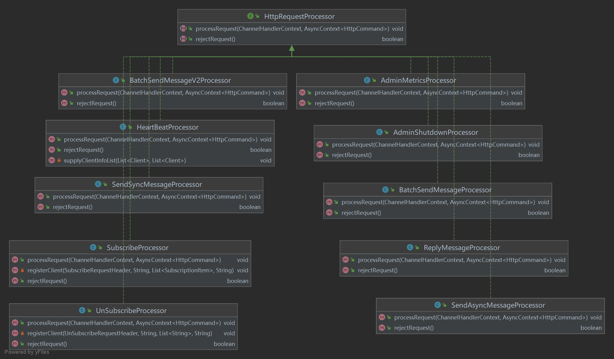
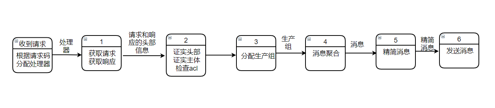

# http处理

上次讲到，当`channel`被注册之后，这个类中的`initChannel`方法就会被调用，就会实现在管道后面加入`handlers`。那具体的，我们的http是怎样处理消息的？

```java
 class HttpsServerInitializer extends ChannelInitializer<SocketChannel> {
			...
            // 在管道后面加入handlers
            pipeline.addLast(new HttpRequestDecoder(),// 这个是对http解码
                    new HttpResponseEncoder(),// 这个是对http的响应编码
                    new HttpConnectionHandler(),// 这个是对http连接处理
                    new HttpObjectAggregator(Integer.MAX_VALUE),// 这个是http对象聚合
                    new HTTPHandler());// 这个是http的Handler的具体实现
        }
    }
}
```

## 处理逻辑


- 代码实现部分：

```java
class HTTPHandler extends SimpleChannelInboundHandler<HttpRequest> {

        @Override
        protected void channelRead0(ChannelHandlerContext ctx, HttpRequest httpRequest) throws Exception {
            HttpPostRequestDecoder decoder = null;
            // todo start server span, we should get channel here to put span in channel's context in async call.

            try {
                if (!httpRequest.decoderResult().isSuccess()) {
                    sendError(ctx, HttpResponseStatus.BAD_REQUEST);
                    return;
                }
				// 请求命令
                final HttpCommand requestCommand = new HttpCommand();
                // todo record command opaque in span.
				
                httpRequest.headers().set(ProtocolKey.ClientInstanceKey.IP, RemotingHelper.parseChannelRemoteAddr(ctx.channel()));

               ...
                Map<String, Object> bodyMap = new HashMap<>();
				// GET请求
                if (httpRequest.method() == HttpMethod.GET) {
                    QueryStringDecoder getDecoder = new QueryStringDecoder(httpRequest.uri());
                    getDecoder.parameters().entrySet().forEach(entry -> {
                        bodyMap.put(entry.getKey(), entry.getValue().get(0));
                    });
                    // POST请求
                } else if (httpRequest.method() == HttpMethod.POST) {
                    decoder = new HttpPostRequestDecoder(defaultHttpDataFactory, httpRequest);
                    // 获取参数列表
                    List<InterfaceHttpData> parmList = decoder.getBodyHttpDatas();
                    for (InterfaceHttpData parm : parmList) {
                        if (parm.getHttpDataType() == InterfaceHttpData.HttpDataType.Attribute) {
                            Attribute data = (Attribute) parm;
                            bodyMap.put(data.getName(), data.getValue());
                        }
                    }
                } else {
                    sendError(ctx, HttpResponseStatus.METHOD_NOT_ALLOWED);
                    return;
                }

                ...
                String requestCode =
                        (httpRequest.method() == HttpMethod.POST) ? StringUtils.deleteWhitespace(httpRequest.headers().get(ProtocolKey.REQUEST_CODE))
                                : MapUtils.getString(bodyMap, StringUtils.lowerCase(ProtocolKey.REQUEST_CODE), "");

                requestCommand.setHttpMethod(httpRequest.method().name());
                requestCommand.setHttpVersion(httpRequest.protocolVersion().protocolName());
                requestCommand.setRequestCode(requestCode);
                // todo record command method, version and requestCode in span.
				// 响应命令
                HttpCommand responseCommand = null;

              ...

                try {
                    // requestCommand头部和主体
                    requestCommand.setHeader(Header.buildHeader(requestCode, parseHTTPHeader(httpRequest)));
                    requestCommand.setBody(Body.buildBody(requestCode, bodyMap));
                } catch (Exception e) {
                    responseCommand = requestCommand.createHttpCommandResponse(EventMeshRetCode.EVENTMESH_RUNTIME_ERR.getRetCode(), EventMeshRetCode.EVENTMESH_RUNTIME_ERR.getErrMsg() + EventMeshUtil.stackTrace(e, 3));
                    sendResponse(ctx, responseCommand.httpResponse());
                    return;
                }

              ...
                  // 异步消息上下文
                AsyncContext<HttpCommand> asyncContext = new AsyncContext<HttpCommand>(requestCommand, responseCommand, asyncContextCompleteHandler);
                // 处理网络请求
                processEventMeshRequest(ctx, asyncContext);
            } catch (Exception ex) {
                httpServerLogger.error("AbrstractHTTPServer.HTTPHandler.channelRead0 err", ex);
                // todo span end with exception.
            } finally {
                try {
                    decoder.destroy();
                } catch (Exception e) {
                }
            }
        }
		// 处理网络请求
        public void processEventMeshRequest(final ChannelHandlerContext ctx,
                                            final AsyncContext<HttpCommand> asyncContext) {
            final Pair<HttpRequestProcessor, ThreadPoolExecutor> choosed = processorTable.get(Integer.valueOf(asyncContext.getRequest().getRequestCode()));
            try {
                // 为任务分配一个线程
                choosed.getObject2().submit(() -> {
                    try {
                        // 拒绝请求
                        if (choosed.getObject1().rejectRequest()) {
                            HttpCommand responseCommand = asyncContext.getRequest().createHttpCommandResponse(EventMeshRetCode.EVENTMESH_REJECT_BY_PROCESSOR_ERROR.getRetCode(), EventMeshRetCode.EVENTMESH_REJECT_BY_PROCESSOR_ERROR.getErrMsg());
                            asyncContext.onComplete(responseCommand);
                            if (asyncContext.isComplete()) {
                                if (httpLogger.isDebugEnabled()) {
                                    httpLogger.debug("{}", asyncContext.getResponse());
                                }
                                sendResponse(ctx, responseCommand.httpResponse());
                            }
                            return;
                        }
						// 处理请求，对接到http的协议部分的处理器
                        choosed.getObject1().processRequest(ctx, asyncContext);
                        if (asyncContext == null || !asyncContext.isComplete()) {
                            return;
                        }

                       ...

						// 发送响应
                        sendResponse(ctx, asyncContext.getResponse().httpResponse());
                    } catch (Exception e) {
                        httpServerLogger.error("process error", e);
                    }
                });
            } catch (RejectedExecutionException re) {
                ...
                try {
                    sendResponse(ctx, asyncContext.getResponse().httpResponse());
                } catch (Exception e) {
                }
            }
        }
...
    }
```

##  处理器

每一个处理器都会继承它的父类`HttpRequestProcessor`，并且重写处理请求和拒绝请求两个方法。具体业务中，会根据消息的请求码分配处理器来对消息进行处理。



- 处理器逻辑，这里以`SendAsyncMessageProcessor`消息讲解，其他处理器参照即可。



```java
public class SendAsyncMessageProcessor implements HttpRequestProcessor {

    @Override
    public void processRequest(ChannelHandlerContext ctx, AsyncContext<HttpCommand> asyncContext) throws Exception {
		...
		// 获取发送消息的请求
        SendMessageRequestHeader sendMessageRequestHeader = (SendMessageRequestHeader) asyncContext.getRequest().getHeader();
        SendMessageRequestBody sendMessageRequestBody = (SendMessageRequestBody) asyncContext.getRequest().getBody();
		// 获取发送消息的响应
        SendMessageResponseHeader sendMessageResponseHeader =
                SendMessageResponseHeader.buildHeader(Integer.valueOf(asyncContext.getRequest().getRequestCode()), eventMeshHTTPServer.getEventMeshHttpConfiguration().eventMeshCluster,
                        IPUtil.getLocalAddress(), eventMeshHTTPServer.getEventMeshHttpConfiguration().eventMeshEnv,
                        eventMeshHTTPServer.getEventMeshHttpConfiguration().eventMeshIDC);

        //证实请求头部
        if (StringUtils.isBlank(sendMessageRequestHeader.getIdc())
                || StringUtils.isBlank(sendMessageRequestHeader.getPid())
                || !StringUtils.isNumeric(sendMessageRequestHeader.getPid())
                || StringUtils.isBlank(sendMessageRequestHeader.getSys())) {
            responseEventMeshCommand = asyncContext.getRequest().createHttpCommandResponse(
                    sendMessageResponseHeader,
                    SendMessageResponseBody.buildBody(EventMeshRetCode.EVENTMESH_PROTOCOL_HEADER_ERR.getRetCode(), EventMeshRetCode.EVENTMESH_PROTOCOL_HEADER_ERR.getErrMsg()));
            asyncContext.onComplete(responseEventMeshCommand);
            return;
        }

        //证实请求主体
        if (StringUtils.isBlank(sendMessageRequestBody.getBizSeqNo())
                || StringUtils.isBlank(sendMessageRequestBody.getUniqueId())
                || StringUtils.isBlank(sendMessageRequestBody.getProducerGroup())
                || StringUtils.isBlank(sendMessageRequestBody.getTopic())
                || StringUtils.isBlank(sendMessageRequestBody.getContent())
                || (StringUtils.isBlank(sendMessageRequestBody.getTtl()))) {
            //sync message TTL can't be empty
            responseEventMeshCommand = asyncContext.getRequest().createHttpCommandResponse(
                    sendMessageResponseHeader,
                    SendMessageResponseBody.buildBody(EventMeshRetCode.EVENTMESH_PROTOCOL_BODY_ERR.getRetCode(), EventMeshRetCode.EVENTMESH_PROTOCOL_BODY_ERR.getErrMsg()));
            asyncContext.onComplete(responseEventMeshCommand);
            return;
        }

        //检查acl
 if(eventMeshHTTPServer.getEventMeshHttpConfiguration().eventMeshServerSecurityEnable) {
            String remoteAddr = RemotingHelper.parseChannelRemoteAddr(ctx.channel());
            String user = sendMessageRequestHeader.getUsername();
            String pass = sendMessageRequestHeader.getPasswd();
            String subsystem = sendMessageRequestHeader.getSys();
            int requestCode = Integer.valueOf(sendMessageRequestHeader.getCode());
            String topic = sendMessageRequestBody.getTopic();
            try {
                Acl.doAclCheckInHttpSend(remoteAddr, user, pass, subsystem, topic, requestCode);
            }catch (Exception e){
                //String errorMsg = String.format("CLIENT HAS NO PERMISSION,send failed, topic:%s, subsys:%s, realIp:%s", topic, subsys, realIp);

                ...
            }
        }
		// 分配生产者组
        String producerGroup = sendMessageRequestBody.getProducerGroup();
        EventMeshProducer eventMeshProducer = eventMeshHTTPServer.getProducerManager().getEventMeshProducer(producerGroup);

      ...

        String ttl = String.valueOf(EventMeshConstants.DEFAULT_MSG_TTL_MILLS);
       
		// 消息
        Message omsMsg = new Message();
        try {
            // body
            omsMsg.setBody(sendMessageRequestBody.getContent().getBytes(EventMeshConstants.DEFAULT_CHARSET));
            // topic
            omsMsg.setTopic(sendMessageRequestBody.getTopic());
            omsMsg.putSystemProperties(Constants.PROPERTY_MESSAGE_DESTINATION, sendMessageRequestBody.getTopic());

          ...
            }
            // ttl
            omsMsg.putUserProperties(Constants.PROPERTY_MESSAGE_TIMEOUT, ttl);
            // bizNo
            omsMsg.putSystemProperties(Constants.PROPERTY_MESSAGE_SEARCH_KEYS, sendMessageRequestBody.getBizSeqNo());
            omsMsg.putUserProperties("msgType", "persistent");
            omsMsg.putUserProperties(EventMeshConstants.REQ_C2EVENTMESH_TIMESTAMP, String.valueOf(System.currentTimeMillis()));
            omsMsg.putUserProperties(Constants.RMB_UNIQ_ID, sendMessageRequestBody.getUniqueId());
            omsMsg.putUserProperties(EventMeshConstants.REQ_EVENTMESH2MQ_TIMESTAMP, String.valueOf(System.currentTimeMillis()));

            // new rocketmq client can't support put DeFiBusConstant.PROPERTY_MESSAGE_TTL
//            rocketMQMsg.putUserProperty(DeFiBusConstant.PROPERTY_MESSAGE_TTL, ttl);

          
        } catch (Exception e) {
           ...
            asyncContext.onComplete(responseEventMeshCommand);
            return;
        }
		// 发送消息的上下文
        final SendMessageContext sendMessageContext = new SendMessageContext(sendMessageRequestBody.getBizSeqNo(), omsMsg, eventMeshProducer, eventMeshHTTPServer);
        eventMeshHTTPServer.metrics.summaryMetrics.recordSendMsg();


        final CompleteHandler<HttpCommand> handler = new CompleteHandler<HttpCommand>() {
            @Override
            // 响应
            public void onResponse(HttpCommand httpCommand) {
                try {
                    if (httpLogger.isDebugEnabled()) {
                        httpLogger.debug("{}", httpCommand);
                    }
                    eventMeshHTTPServer.sendResponse(ctx, httpCommand.httpResponse());
                    eventMeshHTTPServer.metrics.summaryMetrics.recordHTTPReqResTimeCost(System.currentTimeMillis() - asyncContext.getRequest().getReqTime());
                } catch (Exception ex) {
                }
            }
        };
		// 精简消息
        LiteMessage liteMessage = new LiteMessage(sendMessageRequestBody.getBizSeqNo(),
                sendMessageRequestBody.getUniqueId(), sendMessageRequestBody.getTopic(),
                sendMessageRequestBody.getContent())
                .setProp(sendMessageRequestBody.getExtFields());

        try {
            sendMessageContext.getMsg().getUserProperties().put(EventMeshConstants.REQ_EVENTMESH2MQ_TIMESTAMP, String.valueOf(System.currentTimeMillis()));
            // 生产组发送精简消息
            eventMeshProducer.send(sendMessageContext, new SendCallback() {
				// 成功
                @Override
                public void onSuccess(SendResult sendResult) {
                   ...
                }
				// 错误
                @Override
                public void onException(OnExceptionContext context) {
                    ...
                }
            });
        } catch (Exception ex) {
            ...
        }

        return;
    }

    @Override
    public boolean rejectRequest() {
        return false;
    }

}

```


> 最后，我推荐大家去看看官方的协议文档中关于协议这一部分的内容，可以方便我们理解：[官方http协议文档](../instructions/eventmesh-runtime-protocol.zh-CN.md)


