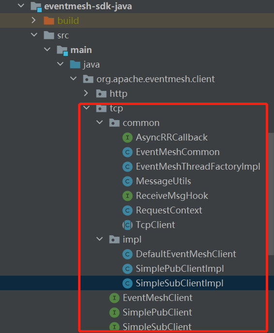
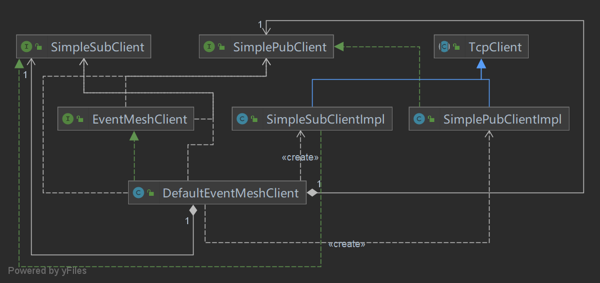

# pub和sub的实现-tcp

> Eventmesh-sdk-java作为客户端，与eventmesh-runtime通信，用于完成消息的发送和接收。
>
> 那么pub和sub作为客户端，在eventmesh中是怎么实现的？

## 结构

> 我们首先看到sdk-java中tcp这一部分的结构：`common`部分定义了tcp协议下广播消息、异步消息都会用到的公共方法，`impl`是对tcp的pub和sub的真正实现。




> 下面来具体介绍一下三个实现类的功能，下面是对应的类图：
>- DefaultEventMeshClient：实现了EventMeshClient接口，用来定义一个具备pub和sub功能的客户端。
>- SimplePubClientImpl：实现了SimplePubClient接口，同时还继承了TcpClient ，用来定义一个具备pub功能的客户端。
>- SimpleSubClientImpl：实现了SimpleSubClient接口，同时也继承了TcpClient ，用来定义一个具备sub功能的客户端。




## 代码

- 对于client的实现，首先是要和runtime进行连接，也就是和服务器进行连接，连接的过程是：client发送心跳包给server，server对心跳包进行回应，然后client发送连接请求，接收到server的回应之后，客户端和服务器连接成功。在EventMeshClient接口中，它是这样定义连接的：

```java
void init() throws Exception;
void heartbeat() throws Exception;
```

- 在DefaultEventMeshClient中具体的实现如下：

```java
public void init() throws Exception {
        this.subClient.init();
        this.pubClient.init();
}
```

```java
public void heartbeat() throws Exception {
        this.pubClient.heartbeat();
        this.subClient.heartbeat();
}
```

- 也就是说，一个客户端和服务器的连接被分成了两个部分，一个是pub客户端的连接，一个是sub客户端的连接。那我们具体来看到两个客户端的实现，因为两个客户端实现有点类似，所以我们这里以`SimpleSubClientImpl`为例进行说明：

  > client和server的握手过程
  >
  > HELLO_REQUEST(2),                                  //client发给server的握手请求
  > HELLO_RESPONSE(3),                                 //server回复client的握手请求

```java
//SimpleSubClientImpl
public void init() throws Exception {
        //指向server的启动入口
        open(new Handler());
    	//设置了hello的header和body部分，client和server进行握手
        hello();
        logger.info("SimpleSubClientImpl|{}|started!", clientNo);
}
```

> client和server的发送心跳包过程
>
> HEARTBEAT_REQUEST(0),                              //client发给server的心跳包
>
>  HEARTBEAT_RESPONSE(1),                             //server回复client的心跳包

```java
//SimpleSubClientImpl
public void heartbeat() throws Exception {
    task = scheduler.scheduleAtFixedRate(new Runnable() {
        @Override
        public void run() {
            try {
                //如果不是处于活跃状态，就重新连接
                if (!isActive()) {
                    SimpleSubClientImpl.this.reconnect();
                }
                //client向server发送心跳包
                Package msg = MessageUtils.heartBeat();
                SimpleSubClientImpl.this.io(msg, EventMeshCommon.DEFAULT_TIME_OUT_MILLS);
            } catch (Exception ignore) {
            }
        }
    }, EventMeshCommon.HEARTBEAT, EventMeshCommon.HEARTBEAT, TimeUnit.MILLISECONDS);
}
```

- 连接成功之后，pub可以实现发布消息，并且可以选择使用异步还是广播的方式进行发布；而sub实现对消息的订阅，并且时刻监听pub发布的消息，对pub发布的消息进行回应。在SimplePubClient和SimpleSubClient的接口中，它们是这样定义的：

```java
//SimplePubClient
//对消息进行发布
Package publish(Package msg, long timeout) throws Exception;
//发送rr消息
Package rr(Package msg, long timeout) throws Exception;
//发送异步单播消息
void asyncRR(Package msg, AsyncRRCallback callback, long timeout) throws Exception;
//广播消息
void broadcast(Package msg, long timeout) throws Exception;
```

```java
//SimpleSubClient
//监听
void listen() throws Exception;
//订阅管理
void subscribe(String topic, SubscriptionMode subscriptionMode, SubcriptionType subcriptionType) throws Exception;
//取消订阅
void unsubscribe() throws Exception;
```

- 下面介绍它们的具体实现

```java
//SimplePubClientImpl 
public class SimplePubClientImpl extends TcpClient implements SimplePubClient {
    ...
     /**
     * 发送事件消息, 返回值是EventMesh 给了ACK
     *
     * @param msg
     * @throws Exception
     */
    public Package publish(Package msg, long timeout) throws Exception {
        logger.info("SimplePubClientImpl|{}|publish|send|type={}|msg={}", clientNo, msg.getHeader().getCommand(), msg);
        //请求上下文，发送事件消息
        return io(msg, timeout);
    }
    
    /**
     * 发送RR消息
     *
     * @param msg
     * @param timeout
     * @return
     * @throws Exception
     */
    public Package rr(Package msg, long timeout) throws Exception {
        logger.info("SimplePubClientImpl|{}|rr|send|type={}|msg={}", clientNo, msg.getHeader().getCommand(), msg);
        return io(msg, timeout);
    }

    /**
     * 异步RR
     *
     * @param msg
     * @param callback
     * @param timeout
     * @throws Exception
     */
    @Override
    public void asyncRR(Package msg, AsyncRRCallback callback, long timeout) throws Exception {
        super.send(msg);
        this.callbackConcurrentHashMap.put((String) RequestContext._key(msg), callback);

    }

    /**
     * 发送广播消息
     *
     * @param msg
     * @param timeout
     * @throws Exception
     */
    public void broadcast(Package msg, long timeout) throws Exception {
        logger.info("SimplePubClientImpl|{}|broadcast|send|type={}|msg={}", clientNo, msg.getHeader().getCommand(), msg);
        super.send(msg);
    }

   ...
}

```

```java
public class SimpleSubClientImpl extends TcpClient implements SimpleSubClient {
    ...
    //监听
    public void listen() throws Exception {
        //调用MessageUtils方法启动监听
        Package request = MessageUtils.listen();
        this.io(request, EventMeshCommon.DEFAULT_TIME_OUT_MILLS);
    }

	//订阅
    public void subscribe(String topic, SubscriptionMode subscriptionMode, SubcriptionType subcriptionType) throws Exception {
        subscriptionItems.add(new SubscriptionItem(topic, subscriptionMode, subcriptionType));
        Package request = MessageUtils.subscribe(topic, subscriptionMode, subcriptionType);
        this.io(request, EventMeshCommon.DEFAULT_TIME_OUT_MILLS);
    }
	//取消订阅
    public void unsubscribe() throws Exception {
        Package request = MessageUtils.unsubscribe();
        this.io(request, EventMeshCommon.DEFAULT_TIME_OUT_MILLS);
    }
    
  ...
}

```

- 最后就是断连，具体过程就是

  > CLIENT_GOODBYE_REQUEST(4),                         //client主动断连时通知server CLIENT_GOODBYE_RESPONSE(5),                        //server回复client的主动断连通知
  > SERVER_GOODBYE_REQUEST(6),                         //server主动断连时通知client
  > SERVER_GOODBYE_RESPONSE(7),                        //client回复server的主动断连通知

- 在EventMeshClient接口中是这样定义的：

```java
void close();
```

- 在DefaultEventMeshClient中的具体实现：

```java
 public void close() {
        this.pubClient.close();
        this.subClient.close();
}
```

```java
//SimplePubClientImpl
private void goodbye() throws Exception {
        Package msg = MessageUtils.goodbye();
        this.io(msg, EventMeshCommon.DEFAULT_TIME_OUT_MILLS);
}
```

```java
//SimpleSubClientImpl
private void goodbye() throws Exception {
        Package msg = MessageUtils.goodbye();
        this.io(msg, EventMeshCommon.DEFAULT_TIME_OUT_MILLS);
}
```

## 举例

> 在eventmesh中有一个test模块，就是包含了tcp和http两种协议的演示，这些演示，就是对sdk-java作为客户端和runtime的server交互的一些举例，下面我们以tcp的单播消息来对上面的内容做一个举例说明

```java
public class AsyncPublish {

    public static Logger logger = LoggerFactory.getLogger(AsyncPublish.class);

    private static EventMeshClient client;

    public static AsyncPublish handler = new AsyncPublish();

    public static void main(String[] agrs) throws Exception {
        // 从application.properties配置文件中获取eventmesh.ip和eventmesh.tcp.port
        Properties properties = Utils.readPropertiesFile("application.properties");
        final String eventMeshIp = properties.getProperty("eventmesh.ip");
        final int eventMeshTcpPort = Integer.parseInt(properties.getProperty("eventmesh.tcp.port"));
        try {
            // 获取用户代理1
            UserAgent userAgent = EventMeshTestUtils.generateClient1();
            // 获取一个默认的eventmesh客户端
            client = new DefaultEventMeshClient(eventMeshIp, eventMeshTcpPort, userAgent);
            // 初始化
            client.init();
            // 心跳
            client.heartbeat();
			// 连续发送五条数据
            for (int i = 0; i < 5; i++) {
                Package asyncMsg = EventMeshTestUtils.asyncMessage();
                logger.info("begin send async msg[{}]==================={}", i, asyncMsg);
                // 消息发布
                client.publish(asyncMsg, EventMeshCommon.DEFAULT_TIME_OUT_MILLS);

                Thread.sleep(1000);
            }

            Thread.sleep(2000);
            //退出,销毁资源
//            client.close();
        } catch (Exception e) {
            logger.warn("AsyncPublish failed", e);
        }
    }
}

```


```java
public class AsyncSubscribe implements ReceiveMsgHook {

    public static Logger logger = LoggerFactory.getLogger(AsyncSubscribe.class);

    private static EventMeshClient client;

    public static AsyncSubscribe handler = new AsyncSubscribe();

    public static void main(String[] agrs) throws Exception {
        // 从application.properties配置文件中获取eventmesh.ip和eventmesh.tcp.port
        Properties properties = Utils.readPropertiesFile("application.properties");
        final String eventMeshIp = properties.getProperty("eventmesh.ip");
        final int eventMeshTcpPort = Integer.parseInt(properties.getProperty("eventmesh.tcp.port"));
        try {
            // 获取用户代理2
            UserAgent userAgent = EventMeshTestUtils.generateClient2();
            // 获取一个默认的eventmesh客户端
            client = new DefaultEventMeshClient(eventMeshIp, eventMeshTcpPort, userAgent);
            // 初始化
            client.init();
            // 心跳包
            client.heartbeat();
			// 订阅一个主题，给定好订阅的模式和类型
            client.subscribe("TEST-TOPIC-TCP-ASYNC", SubscriptionMode.CLUSTERING, SubcriptionType.ASYNC);
            client.registerSubBusiHandler(handler);
			// 监听
            client.listen();

            //client.unsubscribe();

            //退出,销毁资源
//            client.close();
        } catch (Exception e) {
            logger.warn("AsyncSubscribe failed", e);
        }
    }

    @Override
    // 接收到消息的处理机制
    public void handle(Package msg, ChannelHandlerContext ctx) {
        EventMeshMessage eventMeshMessage = (EventMeshMessage) msg.getBody();
        logger.info("receive async msg====================={}", eventMeshMessage);
    }
}

```


