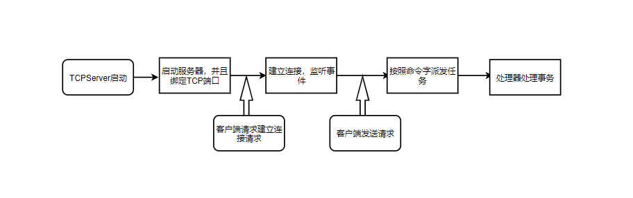
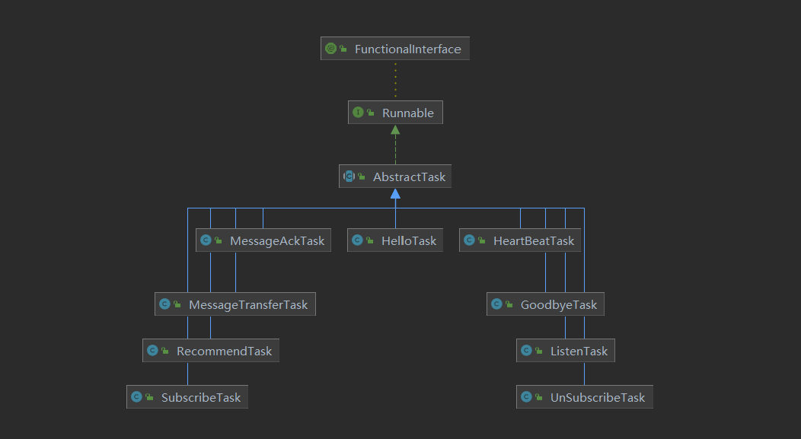

# TCP

## 处理逻辑



## 启动

> bootstrap组装好组件之后绑定到tcp的端口，并初始化处理器，时刻监听是否有客户端请求连接。

```java
    private void startServer() throws Exception {
        Runnable r = () -> {
            ServerBootstrap bootstrap = new ServerBootstrap();
            // 定义一些管道属性
            bootstrap.group(bossGroup, ioGroup)
                    .channel(NioServerSocketChannel.class)
                    .option(ChannelOption.SO_BACKLOG, 128)
                    .option(ChannelOption.SO_REUSEADDR, true)
                    .option(ChannelOption.CONNECT_TIMEOUT_MILLIS, 10000)
                    .childOption(ChannelOption.SO_KEEPALIVE, false)
                    .childOption(ChannelOption.SO_LINGER, 0)
                    .childOption(ChannelOption.SO_TIMEOUT, 600000)
                    .childOption(ChannelOption.TCP_NODELAY, true)
                    .childOption(ChannelOption.SO_SNDBUF, 65535 * 4)
                    .childOption(ChannelOption.SO_RCVBUF, 65535 * 4)
                    .option(ChannelOption.RCVBUF_ALLOCATOR, new AdaptiveRecvByteBufAllocator(2048, 4096, 65536))
                    .option(ChannelOption.ALLOCATOR, PooledByteBufAllocator.DEFAULT)
                    .childOption(ChannelOption.ALLOCATOR, PooledByteBufAllocator.DEFAULT)
                // 初始化管道
                    .childHandler(new ChannelInitializer() {
                        @Override
                        public void initChannel(Channel ch) throws Exception {
                            ch.pipeline().addLast(new Codec.Encoder())
                                    .addLast(new Codec.Decoder())
                                    .addLast("global-traffic-shaping", globalTrafficShapingHandler)
                                    .addLast("channel-traffic-shaping", newCTSHandler())
                                // 连接处理
                                    .addLast(new EventMeshTcpConnectionHandler(EventMeshTCPServer.this))
                                // 空闲状态处理
                                    .addLast(workerGroup, new IdleStateHandler(eventMeshTCPConfiguration.eventMeshTcpIdleReadSeconds,
                                                    eventMeshTCPConfiguration.eventMeshTcpIdleWriteSeconds,
                                                    eventMeshTCPConfiguration.eventMeshTcpIdleAllSeconds),
                                            new EventMeshTcpMessageDispatcher(EventMeshTCPServer.this),// 消息分发
                                            new EventMeshTcpExceptionHandler(EventMeshTCPServer.this)
                                    );
                        }
                    });
            try {
                int port = eventMeshTCPConfiguration.eventMeshTcpServerPort;
                // 绑定端口
                ChannelFuture f = bootstrap.bind(port).sync();
                logger.info("EventMeshTCPServer[port={}] started.....", port);
                f.channel().closeFuture().sync();
            } catch (Exception e) {
               ...
            }
        };

        Thread t = new Thread(r, "eventMesh-tcp-server");
        t.start();
    }
```

## 派发

> TCP在处理事件请求的时候是通过命令字派发事件，然后交给后面的具体的任务来处理的。对于具体的事件和命令字，可以参考官方的协议文档：[协议文档](../instructions/eventmesh-runtime-protocol.md)

```java
// 消息分发
public class EventMeshTcpMessageDispatcher extends SimpleChannelInboundHandler<Package> {

    @Override
    protected void channelRead0(ChannelHandlerContext ctx, Package pkg) throws Exception {
		// 验证包
        validateMsg(pkg);
        eventMeshTCPServer.getEventMeshTcpMonitor().getClient2EventMeshMsgNum().incrementAndGet();
        Command cmd = null;
        try {
            Runnable task;
            cmd = pkg.getHeader().getCommand();
            // 客户端给服务器发送推荐请求
            if (cmd.equals(Command.RECOMMEND_REQUEST)) {
                messageLogger.info("pkg|c2eventMesh|cmd={}|pkg={}", cmd, pkg);
                task = new RecommendTask(pkg, ctx, startTime, eventMeshTCPServer);
                eventMeshTCPServer.getTaskHandleExecutorService().submit(task);
                return;
            }
            // 客户端给服务器发送握手请求
            if (cmd.equals(Command.HELLO_REQUEST)) {
                messageLogger.info("pkg|c2eventMesh|cmd={}|pkg={}", cmd, pkg);
                task = new HelloTask(pkg, ctx, startTime, eventMeshTCPServer);
                eventMeshTCPServer.getTaskHandleExecutorService().submit(task);
                return;
            }
			// 派发事件
            dispatch(ctx, pkg, startTime, cmd);
        } catch (Exception e) {
            logger.error("exception occurred while pkg|cmd={}|pkg={}", cmd, pkg, e);
            writeToClient(cmd, pkg, ctx, e);
        }
    }
	...
	// 派发事件
    private void dispatch(ChannelHandlerContext ctx, Package pkg, long startTime, Command cmd) throws
            Exception {
        Runnable task;
        switch (cmd) {
            case HEARTBEAT_REQUEST:
                task = new HeartBeatTask(pkg, ctx, startTime, eventMeshTCPServer);
                break;
            case CLIENT_GOODBYE_REQUEST:
            case SERVER_GOODBYE_RESPONSE:
                task = new GoodbyeTask(pkg, ctx, startTime, eventMeshTCPServer);
                break;
            case SUBSCRIBE_REQUEST:
                task = new SubscribeTask(pkg, ctx, startTime, eventMeshTCPServer);
                break;
            case UNSUBSCRIBE_REQUEST:
                task = new UnSubscribeTask(pkg, ctx, startTime, eventMeshTCPServer);
                break;
            case LISTEN_REQUEST:
                task = new ListenTask(pkg, ctx, startTime, eventMeshTCPServer);
                break;
            case REQUEST_TO_SERVER:
            case RESPONSE_TO_SERVER:
            case ASYNC_MESSAGE_TO_SERVER:
            case BROADCAST_MESSAGE_TO_SERVER:
                task = new MessageTransferTask(pkg, ctx, startTime, eventMeshTCPServer);
                break;
            case RESPONSE_TO_CLIENT_ACK:
            case ASYNC_MESSAGE_TO_CLIENT_ACK:
            case BROADCAST_MESSAGE_TO_CLIENT_ACK:
            case REQUEST_TO_CLIENT_ACK:
                task = new MessageAckTask(pkg, ctx, startTime, eventMeshTCPServer);
                break;
            default:
                throw new Exception("unknown cmd");
        }
        // 提交任务
        eventMeshTCPServer.getTaskHandleExecutorService().submit(task);
    }
}
```

## 处理

> 任务在处理的时候，会有一个处理器和线程来处理，这些任务都会重写一个`run()`方法，当任务被提交的时候，这个方法被触动，执行相关的操作。这里我就不展开，大家可以根据自己的情况去分析。



