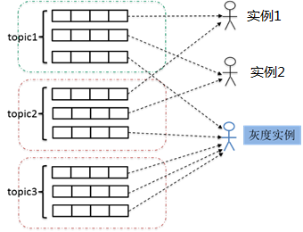

## 2.灰度发布

&nbsp;&nbsp;&nbsp;&nbsp;&nbsp;&nbsp;
同一个消费组中的消费者实例通常订阅的Topic是相同的。在有新业务上线时，我们希望仅仅在个别实例上进行灰度，验证通过之后再进行全量。DeFiBus提供了灰度发布的能力，同一个消费组中，允许不同消费者实例订阅不同的Topic，只有订阅了某个具体Topic的实例才能够收到这个Topic的消息，同消费组中没有订阅这个Topic的实例不会收到消息。

&nbsp;&nbsp;&nbsp;&nbsp;&nbsp;&nbsp;
假设一个消费组有3个消费者实例，上线初期只涉及到Topic1和Topic2。当业务扩展，需要增加Topic3的订阅时，可以先灰度其中一个实例，验证Topic3在灰度实例上执行正常之后，逐步再替换其他实例。在这期间，实例1和实例2不会收到Topic3的消息。

---

#### Links:

* [架构介绍](../../../README.md)
* [Request-Reply调用](docs/cn/features/1-request-response-call.md)
* [灰度发布](docs/cn/features/2-dark-launch.md)
* [熔断机制](docs/cn/features/3-circuit-break-mechanism.md)
* [服务就近](docs/cn/features/4-invoke-service-nearby.md)
* [应用多活](docs/cn/features/5-multi-active.md)
* [动态扩缩队列](docs/cn/features/6-dynamic-adjust-queue.md)
* [容错机制](docs/cn/features/8-fault-tolerant.md)