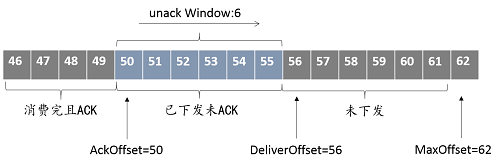

## 3.熔断

&nbsp;&nbsp;&nbsp;&nbsp;&nbsp;&nbsp;
DeFiBus基于队列来做消费端的负载均衡，对同一个消费组，除广播模式外，每个队列只由一个消费者实例消费。当一个实例处理能力下降或者异常出现消息堆积时，为了避免堆积情况继续加剧，DeFiBus会触发队列的熔断，此时生产者实例在感知到队列熔断之后，会优先把消息发送到其他没有熔断的队列上，暂停往熔断队列上写入新消息。当堆积消除后，熔断被解除，生产者恢复往该队列发送消息。

&nbsp;&nbsp;&nbsp;&nbsp;&nbsp;&nbsp;
DeFiBus对每个Topic定义了深度的属性，表示Topic的队列允许堆积的最大消息条数。消息堆积数表示队列中尚未下发给消费者实例的消息条数，可由队列中最新一条消息的offset与消费者实例已经获取到的消息的offset的差值计算。

&nbsp;&nbsp;&nbsp;&nbsp;&nbsp;&nbsp;
当Consumer出现异常或者触发了流控，Consumer拉消息过程受阻，队列的DeliverOffset停止不前，新消息持续写入，MaxOffset不断变大，最终MaxOffset与DeliverOffset将超过Topic的最大深度限制，触发队列熔断。

---

#### Links:

* [架构介绍](../../../README.zh-CN.md)
* [Request-Reply调用](../features/1-request-response-call.md)
* [灰度发布](../features/2-dark-launch.md)
* [熔断机制](../features/3-circuit-break-mechanism.md)
* [服务就近](../features/4-invoke-service-nearby.md)
* [应用多活](../features/5-multi-active.md)
* [动态扩缩队列](../features/6-dynamic-adjust-queue.md)
* [容错机制](../features/8-fault-tolerant.md)
