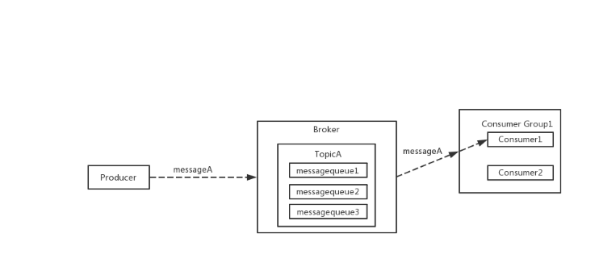
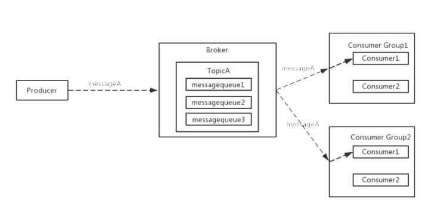
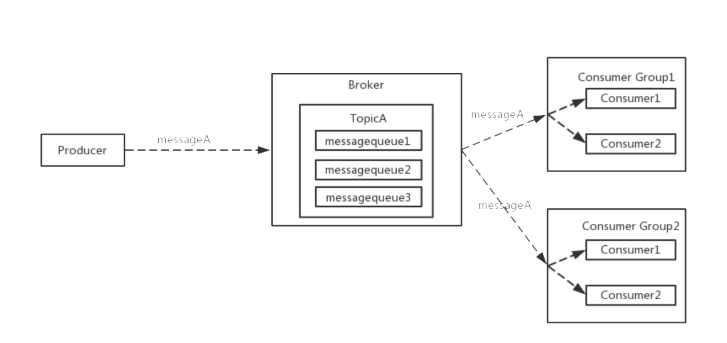

## 2. 单播、多播、广播

&nbsp;&nbsp;&nbsp;&nbsp;&nbsp;&nbsp;
DeFiBus支持单播、多播、广播消费模式。

### 单播

单播模式下，topic只被一个消费组监听；接收消息时，消费组内有且仅有一个实例会收到消息。

### 多播

多播模式下，topic被多个消费组监听；接收消息时，每个消费组内有且仅有一个实例会收到消息。

### 广播

广播模式下，监听此topic的每个消费组中的每个实例都需要收到消息。