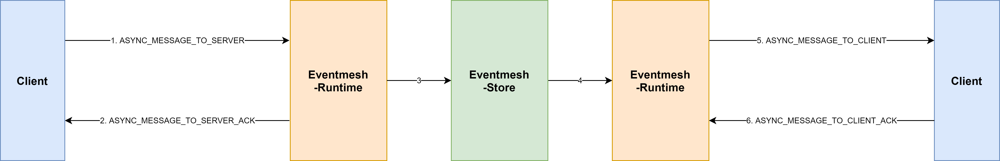
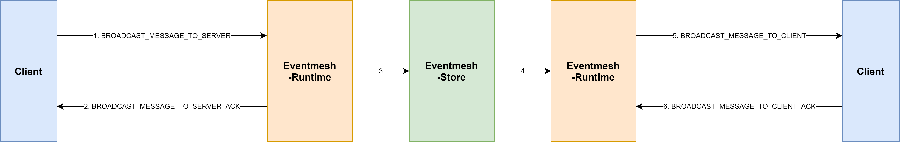

## TCP协议文档

#### 数据流层


**消息组成详解：**

```
魔术字：4位，当前值为“WEMQ”

通信协议版本号：4位，当前值为“0000”

消息总长度值(length)：4位，int类型

消息头长度值(headerLength)：4位，int类型

消息头(header)：长度 = headerLength

消息体(body)：长度 = length - headerLength - 4 - 4  
```


#### 业务逻辑层

**消息组成：**

消息头（header）+ 消息体（body）

```java
public class Package {

    private Header header;
    private Object body;
}


public class Header {

    private Command cmd;
    private int code;
    private String msg;
    private String seq;
}
```


**详解：**

消息头(header)：类型为Header，Header中有Command字段，用于区分不同的消息类型

消息体(body)：对于不同的消息类型，body的类型不同

| 消息命令字                                                   | body类型     |
| ------------------------------------------------------------ | ------------ |
| HEARTBEAT_REQUEST, HEARTBEAT_RESPONSE, HELLO_RESPONSE, CLIENT_GOODBYE_REQUEST, CLIENT_GOODBYE_RESPONSE, SERVER_GOODBYE_REQUEST, SERVER_GOODBYE_RESPONSE, LISTEN_REQUEST, LISTEN_RESPONSE, UNSUBSCRIBE_REQUEST, SUBSCRIBE_RESPONSE, UNSUBSCRIBE_RESPONSE, ASYNC_MESSAGE_TO_SERVER_ACK, BROADCAST_MESSAGE_TO_SERVER_ACK | 无           |
| HELLO_REQUEST                                                | UserAgent    |
| SUBSCRIBE_REQUEST                                            | Subscription |
| REQUEST_TO_SERVER, REQUEST_TO_CLIENT, RESPONSE_TO_SERVER, RESPONSE_TO_CLIENT, ASYNC_MESSAGE_TO_SERVER, ASYNC_MESSAGE_TO_CLIENT, BROADCAST_MESSAGE_TO_SERVER, BROADCAST_MESSAGE_TO_CLIENT, ASYNC_MESSAGE_TO_CLIENT_ACK, BROADCAST_MESSAGE_TO_CLIENT_ACK, RESPONSE_TO_CLIENT_ACK, REQUEST_TO_CLIENT_ACK | WemqMessage  |
| REDIRECT_TO_CLIENT                                           | RedirectInfo |

 

#### Client 与 Eventmesh-Runtime （Server）交互场景详解

```java
public enum Command {

    //心跳
    HEARTBEAT_REQUEST(0),                              //client发给server的心跳包
    HEARTBEAT_RESPONSE(1),                             //server回复client的心跳包

    //握手
    HELLO_REQUEST(2),                                  //client发给server的握手请求
    HELLO_RESPONSE(3),                                 //server回复client的握手请求

    //断连
    CLIENT_GOODBYE_REQUEST(4),                         //client主动断连时通知server
    CLIENT_GOODBYE_RESPONSE(5),                        //server回复client的主动断连通知
    SERVER_GOODBYE_REQUEST(6),                         //server主动断连时通知client
    SERVER_GOODBYE_RESPONSE(7),                        //client回复server的主动断连通知

    //订阅管理
    SUBSCRIBE_REQUEST(8),                              //client发给server的订阅请求
    SUBSCRIBE_RESPONSE(9),                             //server回复client的订阅请求
    UNSUBSCRIBE_REQUEST(10),                           //client发给server的取消订阅请求
    UNSUBSCRIBE_RESPONSE(11),                          //server回复client的取消订阅请求

    //监听
    LISTEN_REQUEST(12),                            	   //client发给server的启动监听请求
    LISTEN_RESPONSE(13),                               //server回复client的监听请求

    //RR
    REQUEST_TO_SERVER(14),                             //client将RR请求发送给server
    REQUEST_TO_CLIENT(15),                             //server将RR请求推送给client
    REQUEST_TO_CLIENT_ACK(16),                         //client收到RR请求后ACK给server
    RESPONSE_TO_SERVER(17),                            //client将RR回包发送给server
    RESPONSE_TO_CLIENT(18),                            //server将RR回包推送给client
    RESPONSE_TO_CLIENT_ACK(19),                        //client收到回包后ACK给server

    //异步事件
    ASYNC_MESSAGE_TO_SERVER(20),                       //client将异步事件发送给server
    ASYNC_MESSAGE_TO_SERVER_ACK(21),                   //server收到异步事件后ACK给client
    ASYNC_MESSAGE_TO_CLIENT(22),                       //server将异步事件推送给client
    ASYNC_MESSAGE_TO_CLIENT_ACK(23),                   //client收到异步事件后ACK给server

    //广播
    BROADCAST_MESSAGE_TO_SERVER(24),                   //client将广播消息发送给server
    BROADCAST_MESSAGE_TO_SERVER_ACK(25),               //server收到广播消息后ACK给client
    BROADCAST_MESSAGE_TO_CLIENT(26),                   //server将广播消息推送给client
    BROADCAST_MESSAGE_TO_CLIENT_ACK(27),               //client收到广播消息后ACK给server

    //重定向指令
    REDIRECT_TO_CLIENT(30),                            //server将重定向指令推动给client
}
```


#### Client发起交互

| 场景           | Client向Server发送消息命令字 | Server回复Client消息的命令字    | 说明 |
| -------------- | ---------------------------- | ------------------------------- | ---- |
| 握手           | HELLO_REQUEST                | HELLO_RESPONSE                  |      |
| 心跳           | HEARTBEAT_REQUEST            | HEARTBEAT_RESPONSE              |      |
| 订阅           | SUBSCRIBE_REQUEST            | SUBSCRIBE_RESPONSE              |      |
| 取消订阅       | UNSUBSCRIBE_REQUEST          | UNSUBSCRIBE_RESPONSE            |      |
| 开始监听消息   | LISTEN_REQUEST               | LISTEN_RESPONSE                 |      |
| 发送RR请求     | REQUEST_TO_SERVER            | RESPONSE_TO_CLIENT              |      |
| 发送RR回包     | RESPONSE_TO_SERVER           | 无                              |      |
| 发送异步事件   | ASYNC_MESSAGE_TO_SERVER      | ASYNC_MESSAGE_TO_SERVER_ACK     |      |
| 发送广播事件   | BROADCAST_MESSAGE_TO_SERVER  | BROADCAST_MESSAGE_TO_SERVER_ACK |      |
| 客户端主动断连 | CLIENT_GOODBYE_REQUEST       | CLIENT_GOODBYE_RESPONSE         |      |


#### Server发起交互

| 场景               | Server向Client发送消息命令字 | Client回复Server消息命令字      | 说明 |
| ------------------ | ---------------------------- | ------------------------------- | ---- |
| 客户端接收RR请求   | REQUEST_TO_CLIENT            | REQUEST_TO_CLIENT_ACK           |      |
| 客户端接收RR回包   | RESPONSE_TO_CLIENT           | RESPONSE_TO_CLIENT_ACK          |      |
| 客户端接收异步事件 | ASYNC_MESSAGE_TO_CLIENT      | ASYNC_MESSAGE_TO_CLIENT_ACK     |      |
| 客户端接收广播事件 | BROADCAST_MESSAGE_TO_CLIENT  | BROADCAST_MESSAGE_TO_CLIENT_ACK |      |
| 服务端主动断连     | SERVER_GOODBYE_REQUEST       | 无                              |      |
| 服务端进行重定向   | REDIRECT_TO_CLIENT           | 无                              |      |
|                    |                              |                                 |      |


+ 发送RR消息


+ 发送异步单播消息




+ 发送广播消息




## HTTP协议文档

Java类`LiteMessage`的`content`字段表示一个特殊的协议，因此，如果您要使用eventmesh-sdk-java的http-client，则只需设计协议的`content`即可。`LiteMessage`组成如下：

```java
public class LiteMessage {

    private String bizSeqNo;

    private String uniqueId;

    private String topic;

    private String content;

    private Map<String, String> prop;

    private long createTime = System.currentTimeMillis();
}
```


#### 消息发送方式与组成


**消息发送方式**：POST方式

**消息组成**：请求头(RequestHeader) + 请求体(RequestBody)


##### 心跳消息：

**RequestHeader**

| Key      | 说明             |
| -------- | ---------------- |
| Env      | client所属环境   |
| Region   | client所属区域   |
| Idc      | client所属IDC    |
| Dcn      | client所在DCN    |
| Sys      | client所属子系统 |
| Pid      | client进程号     |
| Ip       | client Ip        |
| Username | client 用户名    |
| Passwd   | client 密码      |
| Version  | 协议版本         |
| Language | 语言描述         |
| Code     | 请求码           |

**RequestBody**

| Key               | 说明                           |
| ----------------- | ------------------------------ |
| clientType        | 客户端类型                     |
| heartbeatEntities | 心跳实体，包含topic、url等信息 |


##### 订阅消息：

**RequestHeader**

与心跳消息一致

**RequestBody**

| Key   | 说明              |
| ----- | ----------------- |
| topic | 客户端订阅的topic |
| url   | topic对应的url    |


##### 取消订阅消息：

**RequestHeader**

与心跳消息一致

**RequestBody**

与订阅消息一致


##### 发送异步事件：

**RequestHeader**

与心跳消息一致

**RequestBody**

| Key      | 说明                    |
| -------- | ----------------------- |
| topic    | 客户端请求的topic       |
| content  | 客户端发送的topic的内容 |
| ttl      | 客户端请求超时时间      |
| bizSeqNo | 客户端请求业务流水号    |
| uniqueId | 客户端请求消息唯一标识  |


#### Client发起交互

| 场景         | Client向Server发送消息请求码 | Server回复Client消息的响应码            | 说明 |
| ------------ | ---------------------------- | --------------------------------------- | ---- |
| 心跳         | HEARTBEAT(203)               | SUCCESS(0)/PROXY_HEARTBEAT_ERROR(19)    |      |
| 订阅         | SUBSCRIBE(206)               | SUCCESS(0)/PROXY_SUBSCRIBE_ERROR(17)    |      |
| 取消订阅     | UNSUBSCRIBE(207)             | SUCCESS(0)/PROXY_UNSUBSCRIBE_ERROR(18)  |      |
| 发送异步事件 | MSG_SEND_ASYNC(104)          | SUCCESS(0)/PROXY_SEND_ASYNC_MSG_ERR(14) |      |


#### Server发起交互

| 场景               | Server向Client发送消息请求码 | Client回复Server消息响应码 | 说明                   |
| ------------------ | ---------------------------- | -------------------------- | ---------------------- |
| 客户端接收异步事件 | HTTP_PUSH_CLIENT_ASYNC(105)  | retCode                    | retCode值为0时代表成功 |