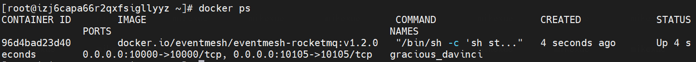

<h1>Eventmesh-runtime快速入门说明</h1>

## 1 远程部署

### 1.1 依赖

```
建议使用64位操作系统，建议使用Linux / Unix；
64位JDK 1.8+;
Gradle至少为7.0, 推荐 7.0.*
```

### 1.2 下载源码

[https://github.com/apache/incubator-eventmesh](https://github.com/apache/incubator-eventmesh)
您将获得**EventMesh-master.zip**

### 1.3 构建源码

```$ xslt
unzip EventMesh-master.zip
cd / *您的部署路径* /EventMesh-master
gradle clean dist tar -x test
```

您将在目录/ *您的部署路径* /EventMesh-master/eventmesh-runtime/dist中获得**eventmesh-runtime_1.0.0.tar.gz**

### 1.4 部署

- 部署eventmesh-runtime

```$ xslt
upload eventmesh-runtime_1.0.0.tar.gz
tar -zxvf eventmesh-runtime_1.0.0.tar.gz
cd bin
配置 eventMesh.properties
cd ../bin
sh start.sh
```

如果看到"EventMeshTCPServer[port=10000] started...."，则说明设置成功。

## 2 本地构建运行

### 2.1 依赖

同上述步骤 1.1

### 2.2 下载源码

同上述步骤 1.2

### 2.3 本地启动

**2.3.1 项目结构说明：**


- eventmesh-common : eventmesh公共类与方法模块
- eventmesh-connector-api : eventmesh插件接口定义模块
- eventmesh-connector-rocketmq : eventmesh rocketmq插件模块
- eventmesh-runtime : eventmesh运行时模块
- eventmesh-sdk-java : eventmesh java客户端sdk
- eventmesh-starter : eventmesh本地启动运行项目入口

> 注：插件模块遵循java spi机制，需要在对应模块中的/main/resources/META-INF/services 下配置相关接口与实现类的映射文件

**2.3.2 配置VM启动参数**

```java
-Dlog4j.configurationFile=..\eventmesh-runtime\conf\log4j2.xml
-Deventmesh.log.home=..\eventmesh-runtime\logs
-Deventmesh.home=..\eventmesh-runtime
-DconfPath=..\eventmesh-runtime\conf
```

**2.3.3 配置build.gradle文件**

通过修改dependencies，compile project 项来指定项目启动后加载的插件

修改`eventmesh-starter`模块下面的`build.gradle`文件

加载**RocketMQ**插件配置：

```java
dependencies {
    compile project(":eventmesh-runtime"), project(":eventmesh-connector-rocketmq")
}
```

**2.3.4 启动运行**

```
运行org.apache.eventmesh.starter.StartUp的主要方法
```

## 3 Docker 运行

### 3.1 拉取镜像

执行 `docker pull eventmesh/eventmesh-rocketmq:v1.2.0` , 你将会获取到EventMesh的镜像，如下图所示：


### 3.2 配置

> **预先准备** : 你可能需要从github上下载源代码，并参考这两个文件(eventMesh.properties 和 rocketmq-client.properties)的内容来做下面的操作

**3.2.1 需要配置的文件**

在运行容器之前，你需要配置如下文件：

**eventMesh.properties**

| 配置项                 | 默认值 | 备注                    |
| ---------------------- | ------ | ----------------------- |
| eventMesh.server.http.port | 10105  | EventMesh http 服务端口 |
| eventMesh.server.tcp.port  | 10000  | EventMesh tcp 服务端口  |

**rocketmq-client.properties**

| 配置项                            | 默认值                        | 备注                  |
| --------------------------------- | ----------------------------- | --------------------- |
| eventMesh.server.rocketmq.namesrvAddr | 127.0.0.1:9876;127.0.0.1:9876 | RocketMQ namesrv 地址 |

拉取了EventMesh镜像到你的宿主机后，你可以执行下面的命令来完成**eventMesh.properties**和**rocketmq-client.properties** 文件的配置

**3.2.2 创建文件**

```shell
mkdir -p /data/eventmesh/rocketmq/conf
cd /data/eventmesh/rocketmq/conf
vi eventMesh.properties
vi rocketmq-client.properties
```

这两个文件内容可以参考 [eventMesh.properties](https://github.com/apache/incubator-eventmesh/blob/develop/eventmesh-runtime/conf/eventMesh.properties)
和 [rocketmq-client.properties](https://github.com/apache/incubator-eventmesh/blob/develop/eventmesh-runtime/conf/rocketmq-client.properties)

### 3.3 运行

**3.3.1 运行**

执行下面的命令来运行容器

```shell
docker run -d -p 10000:10000 -p 10105:10105 -v /data/eventmesh/rocketmq/conf/eventMesh.properties:/data/app/eventmesh/conf/eventMesh.properties -v /data/eventmesh/rocketmq/conf/rocketmq-client.properties:/data/app/eventmesh/conf/rocketmq-client.properties docker.io/eventmesh/eventmesh-rocketmq:v1.2.0
```

> -p : 将容器内端口与宿主机端口绑定，容器的端口应与配置文件中的端口一致
>
> -v : 将容器内的配置文件挂载到宿主机下，需注意配置文件的路径

**3.3.2 检查容器的运行状况**

执行 `docker ps` 来检查容器的运行状况



执行 `docker logs [container id]` 可以得到如下结果


执行 `docker exec -it [container id] /bin/bash` 可以进入到容器中并查看详细信息


### 3.4 测试

**预先准备** ：RocketMQ Namesrv & Broker

你可以通过[这里](https://github.com/apache/rocketmq-docker)来构建rocketmq镜像或者从 docker hub上获取rocketmq镜像.

```shell
#获取namesrv镜像
docker pull rocketmqinc/rocketmq-namesrv:4.5.0-alpine
#获取broker镜像
docker pull rocketmqinc/rocketmq-broker:4.5.0-alpine

#运行namerv容器 
docker run -d -p 9876:9876 -v `pwd` /data/namesrv/logs:/root/logs -v `pwd`/data/namesrv/store:/root/store --name rmqnamesrv  rocketmqinc/rocketmq-namesrv:4.5.0-alpine sh mqnamesrv 

#运行broker容器 
docker run -d -p 10911:10911 -p 10909:10909 -v `pwd`/data/broker/logs:/root/logs -v `pwd`/data/broker/store:/root/store --name rmqbroker --link rmqnamesrv:namesrv -e "NAMESRV_ADDR=namesrv:9876" rocketmqinc/rocketmq-broker:4.5.0-alpine sh mqbroker -c ../conf/broker.conf
```

这里 **rocketmq-broker ip** 是 **pod ip**, 如果你想修改这个ip, 可以通过挂载容器中 **broker.conf** 文件的方式并修改文件中的 **brokerIP1** 配置项为自定义值

**3.4.1 运行示例**

Windows

-
Windows系统下运行示例可以参考[这里](https://github.com/apache/incubator-eventmesh/blob/develop/docs/cn/instructions/eventmesh-sdk-java-quickstart.zh-CN.md)

Linux

- **获取 eventmesh-test_1.2.0-SNAPSHOT.tar.gz**

  你可以从我们的 **releases** 获取或者**通过源码的方式进行构建**

  **通过源码的方式进行构建**：

  ```shell
  cd /* Your Deploy Path */EventMesh/eventmesh-test 
  gradle clean testdist testtar -x test`
  ```

  可以在 `/eventmesh-test/build` 目录下获得 **eventmesh-test_1.2.0-SNAPSHOT.tar.gz**

- **修改配置文件**

  ```shell
  #上传
  upload eventmesh-test_1.2.0-SNAPSHOT.tar.gz
  #解压
  tar -zxvf eventmesh-test_1.2.0-SNAPSHOT.tar.gz
  #配置
  cd conf
  config your application.properties
  ```

- **运行**

  TCP Sub

  ```shell
  cd bin
  sh tcp_sub.sh
  ```

  TCP Pub

  ```shell
  cd bin
  sh tcp_pub.sh
  ```

  TCP Sub Broadcast

  ```shell
  cd bin
  sh tcp_sub_broadcast.sh
  ```

  TCP Pub Broadcast

  ```shell
  cd bin
  sh tcp_pub_broadcast.sh
  ```

  HTTP Sub

  ```shell
  cd bin
  sh http_sub.sh
  ```

  HTTP Pub

  ```shell
  cd bin
  sh http_pub.sh
  ```

  之后 , 你可以在 `/logs` 目录下面看到不同模式的运行日志

