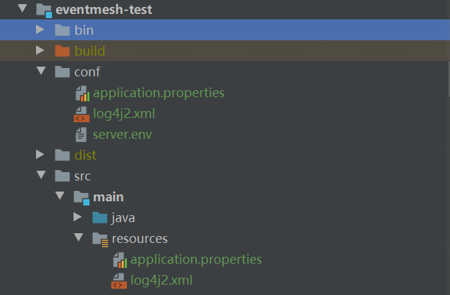

<h2>如何运行eventmesh-sdk-java演示</h2>

> Eventmesh-sdk-java作为客户端，与eventmesh-runtime通信，用于完成消息的发送和接收。
>
> Eventmesh-sdk-java支持异步消息和广播消息。异步消息表示生产者只发送消息，不关心回复消息。广播消息表示生产者发送一次消息，所有订阅广播主题的消费者都将收到消息
>
> Eventmesh-sdk-java支持HTTP和TCP协议。

TCP 和 Http 示例都在**eventmesh-test**模块下

**注意**:下载了源代码后，需要将`/conf/application.properties` 和 `/conf/log4j2.xml` 复制到 `resources` 目录下



### 1. TCP DEMO

<h4>异步消息</h4>

- 创建主题FT0-e-80010000-01-1,可以通过rocketmq-console或者rocketmq tools 命令

- 启动消费者，订阅上一步骤已经创建的Topic

```
运行com.webank.eventmesh.tcp.demo.AsyncSubscribe的主要方法
```

- 启动发送端，发送消息


```
运行com.webank.eventmesh.tcp.demo.AsyncPublish的主要方法
```

<h4>广播消息</h4>

- 创建主题FT0-e-80030000-01-3,可以通过rocketmq-console或者rocketmq tools 命令

- 启动消费端，订阅上一步骤已经创建的Topic

```
运行com.webank.eventmesh.tcp.demo.AsyncSubscribeBroadcast的主要方法
```

- 启动发送端，发送广播消息

```
运行com.webank.eventmesh.tcp.demo.AsyncPublishBroadcast的主要方法
```

### 2. HTTP演示

>对于http，eventmesh-sdk-java对对于异步事件实现了发送与订阅
>
>在演示中，Java类`LiteMessage`的`content`字段表示一个特殊的协议，因此，如果您要使用eventmesh-sdk-java的http-client，则只需设计协议的内容并在同一时间提供消费者的应用程序。

<h4>异步事件</h4>

> 生产者将事件发送给下游即可，无需等待响应

- 启动消费端，订阅Topic

  异步事件消费端为spring boot demo，运行demo即可启动服务并完成Topic订阅

```
运行com.webank.eventmesh.http.demo.sub.SpringBootDemoApplication的主要方法
```

- 启动发送端，发送消息

```
运行com.webank.eventmesh.http.demo.AsyncPublishInstance的主要方法
```


