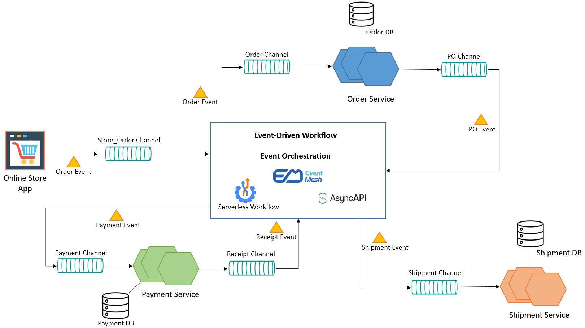
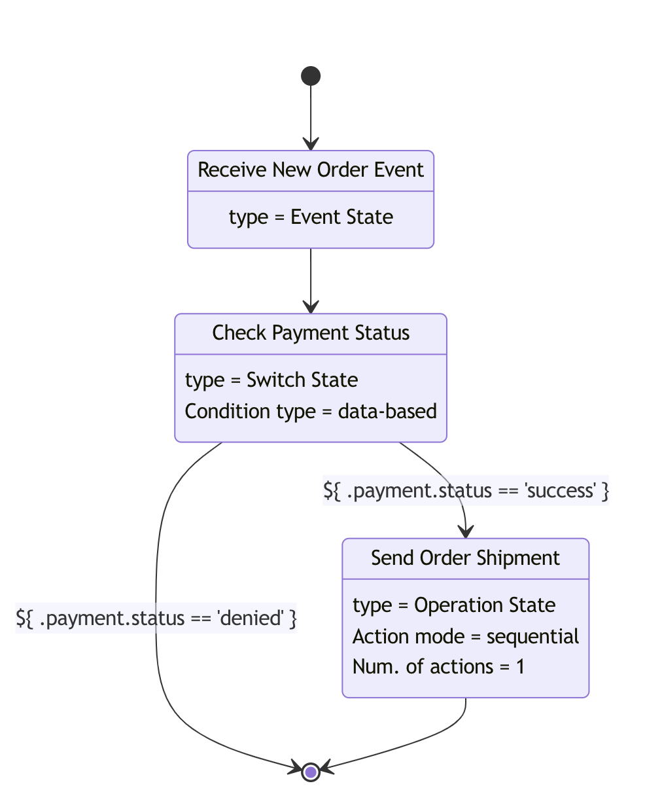
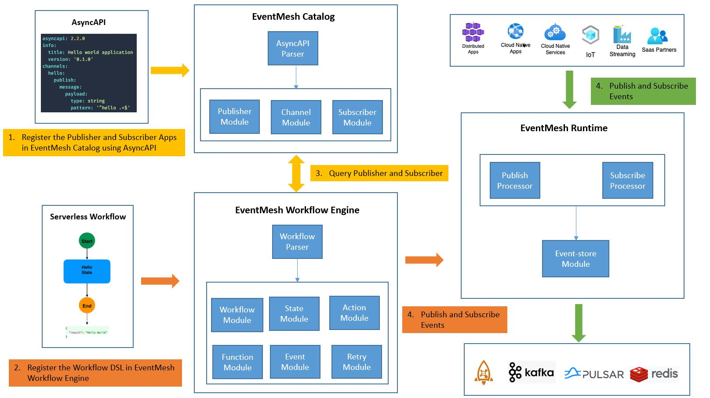

# EventMesh Workflow

## Business Problem

Imaging you are building a simple Order Management System for an E-Commerce Store. The system should be able to receive and provision new orders from a store website. The provisioning process should be able to process all orders, handle payments, as well as process shipments.

For high availability and high performance, you architect the system using event-driven architecture (EDA), and build microservice apps to handle store frontend, order management, payment processing, and shipment management. You deploy the whole system in a cloud environment. To handle high workloads, you leverage a messaging system to buffer the loads, and scale up multiple instances of microservices. The architecture could look similar to:



While each microservice is acting on its own event channels, EventMesh plays a crucial role of doing Event Orchestration.

We use [CNCF Serverless Workflow](https://serverlessworkflow.io/) to describe this Event Workflow Orchestration.

## CNCF Serverless Workflow

CNCF Serverless Workflow defines a vendor-neutral, open-source, and fully community-driven ecosystem for defining and running DSL-based workflows that target the Serverless technology domain.

Serverless Workflow defines a Domain Specific Language (DSL) to describe stateful and stateless workflow-based orchestrations of serverless functions and microservices.

More details could be found in its [official github site](https://github.com/serverlessworkflow/specification)

## EventMesh Workflow

We leverage Serverless Workflow DSL to describe the EventMesh workflow. Based on its spec, the workflow is consists of a series of workflow states used to describe the control-flow logic. At this time we only support event related workflow states. See the supported states in [Workflow DSL Design](#workflow-dsl-design-wip).

A `workflow state` can include applicable `actions`, or services/functions that should be invoked during workflow execution. These `actions` can reference reusable `function` definitions which define how these functions/services should be invoked. They can also reference events that trigger event-based service invocations, and events to wait for that denote completion of such event-based service invocation completion.

In EDA solution, we usually defined our event-driven microservice using AsyncAPI. Serverless workflow `function` definitions support defining invocation semantics using AsyncAPI. See [Using Funtions for AsyncAPI Service](https://github.com/serverlessworkflow/specification/blob/main/specification.md#using-functions-for-async-api-service-invocations) for more information.

### AsyncAPI

AsyncAPI is an open source initiative that seeks to improve the current state of Event-Driven Architectures (EDA).
Our long-term goal is to make working with EDAs as easy as it is to work with REST APIs.
That goes from documentation to code generation, discovery to event management.
Most of the processes you apply to your REST APIs nowadays would be applicable to your event-driven/asynchronous APIs too.

See AsyncAPI detail in the [official site](https://www.asyncapi.com/docs/getting-started)

### Workflow Example

In this example, we build the event-driven workflow of the Order management system above.

First, we need to define AsyncAPI definitions for our microservice apps.

- Online Store App

```yaml
asyncapi: 2.2.0
info:
  title: Online Store application
  version: '0.1.0'
channels:
  store/order:
    subscribe:
      operationId: newStoreOrder
      message:
        $ref : '#/components/NewOrder'

```

- Order Service

```yaml
asyncapi: 2.2.0
info:
  title: Order Service
  version: '0.1.0'
channels:
  order/inbound:
    publish:
      operationId: sendOrder
      message:
        $ref : '#/components/Order'
  order/outbound:
    subscribe:
      operationId: processedOrder
      message:
        $ref : '#/components/Order'
```

- Payment Service

```yaml
asyncapi: 2.2.0
info:
  title: Payment Service
  version: '0.1.0'
channels:
  payment/inbound:
    publish:
      operationId: sendPayment
      message:
        $ref : '#/components/OrderPayment'
  payment/outbound:
    subscribe:
      operationId: paymentReceipt
      message:
        $ref : '#/components/OrderPayment'
```

- Shipment Service

```yaml
asyncapi: 2.2.0
info:
  title: Shipment Service
  version: '0.1.0'
channels:
  shipment/inbound:
    publish:
      operationId: sendShipment
      message:
        $ref : '#/components/OrderShipment'
```

Once that is defined, we define the order workflow that describes our Order Management business logic.

```yaml
id: storeorderworkflow
version: '1.0'
specVersion: '0.8'
name: Store Order Management Workflow
states:
  - name: Receive New Order Event
    type: event
    onEvents:
      - eventRefs:
          - NewOrderEvent
        actions:
          - eventRef:
              triggerEventRef: OrderServiceSendEvent
              resultEventRef: OrderServiceResultEvent
          - eventRef:
              triggerEventRef: PaymentServiceSendEvent
              resultEventRef: PaymentServiceResultEvent
    transition: Check Payment Status
  - name: Check Payment Status
    type: switch
    dataConditions:
      - name: Payment Successfull
        condition: "${ .payment.status == 'success' }"
        transition: Send Order Shipment
      - name: Payment Denied
        condition: "${ .payment.status == 'denied' }"
        end: true
    defaultCondition:
      end: true
  - name: Send Order Shipment
    type: operation
    actions:
      - eventRef:
          triggerEventRef: ShipmentServiceSendEvent
    end: true
events:
  - name: NewOrderEvent
    source: file://onlineStoreApp.yaml#newStoreOrder
    type: asyncapi
    kind: consumed
  - name: OrderServiceSendEvent
    source: file://orderService.yaml#sendOrder
    type: asyncapi
    kind: produced
  - name: OrderServiceResultEvent
    source: file://orderService.yaml#processedOrder
    type: asyncapi
    kind: consumed
  - name: PaymentServiceSendEvent
    source: file://paymentService.yaml#sendPayment
    type: asyncapi
    kind: produced
  - name: PaymentServiceResultEvent
    source: file://paymentService.yaml#paymentReceipt
    type: asyncapi
    kind: consumed
  - name: ShipmentServiceSendEvent
    source: file://shipmentService.yaml#sendShipment
    type: asyncapi
    kind: produced
```

The corresponding workflow diagram is the following:



## EventMesh Workflow Engine

In the following architecture diagram, the EventMesh Catalog, EventMesh Workflow Engine and EventMesh Runtime are running in three different processors.



The steps running the workflow is the followings:

1. Deploy the Publisher and Subscriber Apps in the environment.
   Describe the App APIs using AsyncAPI, generate the asyncAPI yaml.
   Register the Publisher and Subscriber Apps in EventMesh Catalog using AsyncAPI.

2. Register the Serverless Workflow DSL in EventMesh Workflow Engine.

3. EventMesh Workflow Engine query the EventMesh Catalog for Publisher and Subscribers required in Workflow DSL `function`

4. Event-driven Apps are publish events to EventMesh Runtime to trigger the Workflow. EventMesh Workflow Engine also publish and subscribe events for orchestrating the events.

### EventMesh Catalog Design

EventMesh Catalog store the Publisher, Subscriber and Channel metadata. consists of the following modules:

- AsyncAPI Parser

  Using the SDK provided by AsyncAPI community (see [tool list](https://www.asyncapi.com/docs/community/tooling)),
  parse and validated the AsyncAPI yaml inputs, and generate the AsyncAPI definition.

- Publisher, Channel, Subscriber Modules

  From the AsyncAPI definition store the Publisher, Subscriber and Channel information.

### EventMesh Workflow Engine Design

EventMesh Workflow Engine consists of the following modules:

- Workflow Parser

  Using the SDK provided by Serverless Workflow community (see supported [SDKs](https://github.com/serverlessworkflow/specification#sdks)),
  parse and validated the workflow DSL inputs, and generate workflow definition.

- Workflow Module

  It manages a workflow instance life cycle, from create, start, stop to destroy.

- State Module

  It manages workflow state life cycle. We support the event-related states, and the supported state list below is Work-in-Progress.

  | Workflow State | Description |
  | --- | --- |
  | Operation | Execute the AsyncAPI functions defined in the Actions |
  | Event | Check if the defined Event matched, if so execute the defined AsyncAPI functions |
  | Switch | Check the event is matched with the event-conditions, and execute teh defined AsyncAPI functions |
  | Parallel | Execute the defined AsyncAPI functions in parallel |
  | ForEach | Iterate the inputCollection and execute the defined AsyncAPI functions |

- Action Module

  It managed the functions inside the action.

- Function Module

  It manages the AsyncAPI functions by creating the publisher and/or subscriber in EventMesh Runtime, and manage the publisher/subscriber life cycle.

    | AsyncAPI Operation | EventMesh Runtime |
    | --- | --- |
    |  Publish | Publisher |
    | Subscribe | Subscriber |

- Event Module

  It manages the CloudEvents data model, including event filter, correlation and transformation using the rules defined in the workflow DSL.

- Retry Module

  It manages the retry logic of the event publishing into EventMesh Runtime.
