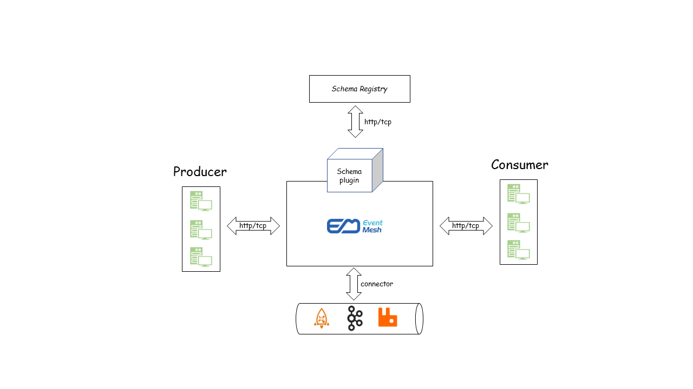
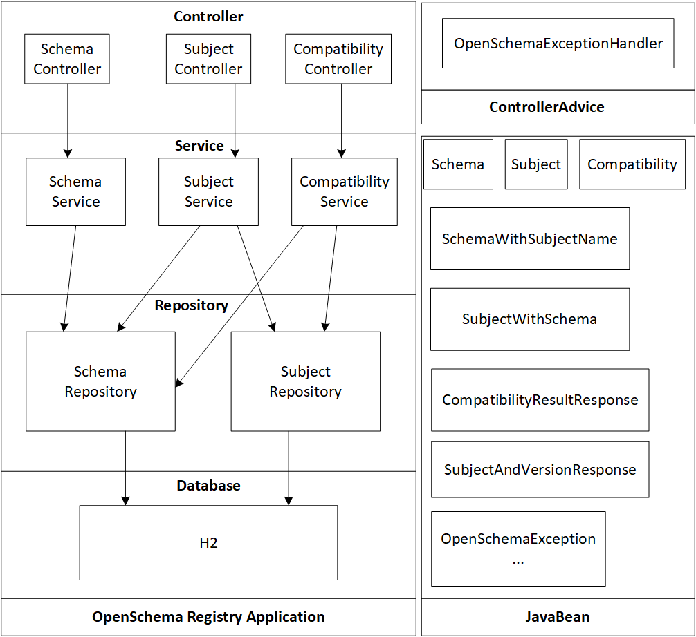

# EventMesh Schema Registry (OpenSchema)

## Overview of Schema and Schema Registry

### Schema

A Schema stands for the description of serialization instances(string/stream/file/...) and has two properties. First, it is also in the format of serialization type. Second, it defines what requirements such serialized instances should satisfy.

Besides describing a serialization instance, a Schema may also be used for validating whether an instance is legitimate. The reason is that it defines the ```type```(and other properties) of a serialized instance and inside keys. Taking JSON Schema for example, it could not only be referred when describing a JSON string, but also be used for validating whether a string satisfies properties defined in the schema[[1]](#References).

Commonly, there are JSON Schema, Protobuf Schema, and Avro Schema.

### Schema Registry

Schema Registry is a server provides RESTful interfaces. It could receive and store Schemas from clients, as well as provide intrefaces for other clients to retrieve Schemas from it.

It could be applied to validation process and (de-)serialization process.

### Comparison of Schema Registry in Different Projects

Project | Application
:---: | :---
EMQ[[2]](#References) | Mainly in (de-)serialization process. Use "Schema Registry" and "Rule Matching" to transfer a message from one serialization format to another.
Pulsar[[3]](#References) | Mainly in validation process. Use "Schema Registry" to validate a message.
Confluentinc[[4]](#References) | In both validation and (de-)serialization process.

## Overview of OpenSchema

OpenSchema[[5]](#References) proposes a specification for data schema when exchanging the message and event in more and more modern cloud-native applications. It designs a RESTful interface for storing and retrieving such as Avro, JSON Schema, and Protobuf3 schemas from three aspects(subject/schema/compatibility).

## Requirements(Goals)

| Requirement ID | Requirement Description                                      | Comments      |
| :------------- | ------------------------------------------------------------ | ------------- |
| F-1            | In transmission, no message needs to contain schema information which bring efficiency. | Functionality |
| F-2            | The message content from producer could be validated whether serialized correctly according to schema. | Functionality |

## Design Details

### Architecture



### Process of Transferring Messages under Schema Registry


The highlevel process of messages transmission contains 10 steps as follows:

- 1: Consumer subscribes "TOPIC" messages from EventMesh.
- 2: Producer registers a schema to EventMesh.
- 3: EventMesh registers a schema to Schema Registry.
- 4: Schema Registry returns the id of newly created schema; EventMesh caches such id and schema.
- 5: EventMesh returns the id of schema to Producer.
- 6: Producer patches the id in front of messages and send messages to EventMesh.
- 7: EventMesh validates the messages in the entry port and send it to EventStore; EventMesh retrieves messages from EventStore.
- 8: EventMesh unpatches the id and send it to Schema Registry(if such `<id, schema>` does not exists in local cache).
- 9: Schema Registry returns schema and EventMesh caches it.
- 10: EventMesh patches schema in front of messages and push it to consumer.

## Current Progress

### Status

**Current state**: Developing

**Discussion thread**: ISSUE #339

### Proposed Changes

The proposal has two aspects.

First is a separated Open Schema Registry, which includes storage and compatibility check for schema.
This proposal is under developing.

Second is the integration of Open Schema in Eventmesh, which includes validation for schema. This proposal is to be developed.

As for the first proposal, some developing statuses are as follows.

#### Status Code and Exception Code

No. | Status Code | Exception Code | Description | status
--- | :---: | :---: | :---: | :---:
1 | 401 | 40101 | Unauthorized Exception | ✔
2 | 404 | 40401 | Schema Non- Exception | ✔
3 | ^ | 40402 | Subject Non-exist Exception | ✔
4 | ^ | 40403 | Version Non-exist Exception | ✔
5 | 409 | 40901 | Compatibility Exception | ✔
6 | 422 | 42201 | Schema Format Exception | ✔
7 | ^ | 42202 | Subject Format Exception | ✔
8 | ^ | 42203 | Version Format Exception | ✔
9 | ^ | 42204 | Compatibility Format Exception | ✔
10 | 500 | 50001 | Storage Service Exception | ✔
11 | ^ | 50002 | Timeout Exception | ✔

#### API Development Status

No. | Type | URL | response | exception | code | test
--- | --- | --- | --- | --- | --- | ---
1 | GET | /schemas/ids/{string: id} | `Schema.class` | 40101\40401\50001 | ✔ | ❌
2 | GET | /schemas/ids/{string: id}/subjects | `SubjectAndVersion.class` | 40101\40401\50001 | ✔ | ❌
3 | GET | /subjects | `List\<String>` | 40101\50001 | ✔ | ❌
4 | GET | /subjects/{string: subject}/versions | `List\<Integer>` | 40101\40402\50001 | ✔ | ❌
5 | DELETE | /subjects/(string: subject) | `List\<Integer>` | 40101\40402\50001 | ✔ | ❌
6 | GET | /subjects/(string: subject) | `Subject.class` | 40101\40402\50001 | ✔ | ❌
7 | GET | /subjects/(string: subject)/versions/(version: version)/schema | `SubjectWithSchema.class` | 40101\40402\40403\50001 | ✔ | ❌
8 | POST | /subjects/(string: subject)/versions | `SchemaIdResponse.class` | 40101\40901\42201\50001\50002 | - | ❌
9 | POST | /subjects/(string: subject)/ | `Subject.class` | 40101\40901\42202\50001\50002 | ✔ | ❌
10 | DELETE | /subjects/(string: subject)/versions/(version: version) | `int` | 40101\40402\40403\40901\50001| - | ❌
11 | POST | /compatibility/subjects/(string: subject)/versions/(version: version) | `CompatibilityResultResponse.class` | 40101\40402\40403\42201\42203\50001| - | ❌
12 | GET | /compatibility/(string: subject) | `Compatibility.class` | 40101\40402\50001 | ✔ | ❌
13 | PUT | /compatibility/(string: subject) | `Compatibility.class` |  40101\40402\40901\42204\50001 | - | ❌

#### Overall Project Structure

```SchemaController.java```+```SchemaService.java``` : ```OpenSchema 7.1.1~7.1.2 (API 1~2)```

```SubjectController.java```+```SubjectService.java``` : ```OpenSchema 7.2.1~7.2.8 (API 3~10)```

```CompatibilityController.java```+```CompatibilityService.java``` : ```OpenSchema 7.3.1~7.3.3 (API 11~13)``` + ```Check for Compatibility```



## References

[1] [schema validator (github.com)](https://github.com/search?q=schema+validator)

[2] [EMQ: Schema Registry](https://www.jianshu.com/p/33e0655c642b)

[3] [Pulsar: Schema Registry](https://mp.weixin.qq.com/s/PaB66-Si00cX80py5ig5Mw)

[4] [confluentinc/schema-registry](https://github.com/confluentinc/schema-registry)

[5] [openmessaging/openschema](https://github.com/openmessaging/openschema)
