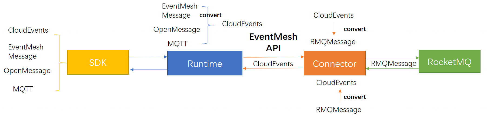

# CloudEvents Integration

## Introduction

[CloudEvents](https://github.com/cloudevents/spec) is a specification for describing event data in common formats to provide interoperability across services, platforms and systems.

As of May 2021, EventMesh contains the following major components: `eventmesh-runtime`, `eventmesh-sdk-java` and `eventmesh-connector-rocketmq`.
For a customer to use EventMesh, `eventmesh-runtime` can be deployed as microservices to transmit
customer's events between event producers and consumers. Customer's applications can then interact
with `eventmesh-runtime` using `eventmesh-sdk-java` to publish/subscribe for events on given topics.

CloudEvents support has been a highly desired feature by EventMesh users. There are many reasons
for users to prefer using a SDK with CloudEvents support:

- CloudEvents is a more widely accepted and supported way to describe events. `eventmesh-sdk-java`
  currently uses the `LiteMessage` structure to describe events, which is less standardized.
- CloudEvents's Java SDK has a wider range of distribution methods. For example, EventMesh users
  currently need to use the SDK tarball or build from source for every EventMesh release. With
  CloudEvents support, it's easier for users to take a dependency on EventMesh's SDK using CloudEvents's public distributions (e.g. through a Maven configuration).
- CloudEvents's SDK supports multiple languages. Although EventMesh currently only supports a Java SDK, in future if more languages need to be supported, the extensions can be easier with experience on binding Java SDK with CloudEvents.

## Requirements

### Functional Requirements

| Requirement ID | Requirement Description | Comments |
| -------------- | ----------------------- | -------- |
| F-1            | EventMesh users should be able to depend on a public SDK to publish/subscribe events in CloudEvents format | Functionality |
| F-2            | EventMesh users should continue to have access to existing EventMesh client features (e.g. load balancing) with an SDK that supports CloudEvent | Feature Parity |
| F-3            | EventMesh developers should be able to sync `eventmesh-sdk-java` and an SDK with CloudEvents support without much effort/pain | Maintainability |
| F-4 | EventMesh support pluggable protocols for developers integrate other protocols (e.g. CloudEvents\EventMesh Message\OpenMessage\MQTT ...) | Functionality |
| F-5 | EventMesh support the unified api for publish/subscribe events to/from event store | Functionality |

### Performance Requirements

| Requirement ID | Requirement Description | Comments |
| -------------- | ----------------------- | -------- |
| P-1            | Client side latency for SDK with CloudEvents support should be similar to current SDK | |

## Design Details

Binding with the CloudEvents Java SDK (similar to what Kafka already did, see Reference for more details)
should be an easy way to achieve the requirements.

### Pluggable Protocols

### Process of CloudEvents under EventMesh

#### For TCP

##### SDK side for publish

- add the CloudEvents identifier in `package` header
- use `CloudEventBuilder` build the CloudEvent and put it into the `package` body

##### SDK side for subscribe

- add `convert` function under the `ReceiveMsgHook` interface, for converting the `package` body to the specific protocol with the identifier in `package` header
- different protocols should implement the `ReceiveMsgHook`  interface

##### Server side for publish

- design the protocol convert api contains `decodeMessage` interface which convert the package's body to CloudEvent
- update `Session.upstreamMsg()` in `MessageTransferTask` change the input parameter Message to CloudEvent, the CloudEvent use the last step `decodeMessage` api convert
- update `SessionSender.send()`  change the input parameter `Message` to `CloudEvent`
- update `MeshMQProducer` api support send `CloudEvents` in runtime
- support the implementation in `connector-plugin` for send `CloudEvents` to EventStore

##### Server side for subscribe

- support change the `RocketMessage` to `CloudEvent` in connector-plugin

- overwrite the `AsyncMessageListener.consume()` function, change the input parameter `Message` to `CloudEvent`

- update the `MeshMQPushConsumer.updateOffset()` implementation change the the input parameter `Message` to `CloudEvent`

- update `DownStreamMsgContext` , change the input parameter `Message` to `CloudEvent`, update the `DownStreamMsgContext.ackMsg`

#### For HTTP

##### SDK side for publish

- support `LiteProducer.publish(cloudEvent)`
- add the CloudEvents identifier in http request header

##### SDK side for subscribe

##### Server side for publish

- support build the `HttpCommand.body` by pluggable protocol plugins according the protocol type in `HttpCommand` header
- support publish the CloudEvent in message processors

##### Server side for subscribe

- update the `EventMeshConsumer.subscribe()`

- update `HandleMsgContext` , change the input parameter `Message` to `CloudEvent`
- update `AsyncHttpPushRequest.tryHTTPRequest()`

## Appendix

### References

- <https://cloudevents.github.io/sdk-java/kafka>
