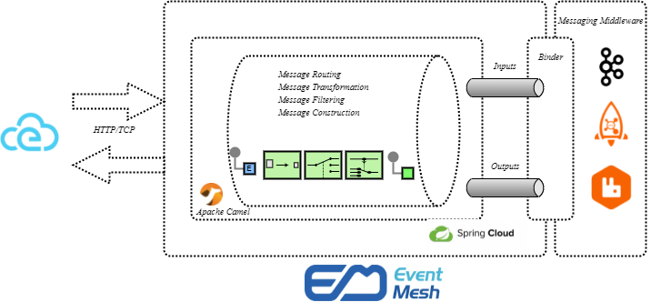

# EventMesh Stream

## Introduction

[EventMesh(incubating)](https://github.com/apache/incubator-eventmesh) is a dynamic
cloud-native eventing infrastructure.

## An overview of Event Streaming

Event Streaming is an implementation of Pub/Sub architecture pattern,it consist of

- Message or Event: Change of State.

- Topic: Partition in messaging middle ware broker.

- Consumer: Can subscribe to read events from broker topic.

- Producer: Generate events

Streaming of event is continuous flow of events in order to maintain order between events, events flow should be in a specific direction means from producers to consumers.

## Requirements

### Functional Requirements

| Requirement ID | Requirement Description | Comments |
| -------------- | ----------------------- | -------- |
| F-1            | EventMesh users should be able to achieve Event Streaming functionality in EventMesh | Functionality |
| F-2            | EventMesh users can apply dynamic user specific logics for routing, filter, transformation etc | Functionality |

## Design Details

We are introduce EventMesh Stream component allow us to use programming model and binder abstractions
from Spring Cloud Stream natively within Apache Camel.

[Spring-Cloud-Stream](https://spring.io/projects/spring-cloud-stream) Spring Cloud Stream is a framework for building
highly scalable event-driven microservices connected with shared messaging systems.

[Apache Camel](https://camel.apache.org/) Camel is an Open Source integration framework that empowers you to quickly
and easily integrate various systems consuming or producing data.

## Architecture

## Design

### EventMesh-Stream Component

- Event
- Event Channel
- Event EndPoint
- Event Pipes & Filters
- Event Routes
- Event Converter

#### Event

> A event is the smallest unit for transmitting data in system. It structure divided into headers, body and attachments.

#### Event Channel

> A event channel is a logical channel in system, we are achieving by Spring Cloud Stream programming model, it has abstract functionality around messaging channels(As of now Spring `MessageChannel`).

#### Event EndPoint

> A event endpoint is the interface between an application and a messaging system. We can define two types of endpoint

- Consumer endpoint - Appears at start of a route and read incoming events from an incoming channel.
- Producer endpoint - Appears at end of a route and write incoming events to an outgoing channel.

#### Event Pipes & Filters

> We can construct a route by creating chain of filters( Apache Camel `Processor`), where the output of one filter is fed into input for next filter in the pipeline.
The main advantage of the pipeline is that you can create complex event processing logic.

#### Event Routes

> A event router, is a type of filter on consumer and redirect them to the appropriate target endpoint based on a decision criteria.

#### Event Converter

> The event converter that modifies the contents of a event, translating it to a different format(i.e cloudevents -> Event (Camel) -> Binder Message(Spring Message) and vice versa).

## EventMesh-Stream Component Interfaces

### Component

Component interface is the primary entry point, you can use Component object as a factory to create EndPoint objects.

### EndPoint

EndPoint which is act as factories for creating Consumer, Producer and Event objects.

- `createConsumer()` — Creates a consumer endpoint, which represents the source endpoint at the beginning of a route.
- `createProducer()` — Creates a producer endpoint, which represents the target endpoint at the end of a route.

#### Producer

User can create following types of producer
> Synchronous Producer-Processing thread blocks until the producer has finished the event processing.

In future Producer Types:

- Asynchronous Producer - Producer process the event in a sub-thread.

#### Consumer

User can create following types of consumer
> Event-driven consumer-the processing of an incoming request is initiated when message binder call a method in consumer.

In Future

- Scheduled poll consumer
- Custom polling consumer

## Appendix

### References

- <https://donovanmuller.blog/camel-spring-cloud-stream/>
