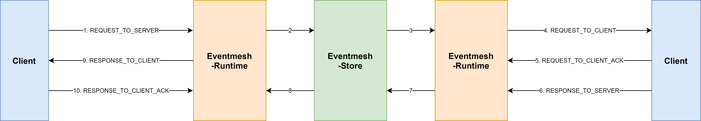
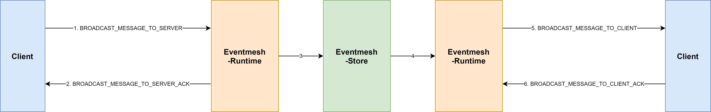

# TCP Protocol Document In Eventmesh-Runtime

#### 1. Protocol Format


**Protocol Specification**

```
Magic Code: 9 bit, defaultValue:EventMesh

Protocol Version: 4 bit, defaultValue:0000

Message Size: 4 bit, the total length of message

Header Size: 4 bit，the length of Message Header

Message Header: the specific header content of message

Message Body: the specific body content of message
```

#### 2. Message Object in business logic layer

* Message Composition

The class of `Package.java` is message object in business logic layer. It contains two parts: header and body.

```java
public class Package {

    private Header header;
    private Object body;
}


public class Header {

    private Command cmd;
    private int code;
    private String msg;
    private String seq;
}
```

* Specificatiion

Message Header(header): The field of Command in Header, used to distinguishing different message types.

Message Body(body): The message body is defined as different objects according to the message type.

| Command                                                   | type of Body     |
| ------------------------------------------------------------ | ------------ |
| HEARTBEAT_REQUEST, HEARTBEAT_RESPONSE, HELLO_RESPONSE, CLIENT_GOODBYE_REQUEST, CLIENT_GOODBYE_RESPONSE, SERVER_GOODBYE_REQUEST, SERVER_GOODBYE_RESPONSE, LISTEN_REQUEST, LISTEN_RESPONSE, UNSUBSCRIBE_REQUEST, SUBSCRIBE_RESPONSE, UNSUBSCRIBE_RESPONSE, ASYNC_MESSAGE_TO_SERVER_ACK, BROADCAST_MESSAGE_TO_SERVER_ACK | --           |
| HELLO_REQUEST                                                | UserAgent    |
| SUBSCRIBE_REQUEST                                            | Subscription |
| REQUEST_TO_SERVER, REQUEST_TO_CLIENT, RESPONSE_TO_SERVER, RESPONSE_TO_CLIENT, ASYNC_MESSAGE_TO_SERVER, ASYNC_MESSAGE_TO_CLIENT, BROADCAST_MESSAGE_TO_SERVER, BROADCAST_MESSAGE_TO_CLIENT, ASYNC_MESSAGE_TO_CLIENT_ACK, BROADCAST_MESSAGE_TO_CLIENT_ACK, RESPONSE_TO_CLIENT_ACK, REQUEST_TO_CLIENT_ACK | OpenMessage  |
| REDIRECT_TO_CLIENT                                           | RedirectInfo |

#### 3. The Interactive Command between Client and Server(Eventmesh-Runtime)

```java
public enum Command {

    //HeartBeat
    HEARTBEAT_REQUEST(0),                              //client send heartbeat request to server
    HEARTBEAT_RESPONSE(1),                             //server reply heartbeat response to client

    //Hello
    HELLO_REQUEST(2),                                  //client send connect request to server
    HELLO_RESPONSE(3),                                 //server reply connect response to client

    //Disconncet
    CLIENT_GOODBYE_REQUEST(4),                         //client send disconnect request to server
    CLIENT_GOODBYE_RESPONSE(5),                        //server reply disconnect response to client
    SERVER_GOODBYE_REQUEST(6),                         //server send disconncet request to client
    SERVER_GOODBYE_RESPONSE(7),                        //client reply disconnect response to server

    //Subscribe and UnSubscribe
    SUBSCRIBE_REQUEST(8),                              //client send subscribe request to server
    SUBSCRIBE_RESPONSE(9),                             //server reply subscribe response to client
    UNSUBSCRIBE_REQUEST(10),                           //client send unsubscribe request to server
    UNSUBSCRIBE_RESPONSE(11),                          //server reply unsubscribe response to client

    //Listen
    LISTEN_REQUEST(12),                            	   //client send listen request to server
    LISTEN_RESPONSE(13),                               //server reply listen response to client

    //send sync message
    REQUEST_TO_SERVER(14),                             //client(Producer) send sync msg to server
    REQUEST_TO_CLIENT(15),                             //server push sync msg to client(Consumer)
    REQUEST_TO_CLIENT_ACK(16),                         //client(Consumer) send ack of sync msg to server
    RESPONSE_TO_SERVER(17),                            //client(Consumer) send reply msg to server
    RESPONSE_TO_CLIENT(18),                            //server push reply msg to client(Producer)
    RESPONSE_TO_CLIENT_ACK(19),                        //client(Producer) send ack of reply msg to server

    //send async message
    ASYNC_MESSAGE_TO_SERVER(20),                       //client send async msg to server
    ASYNC_MESSAGE_TO_SERVER_ACK(21),                   //server reply ack of async msg to client
    ASYNC_MESSAGE_TO_CLIENT(22),                       //server push async msg to client
    ASYNC_MESSAGE_TO_CLIENT_ACK(23),                   //client reply ack of async msg to server

    //send broadcast message
    BROADCAST_MESSAGE_TO_SERVER(24),                   //client send broadcast msg to server
    BROADCAST_MESSAGE_TO_SERVER_ACK(25),               //server reply ack of broadcast msg to client
    BROADCAST_MESSAGE_TO_CLIENT(26),                   //server push broadcast msg to client
    BROADCAST_MESSAGE_TO_CLIENT_ACK(27),               //client reply ack of broadcast msg to server

    //redirect
    REDIRECT_TO_CLIENT(30),                            //server send redirect instruction to client
}
```

#### 4. Client initiates interaction

| Scene          | Client Send | Server Reply    | Remark |
| -------------- | ---------------------------- | ------------------------------- | ---- |
| Hello           | HELLO_REQUEST                | HELLO_RESPONSE                  |      |
| Heartbeat           | HEARTBEAT_REQUEST            | HEARTBEAT_RESPONSE              |      |
| Subscribe           | SUBSCRIBE_REQUEST            | SUBSCRIBE_RESPONSE              |      |
| Unsubscribe       | UNSUBSCRIBE_REQUEST          | UNSUBSCRIBE_RESPONSE            |      |
| Listen   | LISTEN_REQUEST               | LISTEN_RESPONSE                 |      |
| Send sync msg     | REQUEST_TO_SERVER            | RESPONSE_TO_CLIENT              |      |
| Send reply msg of sync msg     | RESPONSE_TO_SERVER           | --                              |      |
| Send async msg   | ASYNC_MESSAGE_TO_SERVER      | ASYNC_MESSAGE_TO_SERVER_ACK     |      |
| Send broadcast msg   | BROADCAST_MESSAGE_TO_SERVER  | BROADCAST_MESSAGE_TO_SERVER_ACK |      |
| Client start disconnect | CLIENT_GOODBYE_REQUEST       | CLIENT_GOODBYE_RESPONSE         |      |

#### 5. Server initiates interaction

| Scene              | Server Send | Client Reply      | Remark |
| ------------------ | ---------------------------- | ------------------------------- | ---- |
| Push sync msg to client   | REQUEST_TO_CLIENT            | REQUEST_TO_CLIENT_ACK           |      |
| Push reply msg of sync msg to client   | RESPONSE_TO_CLIENT           | RESPONSE_TO_CLIENT_ACK          |      |
| Push async msg to client | ASYNC_MESSAGE_TO_CLIENT      | ASYNC_MESSAGE_TO_CLIENT_ACK     |      |
| Push broadcast msg to client | BROADCAST_MESSAGE_TO_CLIENT  | BROADCAST_MESSAGE_TO_CLIENT_ACK |      |
| Server start disconnect     | SERVER_GOODBYE_REQUEST       | --                              |      |
| Server send redirect   | REDIRECT_TO_CLIENT           | --                              |      |

#### 6. Message classification

+ Send sync msg



+ Send async msg


+ Send broadcast msg



## HTTP Protocol Document In Eventmesh-Runtime

The class of `LiteMessage.java` is message definition in http protocal of EventMesh-Runtime.If you want to send msg by
using http protocol,you can use client in eventmesh-sdk-java, and you just need care the specific protocol in the field
of content.

```java
public class LiteMessage {

    private String bizSeqNo;

    private String uniqueId;

    private String topic;

    private String content;

    private Map<String, String> prop;

    private long createTime = System.currentTimeMillis();
}
```

#### 1. Message Send and Message Composition

**Request Method**: POST

**Message Composition**: RequestHeader + RequestBody

+ Heartbeat Msg

**RequestHeader**

| Key      | Description             |
| -------- | ---------------- |
| Env      | Enviroment of Client   |
| Region   | Region of Client  |
| Idc      | IDC of Client    |
| Dcn      | DCN of Client    |
| Sys      | Subsystem ID of Client |
| Pid      | Client Process ID     |
| Ip       | Client Ip        |
| Username | Client username    |
| Passwd   | Client password      |
| Version  | Protocol version        |
| Language | Develop language         |
| Code     | Request Code           |

**RequestBody**

| Key               | Description                           |
| ----------------- | ------------------------------ |
| clientType        | Producer:clientType is ClientType.PUB,Consumer:clientType is ClientType.SUB                   |
| heartbeatEntities | Heartbeat content,contains topic,url... |

+ Subscribe Msg

**RequestHeader**

same with RequestHeader of heartbeat msg

**RequestBody**

| Key   | Description              |
| ----- | ----------------- |
| topic | topic of client want to subscribe |
| url   | url of client, server push msg to the url when receiving msg from other components   |

+ Unsubscribe Msg

**RequestHeader**

same with RequestHeader of Heartbeat Msg

**RequestBody**

same with RequestBody of Subscribe Msg

+ Send async msg

**RequestHeader**

same with RequestHeader of Heartbeat Msg

**RequestBody**

| Key      | Description                    |
| -------- | ----------------------- |
| topic    | topic of msg       |
| content  | msg content |
| ttl      | timeout time of  msg      |
| bizSeqNo | biz sequence number of msg    |
| uniqueId | unique mark of msg  |

#### 2. Client initiates interaction

| Scene         | Client Send | Server Reply           | Remark |
| ------------ | ---------------------------- | --------------------------------------- | ---- |
| Heartbeat         | HEARTBEAT(203)               | SUCCESS(0)/EVENTMESH_HEARTBEAT_ERROR(19)    |      |
| Subscribe         | SUBSCRIBE(206)               | SUCCESS(0)/EVENTMESH_SUBSCRIBE_ERROR(17)    |      |
| Unsubscribe     | UNSUBSCRIBE(207)             | SUCCESS(0)/EVENTMESH_UNSUBSCRIBE_ERROR(18)  |      |
| Send async msg | MSG_SEND_ASYNC(104)          | SUCCESS(0)/EVENTMESH_SEND_ASYNC_MSG_ERR(14) |      |

#### 3. Server initiates interaction

| Scene                | Server Send | Client Reply | Remark                  |
| ------------------ | ---------------------------- | -------------------------- | ---------------------- |
| Push async msg to client | HTTP_PUSH_CLIENT_ASYNC(105)  | retCode              | retCode=0,send success |

## gRPC Protocol Document In Eventmesh-Runtime

#### 1. protobuf

The `eventmesh-protocol-gprc` module contains the protobuf file of the evenmesh client. the protobuf file
is located as `/src/main/proto/eventmesh-client.proto`.

Run the gradle build to generate the gRPC codes. The generated codes are located at `/build/generated/source/proto/main`.

These generated grpc codes will be used in `eventmesh-sdk-java` module.

#### 2. data models

- message

The following is the message data model, used by `publish()`, `requestReply()` and `broadcast()` APIs.

```
message RequestHeader {
    string env = 1;
    string region = 2;
    string idc = 3;
    string ip = 4;
    string pid = 5;
    string sys = 6;
    string username = 7;
    string password = 8;
    string language = 9;
    string protocolType = 10;
    string protocolVersion = 11;
    string protocolDesc = 12;
}

message SimpleMessage {
   RequestHeader header = 1;
   string producerGroup = 2;
   string topic = 3;
   string content = 4;
   string ttl = 5;
   string uniqueId = 6;
   string seqNum = 7;
   string tag = 8;
   map<string, string> properties = 9;
}

message BatchMessage {
   RequestHeader header = 1;
   string producerGroup = 2;
   string topic = 3;

   message MessageItem {
      string content = 1;
      string ttl = 2;
      string uniqueId = 3;
      string seqNum = 4;
      string tag = 5;
      map<string, string> properties = 6;
   }

   repeated MessageItem messageItem = 4;
}

message Response {
   string respCode = 1;
   string respMsg = 2;
   string respTime = 3;
}
```

- subscription

The following data model is used by `subscribe()` and `unsubscribe()` APIs.

```
message Subscription {
   RequestHeader header = 1;
   string consumerGroup = 2;

   message SubscriptionItem {
      enum SubscriptionMode {
         CLUSTERING = 0;
         BROADCASTING = 1;
      }

      enum SubscriptionType {
         ASYNC = 0;
         SYNC = 1;
      }

      string topic = 1;
      SubscriptionMode mode = 2;
      SubscriptionType type = 3;
   }

   repeated SubscriptionItem subscriptionItems = 3;
   string url = 4;
}
```

- heartbeat

The following data model is used by `heartbeat()` API.

```
message Heartbeat {
  enum ClientType {
     PUB = 0;
     SUB = 1;
  }

  RequestHeader header = 1;
  ClientType clientType = 2;
  string producerGroup = 3;
  string consumerGroup = 4;

  message HeartbeatItem {
     string topic = 1;
     string url = 2;
  }

  repeated HeartbeatItem heartbeatItems = 5;
}
```

#### 3. service operations

- event publisher service APIs

```
service PublisherService {
   # Async event publish
   rpc publish(SimpleMessage) returns (Response);

   # Sync event publish
   rpc requestReply(SimpleMessage) returns (Response);

   # Batch event publish
   rpc batchPublish(BatchMessage) returns (Response);
}
```

- event consumer service APIs

```
service ConsumerService {
   # The subscribed event will be delivered by invoking the webhook url in the Subscription
   rpc subscribe(Subscription) returns (Response);

   # The subscribed event will be delivered through stream of Message
   rpc subscribeStream(Subscription) returns (stream SimpleMessage);

   rpc unsubscribe(Subscription) returns (Response);
}
```

- client heartbeat service API

```
service HeartbeatService {
   rpc heartbeat(Heartbeat) returns (Response);
}
```