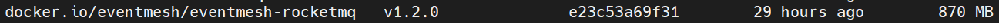
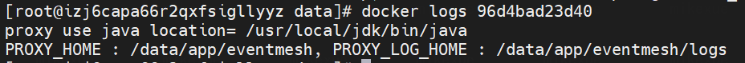

# Eventmesh-runtime Quick start Instruction

## 1 Remote Deploy

### 1.1 dependencies

```
64bit OS, Linux/Unix is recommended;
64bit JDK 1.8+;
Gradle at least 5.6, eg 5.6.*
```

### 1.2 download sources

download source code from [https://github.com/WeBankFinTech/EventMesh](https://github.com/WeBankFinTech/EventMesh)  
You will get **EventMesh-master.zip**

### 1.3 build sources

```$xslt
unzip EventMesh-master.zip
cd /*YOUR DEPLOY PATH*/EventMesh-master/eventmesh-runtime
gradle clean tar -x test
```

You will get **EventMesh_1.2.0.tar.gz** in directory /* YOUR DEPLOY PATH */EventMesh-master/build

### 1.4 Deployment

- deploy eventmesh-runtime  

```shell
upload Eventmesh_1.2.0.tar.gz
tar -zxvf Eventmesh_1.2.0.tar.gz
cd conf
config your eventMesh.properties
cd ../bin
sh start.sh
```

If you see "EventMeshTCPServer[port=10000] started....", you setup runtime successfully.


## 2 Run Locally

### 2.1 dependencies

Same with 1.1

### 2.2 download sources

Same with 1.2

### 2.3 Run

**2.3.1 Project structure：**


- eventmesh-common : eventmesh common classes and method module
- eventmesh-connector-api : eventmesh connector api definition module
- eventmesh-connector-rocketmq : eventmesh rocketmq connector module
- eventmesh-runtime : eventmesh runtime module
- eventmesh-sdk-java : eventmesh java client sdk
- eventmesh-starter : eventmesh project local start entry

ps：The loading of connector plugin follows the Java SPI mechanism,  it's necessary to configure the mapping file of related interface and implementation class under /main/resources/meta-inf/services in the corresponding module

**2.3.2 Configure VM Options**

```java
-Dlog4j.configurationFile=..\eventmesh-runtime\conf\log4j2.xml
-Dproxy.log.home=..\eventmesh-runtime\logs
-Dproxy.home=..\eventmesh-runtime
-DconfPath=..\eventmesh-runtime\conf
```

**2.3.3 Configure build.gradle file**

Specify the connector that will be loaded after the project start with updating compile project item in dependencies

update `build.gradle` file under the `eventmesh-starter` module

load **rocketmq connector** configuration：

```java
dependencies {
    compile project(":eventmesh-runtime"), project(":eventmesh-connector-rocketmq")
}
```

**2.3.4 Run**

running `com.webank.eventmesh.starter.StartUp` main method


## 3 Run with Docker 

### 3.1 Pull

execute `docker pull eventmesh/eventmesh-rocketmq:v1.2.0` , you will get EventMesh image like below



### 3.2 Config

> **prerequisite** : may be you need download the source code from git first and use the contents of these files(eventMesh.properties and rocketmq-client.properties) as a reference for the following actions.

**3.2.1 Files to configure**

Before run the container you should configure some files.

**eventMesh.properties** 

| Configuration Key      | Default Value | Remarks                    |
| ---------------------- | ------------- | -------------------------- |
| eventMesh.server.http.port | 10105         | EventMesh http server port |
| eventMesh.server.tcp.port  | 10000         | EventMesh tcp server port  |

**rocketmq-client.properties**

| Configuration Key                 | Default Value                 | Remarks                          |
| --------------------------------- | ----------------------------- | -------------------------------- |
| eventMesh.server.rocketmq.namesrvAddr | 127.0.0.1:9876;127.0.0.1:9876 | RocketMQ namesrv default address |

After pull the EventMesh image to your host machine, you can execute command below to configure **eventMesh.properties** and **rocketmq-client.properties**

**3.2.2 Create Files**

```shell
mkdir -p /data/eventmesh/rocketmq/conf
cd /data/eventmesh/rocketmq/conf
vi eventMesh.properties
vi rocketmq-client.properties
```

The contents of these files can reference from [eventMesh.properties](https://github.com/WeBankFinTech/EventMesh/blob/develop/eventmesh-runtime/conf/eventMesh.properties) and [rocketmq-client.properties](https://github.com/WeBankFinTech/EventMesh/blob/develop/eventmesh-runtime/conf/rocketmq-client.properties)

### 3.3 Run

**3.3.1 run**

execute command below to run container

```
docker run -d -p 10000:10000 -p 10105:10105 -v /data/eventmesh/rocketmq/conf/eventMesh.properties:/data/app/eventmesh/conf/eventMesh.properties -v /data/eventmesh/rocketmq/conf/rocketmq-client.properties:/data/app/eventmesh/conf/rocketmq-client.properties docker.io/eventmesh/eventmesh-rocketmq:v1.2.0
```

> -p : binding the container port with host machine port
>
> -v : mount the container configuration files with host machine files

**3.3.2 check container**

execute `docker ps` to check the container health


execute `docker logs [container id]` you will get following result:



execute `docker exec -it [container id] /bin/bash` you will go into the container and see the details:


### 3.4 Test

**Prerequisite** ：RocketMQ Namesrv & Broker

you can build the rocketmq image following  [here](https://github.com/apache/rocketmq-docker) or get the rocketmq image from docker hub.

```
docker pull rocketmqinc/rocketmq-namesrv:4.5.0-alpine
docker pull rocketmqinc/rocketmq-broker:4.5.0-alpine

#namesrv 
docker run -d -p 9876:9876 -v `pwd` /data/namesrv/logs:/root/logs -v `pwd`/data/namesrv/store:/root/store --name rmqnamesrv  rocketmqinc/rocketmq-namesrv:4.5.0-alpine sh mqnamesrv 

#broker 
docker run -d -p 10911:10911 -p 10909:10909 -v `pwd`/data/broker/logs:/root/logs -v `pwd`/data/broker/store:/root/store --name rmqbroker --link rmqnamesrv:namesrv -e "NAMESRV_ADDR=namesrv:9876" rocketmqinc/rocketmq-broker:4.5.0-alpine sh mqbroker -c ../conf/broker.conf
```

When we get this point, **rocketmq-broker ip** is the **pod ip**, if you want to change the ip, you can mount the **broker.conf** file in container and modify **brokerIP1** configuration in this file to your custom values.

**3.4.1 Run Demo**

Windows

- For demos running under the Windows , you can refer [here](https://github.com/WeBankFinTech/EventMesh/blob/develop/docs/en/instructions/eventmesh-sdk-java-quickstart.md)

Linux

- **Get eventmesh-test_1.2.0-SNAPSHOT.tar.gz**

  you can get this package from **our releases** or **build with source code**.

  **build with source code**:

  ```shell
  cd /* Your Deploy Path */EventMesh/eventmesh-test 
  gradle clean testdist testtar -x test`
  ```

  you will get **eventmesh-test_1.2.0-SNAPSHOT.tar.gz** under the /eventmesh-test/build 

- **Modify configuration files**

  ```shell
  upload eventmesh-test_1.2.0-SNAPSHOT.tar.gz
  tar -zxvf eventmesh-test_1.2.0-SNAPSHOT.tar.gz
  cd conf
  config your application.properties
  ```

- **Run demo**

  TCP Sub 

  ```shell
  cd bin
  sh tcp_sub.sh
  ```

  TCP Pub

  ```shell
  cd bin
  sh tcp_pub.sh
  ```

  TCP Sub Broadcast

  ```shell
  cd bin
  sh tcp_sub_broadcast.sh
  ```

  TCP Pub Broadcast

  ```shell
  cd bin
  sh tcp_pub_broadcast.sh
  ```

  HTTP Sub

  ```shell
  cd bin
  sh http_sub.sh
  ```

  HTTP Pub

  ```shell
  cd bin
  sh http_pub.sh
  ```

  After this , you can see result of different mode in logs file under `/logs` directory

