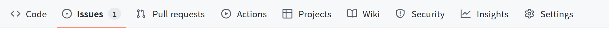
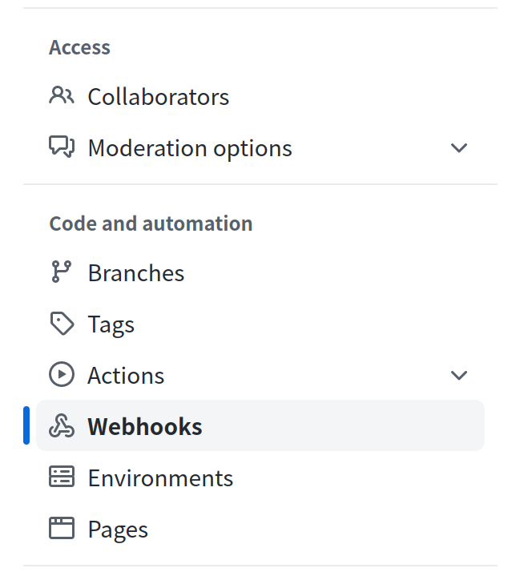
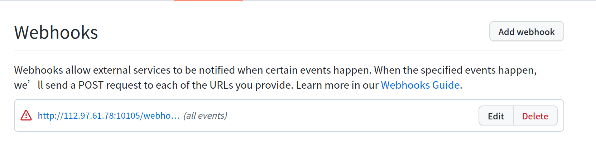

## webhook使用流程
#### 第一步：在eventmesh配置webhook相关信息并且启动

##### 配置说明
```
# 是否启动webhook admin服务
eventMesh.webHook.admin.start=true

# webhook事件配置存储模式。目前只支持file与nacos
eventMesh.webHook.operationMode=file
# 文件存储模式的文件存放路径，如果写上#{eventMeshHome}，在eventMesh根目录
eventMesh.webHook.fileMode.filePath= #{eventMeshHome}/webhook

# nacos存储模式，配置命名规则是eventMesh.webHook.nacosMode.{nacos 原生配置key} 具体的配置请看 [nacos github api](https://github.com/alibaba/nacos/blob/develop/api/src/main/java/com/alibaba/nacos/api/SystemPropertyKeyConst.java)
## nacos的地址
eventMesh.webHook.nacosMode.serverAddr=127.0.0.1:8848

# webhook eventcloud 发送模式。与eventMesh.connector.plugin.type 配置一样
eventMesh.webHook.producer.connector=standalone
```

#### 第二步：添加webhook配置信息
配置信息说明
```java
   /**
    * 厂商调用的path。厂商事件调用地址、 [http or https ]://[域名 or IP 【厂商可以被调用】]:[端口]/webhook/[callbackPath]
    * 比如：http://127.0.0.1:10504/webhook/test/event 需要把全完url填入厂商调用输入中
    * callbackPath 是唯一
    * manufacturer callback path
    */
    private String callbackPath;

    /**
     * 厂商的名字
     * manufacturer name ,like github
     */
    private String manufacturerName;

    /**
     * 厂商的事件名
     * webhook event name ,like rep-push
     */
    private String manufacturerEventName;

    /**
     * 
     * http header content type
     */
    private String contentType = "application/json";

    /**
     * 说明
     * description of this WebHookConfig
     */
    private String description;

    /**
     * 有一些厂商使用验签方式，
     * secret key ,for authentication
     */
    private String secret;

    /**
     *  有一些厂商使用验签方式，使用账户密码方式
     * userName ,for HTTP authentication
     */
    private String userName;

    /**
     *  有一些厂商使用验签方式，使用账户密码方式
     * password ,for HTTP authentication
     */
    private String password;


    /**
     * 事件发送到那个topic
     * roll out event name ,like topic to mq
     */
    private String cloudEventName;

    /**
     * roll out data format -> CloudEvent serialization mode
     * If HTTP protocol is used, the request header contentType needs to be marked
     */
    private String dataContentType = "application/json";;

    /**
     * source of event
     */
    private String cloudEventSource;

    /**
     * cloudEvent事件对象唯一标识符识别方式，uuid或者manufacturerEventId(厂商id)
     * id of cloudEvent ,like uuid/manufacturerEventId
     */
    private String cloudEventIdGenerateMode;

```

##### 添加接口
路径： /webhook/insertWebHookConfig
方法： POST
contentType： application/json

输入参数：
| 字段 | 说明 | 类型 |　必须 | 默认值　|
| -- | -- | -- | -- | -- |
| callbackPath | 调用地址，唯一地址 | string | 是　| null　|
| manufacturerName | 厂商名 | string | 是　| null　|
| manufacturerEventName | 厂商事件名 | string | 是　| null　|
| contentType | http connettype | string | 否　| application/json　|
| description | 配置说明 | string | 否　| null　|
| secret | 验签密钥 | string | 否　| null　|
| userName | 用户名 | string | 否　| null　|
| password | 用户密码 | string | 否　| null　|
| cloudEventName | 事件名（） | string | 是　| null　|
| cloudEventSource | 事件来源可以填写 | string | 是　| null　|
| cloudEventIdGenerateMode | cloudEvent事件对象唯一标识符识别方式，uuid或者manufacturerEventId(厂商id)  | string | 否　| manufacturerEventId　|

列子：
```json

{
	"callbackPath":"/webhook/github/eventmesh/all",
	"manufacturerName":"github",
	"manufacturerEventName":"all",
	"secret":"eventmesh",
	"cloudEventName":"github-eventmesh",
	"cloudEventSource":"github"
}

```
输出参数：１　成功，０失败

##### 删除接口
路径： /webhook/deleteWebHookConfig
方法： POST
contentType： application/json

输入参数：
| 字段 | 说明 | 类型 |　必须 | 默认值　|
| -- | -- | -- | -- | -- |
| callbackPath | 调用地址，唯一地址 | string | 是　| null　|


列子：

```json

{
	"callbackPath":"/webhook/github/eventmesh/all"
}

```


输出参数：１　成功，０失败

##### 通过callbackPath查询WebHookConfig
路径： /webhook/queryWebHookConfigById
方法： POST
contentType： application/json

输入参数：
| 字段 | 说明 | 类型 |　必须 | 默认值　|
| -- | -- | -- | -- | -- |
| callbackPath | 调用地址，唯一地址 | string | 是　| null　|


列子：

```json

{
	"callbackPath":"/webhook/github/eventmesh/all"
}

```


输出参数：
| 字段 | 说明 | 类型 |　必须 | 默认值　|
| -- | -- | -- | -- | -- |
| callbackPath | 调用地址，唯一地址 | string | 是　| null　|
| manufacturerName | 厂商名 | string | 是　| null　|
| manufacturerEventName | 厂商事件名 | string | 是　| null　|
| contentType | http connettype | string | 否　| application/json　|
| description | 配置说明 | string | 否　| null　|
| secret | 验签密钥 | string | 否　| null　|
| userName | 用户名 | string | 否　| null　|
| password | 用户密码 | string | 否　| null　|
| cloudEventName | 事件名（） | string | 是　| null　|
| cloudEventSource | 事件来源可以填写 | string | 是　| null　|
| cloudEventIdGenerateMode | cloudEvent事件对象唯一标识符识别方式，uuid或者manufacturerEventId(厂商id)  | string | 否　| manufacturerEventId　|


##### 通过manufacturer查询WebHookConfig列表
路径： /webhook/queryWebHookConfigByManufacturer
方法： POST
contentType： application/json

输入参数：
| 字段 | 说明 | 类型 |　必须 | 默认值　|
| -- | -- | -- | -- | -- |
| manufacturerName | 厂商名 | string | 是　| null　|


列子：

```json

{
	"manufacturerName":"github"
}

```


输出参数：
| 字段 | 说明 | 类型 |　必须 | 默认值　|
| -- | -- | -- | -- | -- |
| callbackPath | 调用地址，唯一地址 | string | 是　| null　|
| manufacturerName | 厂商名 | string | 是　| null　|
| manufacturerEventName | 厂商事件名 | string | 是　| null　|
| contentType | http connettype | string | 否　| application/json　|
| description | 配置说明 | string | 否　| null　|
| secret | 验签密钥 | string | 否　| null　|
| userName | 用户名 | string | 否　| null　|
| password | 用户密码 | string | 否　| null　|
| cloudEventName | 事件名（） | string | 是　| null　|
| cloudEventSource | 事件来源可以填写 | string | 是　| null　|
| cloudEventIdGenerateMode | cloudEvent事件对象唯一标识符识别方式，uuid或者manufacturerEventId(厂商id)  | string | 否　| manufacturerEventId　|


#### 第三步：查看配置是否成功
1. file存储模式。请到eventMesh.webHook.fileMode.filePath 目录下查看。文件名为callbackPath转移后的
2. nacos存储模式。请到eventMesh.webHook.nacosMode.serverAddr 配置的nacos服务去看

#### 第四步：配置cloudevent的消费者


#### 第五步：在厂商配置webhook相关信息
> 厂商操作请看【厂商webhook操作说明】


## 厂商webhook操作说明
### github 注册
#### 第一步：进入对应的项目
#### 第二步：点击setting

#### 第三步：点击Webhooks

#### 第四步：点击 Add webhook

#### 第五步: 填写webhook信息


Payload URL: 服务地址以及pahts。[http or https ]://[域名 or IP 【厂商可以被调用】]:[端口]/webhook/[callbackPath]
Content type：http header content type
secret: 验签字符串


