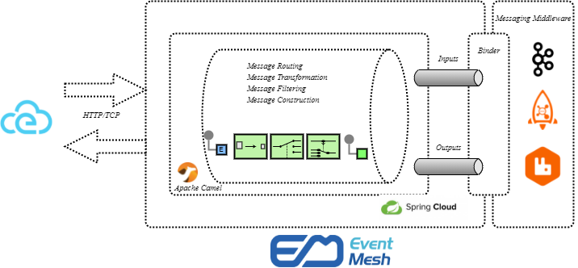
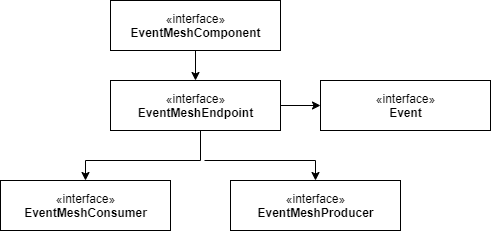
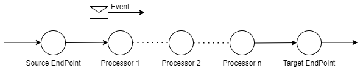
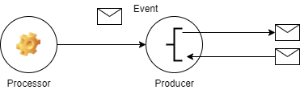
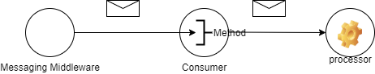

# EventMesh Stream

## 事件流概述

事件流是发布/订阅架构模式的一种实现，它包括以下几个部分

- 消息或事件：状态变化。

- 主题：消息中间件代理中的分区。

- 消费者：可以从代理主题订阅读取事件。

- 生产者：生成事件

事件流是事件的连续流动，为了维持事件之间的秩序，事件流应该以特定的方式从生产者流向消费者。

## 要求

### 功能要求

| 需求编号 | 需求描述 | 注释 |
| -------------- | ----------------------- | -------- |
| F-1            | EventMesh用户应该能够在 EventMesh 中实现事件流功能 | 功能性 |
| F-2            | EventMesh用户可以为路由、过滤、转换等应用动态用户特定逻辑 | 功能性 |

## 设计细节

我们引入了 EventMesh Stream 组件，允许我们在 Apache Camel 中本地使用来自 Spring Cloud Stream 的编程模型和绑定器抽象。

[Spring-Cloud-Stream](https://spring.io/projects/spring-cloud-stream) Spring Cloud Stream是一个用于构建
与共享消息传递系统连接的、高度可扩展的事件驱动微服务框架。

[Apache Camel](https://camel.apache.org/) Camel 是一个开源集成框架，使您能够快速轻松地集成各种消费或生产数据的系统。

## 架构

## 设计

### EventMesh-Stream 组件

- Event（事件）
- Event Channel（事件通道）
- Event EndPoint（事件端点）
- Event Pipes & Filters（事件管道和过滤器）
- Event Routes（事件路由器）
- Event Converter（事件转换器）

#### Event（事件）

> 事件是系统中传输数据的最小单位。它的结构分为标题、正文和附件。

#### Event Channel（事件通道）

> 事件通道是系统中的逻辑通道，我们是通过 Spring Cloud Stream 编程模型实现的，它具有围绕消息通道的抽象功能（截至目前用的是 Spring `MessageChannel`）。

#### Event EndPoint（事件端点）

> 事件端点是应用程序和消息传递系统之间的接口。我们可以定义两种类型的端点

- 消费者端点 - 出现在路由开始并从传入通道读取传入事件。
- 生产者端点 - 出现在路由的末尾并将传入事件写入传出通道。

#### Event Pipes & Filters（事件管道和过滤器）

> 我们可以通过创建过滤器链（Apache Camel `Processor`）来构建路由，其中一个过滤器的输出被用于管道中下一个过滤器的输入。管道的主要优点是可以创建复杂的事件处理逻辑。

#### Event Routes（事件路由器）

> 事件路由器是消费者的一种过滤器，并根据决策标准将它们重定向到适当的目标端点。

#### Event Converter（事件转换器）

> 事件转换器用于修改事件内容，将其转换为不同的格式（换而言之 cloudevents -> Event (Camel) -> Binder Message(Spring Message)，反之亦然）。

## EventMesh-Stream 组件接口

### Component（组件）

Component 接口是主要的入口点，您可以使用 Component 对象作为工厂来创建 EndPoint 对象。

### EndPoint（端点）

EndPoint 作为创建消费者、生产者和事件对象的工厂。

- `createConsumer()` — 创建消费者端点，该端点表示路由开始的源端点。
- `createProducer()` — 创建生产者端点，该端点表示路由末端的目标端点。

#### Producer（生产者）

用户可以创建以下类型的生产者
> 同步生产者：处理线程阻塞，直到生产者完成事件处理。

未来将会实现的生产者类型：

- 异步生产者 - 生产者在子线程中处理事件。

#### Consumer（消费者）

用户可以创建以下类型的消费者
> 事件驱动的消费者：当消息绑定器调用消费者中的方法时，开始处理传入请求。

未来将会实现的消费者类型：

- 定时轮训消费者
- 自定义轮询消费者
