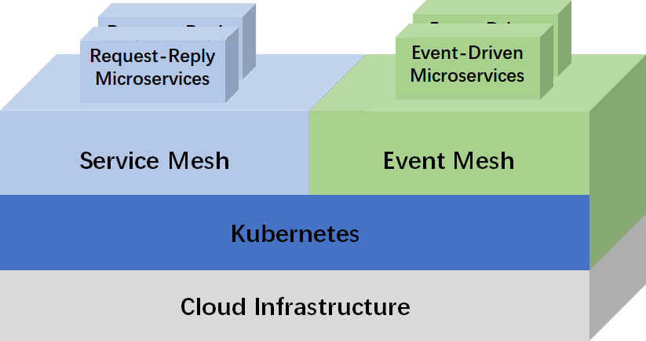
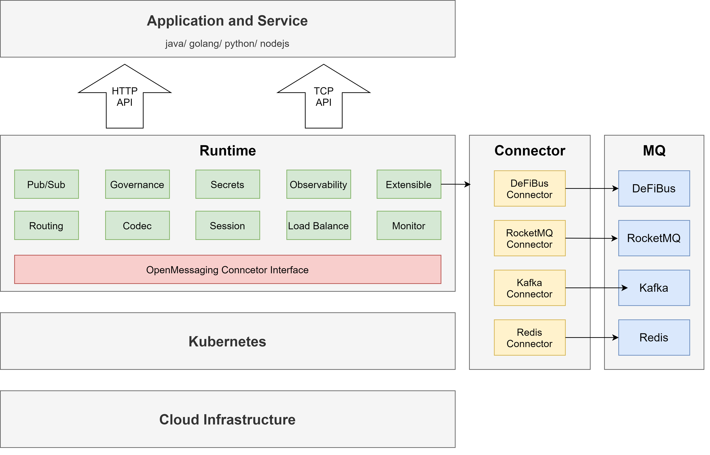
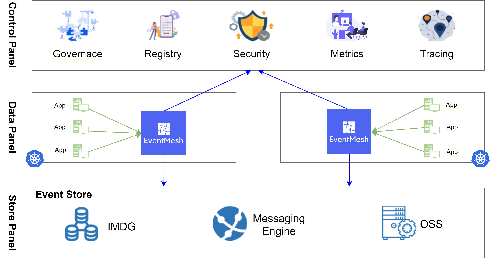

# Apache EventMesh (Incubating)

## 什么是Event Mesh？

EventMesh是一个动态的云原生事件驱动架构基础设施，用于分离应用程序和后端中间件层，它支持广泛的用例，包括复杂的混合云、使用了不同技术栈的分布式架构。

**EventMesh架构：**

**EventMesh云原生结构：**

Event Mesh允许将来自一个应用程序的事件动态路由到任何其他应用程序. Event Mesh的一般功能:

* 事件驱动;
* 事件治理;
* 动态路由;
* 云原生

部件：

* eventmesh-runtime：一种中间件，用于在事件生产者和消费者之间传输事件，支持云原生应用程序和微服务
* eventmesh-sdk-java：当前支持HTTP、HHTTP、TCP和 [gRPC](https://grpc.io) 协议

## 快速开始

1. 构建并部署 event-store(RocketMQ), 请参见[说明](instruction/01-store.md)
2. 构建并部署 eventmesh-runtime，请参见[说明](instruction/02-runtime.md)
3. 运行 eventmesh-sdk-java 演示，请参见[说明](instruction/03-demo.md)

## 贡献

永远欢迎参与共建, 请参阅[贡献](../../03-new-contributor-guidelines.md)了解详细指南

您可以从发现和解决问题开始～
[GitHub Issues](https://github.com/apache/incubator-eventmesh/issues)

