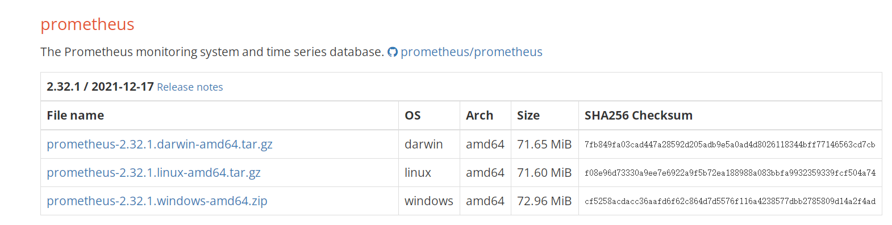
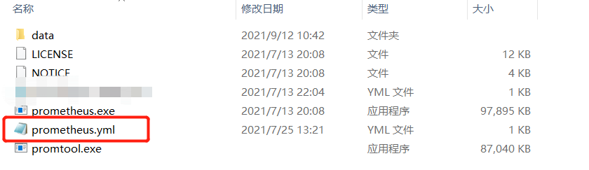
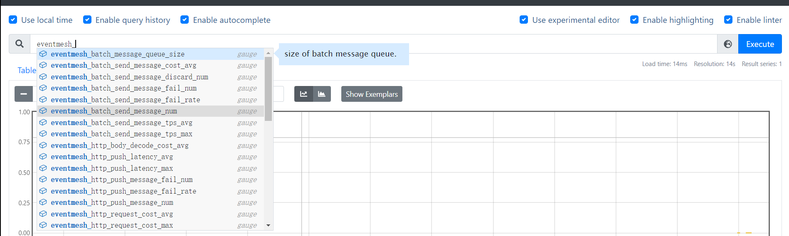

# 通过 Prometheus 观察 Metrics

## 下载 Prometheus

官网：https://prometheus.io/

本地下载Prometheus：https://prometheus.io/download/

选择自己电脑对应的版本下载并解压缩



### 2、在prometheus.yml中添加配置

如果你是Prometheus的新手，可以直接复制eventmesh-runtime/conf/prometheus.yml替换

例如：这是win-64的下载后的样子：



替换红框中的文件

如果你十分了解Prometheus，可以自行配置，eventmesh默认的导出的端口为19090。

ps：如果需要更换端口的话，请修改eventmesh-runtime/conf/eventmesh.properties中的

```properties
#prometheusPort
eventMesh.metrics.prometheus.port=19090
```

## 运行 Prometheus 和 EventMesh

双击Prometheus.exe运行

运行eventmesh-starter(参考[eventmesh-runtime-quickstart](eventmesh-runtime-quickstart.md))

运行eventmesh-example(参考[eventmesh-sdk-java-quickstart](eventmesh-sdk-java-quickstart.md))

打开浏览器访问：http://localhost:9090/

### 输入想观察的 Metrics

输入’**eventmesh_**‘ 就会出现相关的指标的提示


