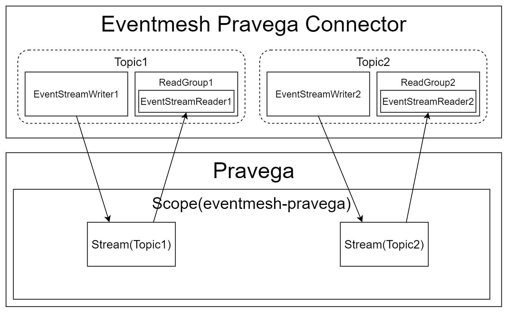

# Pravega Connector
Pravega connector of EventMesh supports taking Pravega as event storage. [Pravega](https://cncf.pravega.io/) is a storage system that exposes Stream as the main primitive for continuous and unbounded data and meets the requirement of EventMesh connector module. 

## The Design of Pravega Connector
Pravega has 3 level storage concepts, which are **Event**, **Stream**, **Scope**. An **Event** is represented as a set of bytes within a Stream. A **Stream** is a durable, elastic, append-only, unbounded sequence of bytes having good performance and strong consistency. A **Scope** acts as a namespace for Stream names and all Stream names are unique within their Scope.

Naturally, Pravega connector makes each topic correspond to a pravega stream. Because `EventStreamWriter` and `EventStreamReader` must assign to a special stream in a special scope, each topic corresponds to an `EventStreamWriter` and a `ReaderGroup`(only contains one `EventStreamReader`) as well. What's more, `SubscribeTask` thread will read every topic stream continuously.

**Note**: 
- Publish success will respond `-1` as messageId since writing to Pravega will not return message offset of the stream. If you want to use EventMesh with Pravega, please ensure messageId is unimportant.
- Name and ID in Pravega must be `0-9`, `A-Z`, `a-z`, `.`, `-`.
  - Topic must be legal in Pravega.
  - ReaderGroup name format is `String.format("%s-%s", consumerGroup, topic)`
  - Reader name format is `String.format("%s-reader", instanceName).replaceAll("\\(", "-").replaceAll("\\)", "-")`. The `instanceName` consists of `consumerGroup`, config `eventMesh.server.cluster`, EventMesh version and PID. 

## Active Pravega Connector
Referring to doc [_Build and Load Plugins_](https://eventmesh.apache.org/docs/installation/runtime#13-build-and-load-plugins) to load `:eventmesh-connector-plugin:eventmesh-connector-pravega` plugin module, and edit `eventMesh.connector.plugin.type=pravega` in config file `eventmesh.properties` to active pravega connector.